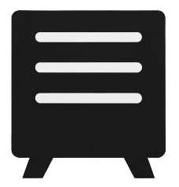
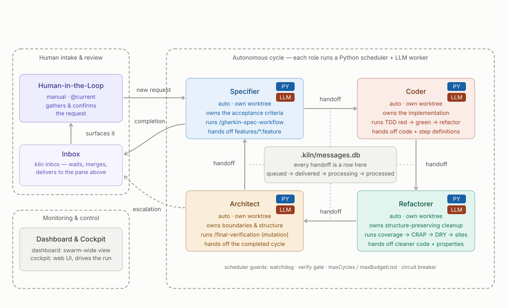
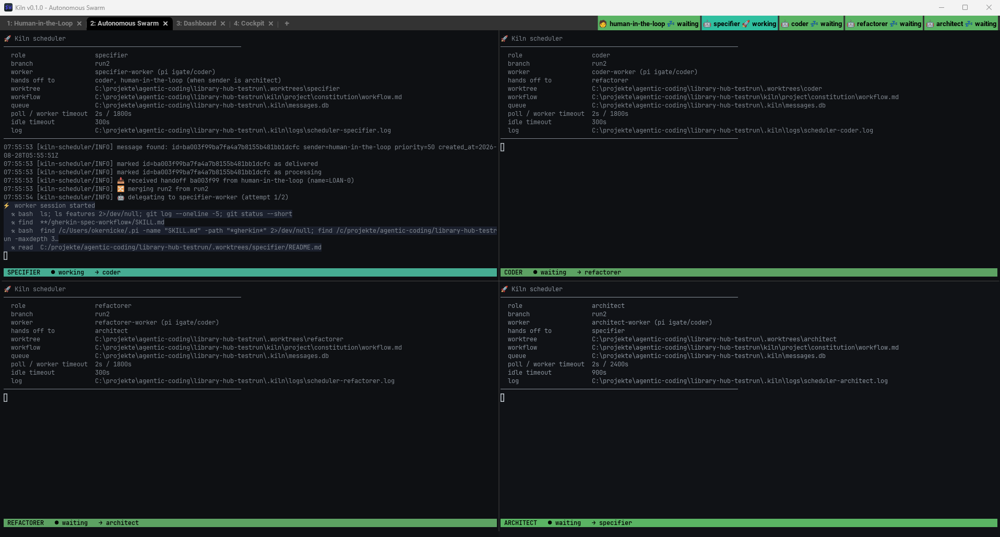
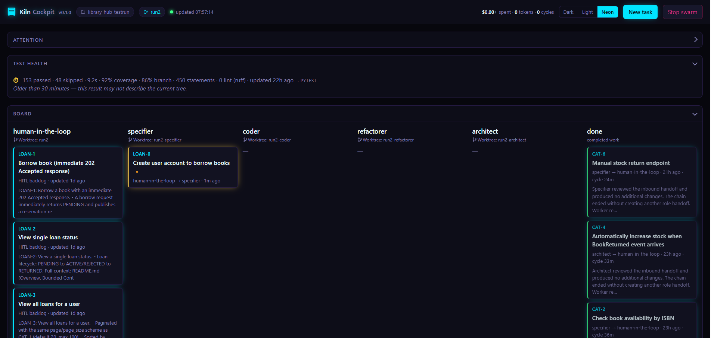
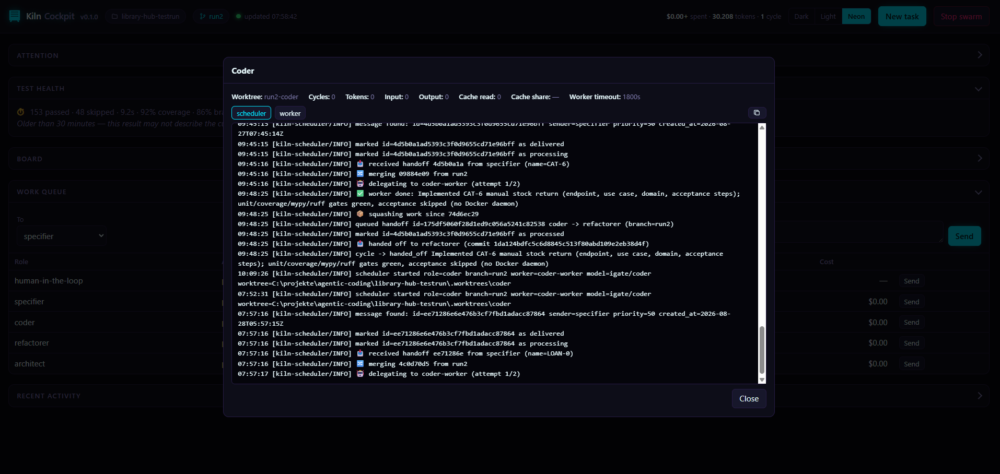
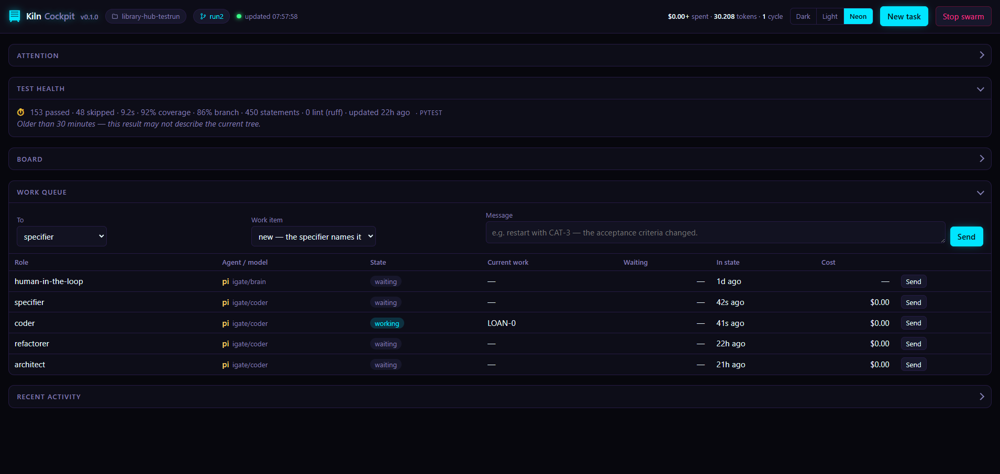
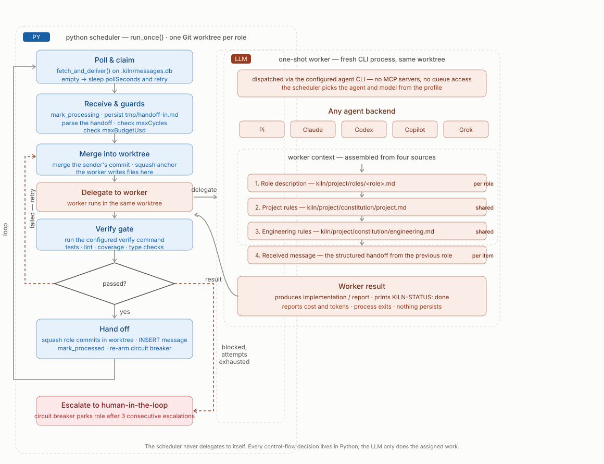

<p align="center">
  
</p>

<p align="center">
  <a href="https://github.com/nsd0okernicke/kiln/tags"></a>
  
</p>

# Kiln

Kiln runs local, role-based AI development swarms. Each autonomous role works in its own Git
worktree, receives project-specific instructions, and hands work to the next role through a
shared queue. A human-facing role starts the work, reviews results, and handles escalations.

Kiln is useful when a task benefits from explicit separation of concerns—for example,
specification, implementation, refactoring, and architectural review—and when you want those
steps to be observable and repeatable rather than managed in one long agent conversation.

## Contents

**Overview**

- [Why Kiln](#why-kiln)
- [What users should know](#what-users-should-know)
- [The default workflow](#the-default-workflow)

**Setup**

- [Requirements](#requirements)
- [Getting started](#getting-started)
  - [1. Initialize your project](#1-initialize-your-project)
  - [2. Commit the scaffold](#2-commit-the-scaffold)
  - [3. Start Kiln and configure the constitution](#3-start-kiln-and-configure-the-constitution)
  - [4. Build the knowledge base](#4-build-the-knowledge-base)
  - [5. Review, commit, and restart](#5-review-commit-and-restart)
  - [6. Check the resolved workflow](#6-check-the-resolved-workflow)

**Daily use**

- [Working with the swarm](#working-with-the-swarm)
  - [The WezTerm window](#the-wezterm-window)
  - [Talking to human-in-the-loop (HITL)](#talking-to-human-in-the-loop-hitl)
  - [The Cockpit](#the-cockpit)
- [Dashboard and cockpit](#dashboard-and-cockpit)
  - [Cockpit panels](#cockpit-panels)
  - [Handing off a task](#handing-off-a-task)
  - [Reading a scheduler or worker log](#reading-a-scheduler-or-worker-log)
  - [Retrying and sending work](#retrying-and-sending-work)
  - [Test health](#test-health)
- [Choosing a profile](#choosing-a-profile)
- [Daily commands](#daily-commands)
  - [Launch](#launch) · [Send work](#send-work) · [Stop](#stop)
  - [Inspect and retry failures](#inspect-and-retry-failures)
  - [Search project knowledge](#search-project-knowledge)

**How it works**

- [Execution model](#execution-model)
  - [Scheduler mode](#scheduler-mode) · [Wrapper mode](#wrapper-mode)
- [Git and project isolation](#git-and-project-isolation)
- [Project files](#project-files)

**Configuration**

- [Profile configuration](#profile-configuration)
  - [Routing](#routing)
  - [Custom roles](#custom-roles)
  - [Role fields](#role-fields)
- [Traffic capture](#traffic-capture)

**Operations**

- [Safety](#safety)
- [Troubleshooting](#troubleshooting)
  - [Nothing launches](#nothing-launches)
  - [A wrapper cannot receive messages](#a-wrapper-cannot-receive-messages)
  - [A role is blocked or halted](#a-role-is-blocked-or-halted)
  - [A worker appears stuck](#a-worker-appears-stuck)
  - [Worktrees conflict](#worktrees-conflict)
  - [Status or cockpit data looks stale](#status-or-cockpit-data-looks-stale)

**Project**

- [Development](#development)
- [Version](#version)
- [License and status](#license-and-status)

---

## Why Kiln

Long agent conversations degrade. Context accumulates, earlier decisions get summarized away,
and by the tenth turn the agent is working from a blurred copy of the original intent. Kiln's
answer is to never let a context grow long: each role starts from written instructions, does one
job, commits, and hands on.

- **No context drift.** A one-shot worker is invoked per handoff with the constitution, its own
  role instructions, and one structured message — not a conversation it has been inside for an
  hour.
- **Fewer laps.** Specification, implementation, hardening, and review are separate roles with
  separate standards, so a defect is caught by the role that owns that standard instead of
  surfacing three turns later.
- **Reliability you can inspect.** A deterministic Python scheduler owns retries, timeouts, cost
  caps, and escalation — not an LLM deciding whether to try again.
- **Quality that is enforced, not requested.** A role's `verify` command must pass before it may
  hand off, and the Cockpit reads the resulting test, coverage, and lint reports.
- **Gates set high on purpose.** Coverage, CRAP, DRY, property tests, and mutation testing run
  inside the cycle rather than after it — the refactorer splits any file that grows past 100
  mutation sites, and the architect runs the mutation suite itself. Every lap is slower for it.

That last one is the deliberate trade. Heavy gates cost time per lap and buy back more than they
cost: the work stays on target, there is no cycling discussion with an agent about whether
something is good enough, and the swarm can run unattended — every role must pass the gates, and
cannot argue its way around them.

## What users should know

- Kiln runs on your machine and operates directly on a Git repository.
- Agents can execute commands and modify files without interactive approval.
- Autonomous roles use separate Git worktrees and exchange structured handoffs.
- Profiles define the roles, routing, models, timeouts, and terminal layout.
- Pi, Claude, Codex, Copilot, and Grok are supported as role backends; the shipped profiles use
  Pi by default.
- The default profile is human-guided at intake and autonomous afterward.
- Failures are retried, then escalated to the human. Repeated escalation parks the role until
  you explicitly retry it.
- The dashboard and local web cockpit show role state, queues, work items, usage, and failures.

Kiln is an orchestration layer, not an AI provider. You install and authenticate the agent
CLI you intend to use.

## The default workflow

The `full` profile runs this cycle:



The human-facing role gathers and confirms the request. The autonomous roles then:

1. turn the request into an implementable specification;
2. implement it;
3. improve tests, coverage, design, and mutation resistance;
4. review the result and either return it to the human or start another lap.

An inbox pane displays human-directed messages and escalations. The terminal dashboard and web
cockpit provide a swarm-wide view.

---

## Requirements

- Python 3.11 or newer
- Git
- At least one supported agent CLI on `PATH`:
  - Pi coding agent — used by the shipped profiles by default
  - Claude Code
  - OpenAI Codex CLI
  - GitHub Copilot CLI
  - Grok CLI
- A terminal backend:
  - WezTerm is recommended on every platform
  - Windows Terminal is supported on Windows
  - tmux is supported on Linux and macOS

Wrapper-mode roles also require the MCP Python dependencies:

```bash
python -m pip install -r src/kiln/mcp_server/requirements.txt
```

Kiln warns at launch when the interpreter used by the agent CLI cannot import the required MCP
package.

## Getting started

Clone Kiln and run it in place:

```bash
git clone https://github.com/nsd0okernicke/kiln.git
cd kiln
```

### 1. Initialize your project

For a new, empty project on Windows:

```powershell
.\bin\kiln.ps1 -Init -WorkingDir C:\path\to\my-project
```

On Linux or macOS:

```bash
./bin/kiln.sh init /path/to/my-project
```

To start from a bundled example, add `-Example library-hub` on Windows or
`--example library-hub` on Linux and macOS.

For an existing project, first commit or stash its current changes, then run the same init
command with the repository root as the working directory. Kiln keeps the application source
in place and adds its project instructions, skills, runtime configuration, Git ignore rules,
and message database. Review the resulting `git diff` before committing it.

Initialization creates generic constitution files. Do not start real work with them yet—the
next step adapts them to the project.

### 2. Commit the scaffold

Kiln creates role worktrees from committed files. Review the initialization and commit the
scaffold before the first launch, otherwise those worktrees cannot receive the constitution,
roles, or skills:

```bash
git status
git diff
git add kiln .gitignore .gitattributes
git commit -m "Initialize Kiln project"
```

Include any other initialization files shown by `git status` that you intentionally want to
version. Do not commit `.kiln/`, `.worktrees/`, generated agent instructions, or credentials.

### 3. Start Kiln and configure the constitution

Launch Kiln on Windows:

```powershell
.\bin\kiln.ps1 -WorkingDir C:\path\to\my-project
```

Or on Linux and macOS:

```bash
./bin/kiln.sh /path/to/my-project
```

In the interactive human-in-the-loop (HITL) pane, enter:

```text
Use kiln-constitution-setup to configure this project. Inspect the repository first, ask me
only for decisions you cannot establish from evidence, and show me both complete constitution
files for approval before writing them.
```

For an existing codebase, the skill examines its manifests, source layout, tests, CI, and
documentation before asking questions. For a new project, it guides you through a short
interview about the product, architecture, toolchain, quality gates, and constraints.

Review the proposed contents carefully, resolve any contradictions the skill reports, and
approve the two files only when they describe the intended project:

```text
kiln/project/constitution/project.md
kiln/project/constitution/engineering.md
```

The setup skill changes only these constitution files. It does not alter roles, profiles,
routing, or the workflow.

### 4. Build the knowledge base

The constitution says how the project is built. The **knowledge base** is the separate,
optional layer that lets any role look up what the project already knows — domain
documentation, ADRs, product policies, runbooks, API references, local PDF manuals — without
that material being pasted into every prompt.

Skipping this step is fine for a small or greenfield project. It pays off as soon as the
agents need context that is written down somewhere but is too large to carry in a role file.

In the same HITL pane, ask for the setup skill:

```text
Use kiln-knowledge-setup to catalog this project's documentation. Show me the proposed
sources with what each one is good for before you change knowledge.json.
```

The skill runs `kiln knowledge setup --json` to discover candidate Markdown, text, and PDF
files, explains what decisions each can support, and excludes generated reports, dependencies,
and anything unrelated. It never proposes a URL — a human must name those. Review the proposal,
approve it, and the skill runs `kiln knowledge add` and `kiln knowledge sync` for you.

Doing it by hand is the same three commands:

```bash
./bin/kiln.sh knowledge add docs/domain.md --id domain --title "Domain model"
./bin/kiln.sh knowledge sync
./bin/kiln.sh knowledge search "subscription cancellation"
```

Two files result, and they are not equal. `kiln/project/knowledge.json` is the approved
catalog: commit it. `.kiln/knowledge.db` is the generated index: never commit it, and delete
it freely — the next `knowledge sync` or launch rebuilds it from the catalog. Launch refreshes
changed sources incrementally, so the index tracks the documents without you thinking about it.

Only HITL curates the catalog. Autonomous roles may search it and read indexed documents, but
cannot add or remove sources. Knowledge supports decisions; it never overrides the
constitution. See [Search project knowledge](#search-project-knowledge) for the full command
set and for how URL sources differ from files.

### 5. Review, commit, and restart

After approving the constitution, inspect and commit the adapted files. Include
`knowledge.json` if you completed the previous step:

```bash
git diff
git add kiln/project/constitution/project.md kiln/project/constitution/engineering.md
git add kiln/project/knowledge.json
git commit -m "Configure Kiln project"
```

Stop the initial session so it can be regenerated from the approved constitution:

```powershell
.\bin\kiln.ps1 -WorkingDir C:\path\to\my-project -Stop
```

On Linux and macOS, use `./bin/kiln.sh /path/to/my-project --stop`.

### 6. Check the resolved workflow

You can inspect the selected profile, roles, routes, worktrees, and scheduler commands without
launching terminal panes:

```bash
./bin/kiln.sh /path/to/my-project --dry-run
```

Use `.\bin\kiln.ps1` instead of `./bin/kiln.sh` in the remaining examples on Windows. Once the
dry run matches your expectations, launch Kiln normally. Every role and worker definition will
now use the approved constitution. Create work through the HITL backlog or the Cockpit.

### Beyond the shipped roles

The five bundled profiles cover most work, but neither the role set nor the workflow is fixed.
You can write your own roles — a security auditor, a performance analyst, a migration
specialist — and wire them into a workflow of your own shape, including sender-dependent
routing so a role hands off to different places depending on where the work came from.

That is project configuration rather than a setup step, so it lives in
[Custom roles](#custom-roles) and [Profile configuration](#profile-configuration).

---

## Working with the swarm

Day to day you drive Kiln from two places: the **HITL pane** in WezTerm, and the **Cockpit** in
your browser. The CLI in [Daily commands](#daily-commands) does the same things, and is there
for scripting or for when you are working outside the panes — but it is not the main way in.

### The WezTerm window

WezTerm is the recommended backend on every platform, because it is the one that lays the swarm
out for you. Launching the `full` profile gives you a single window with four tabs:

| Tab | Contains | You |
|---|---|---|
| **1: Human-in-the-Loop** | The HITL agent session, with the Inbox pane below it | type here |
| **2: Autonomous Swarm** | Specifier, coder, refactorer, architect in a 2×2 grid | watch |
| **3: Dashboard** | The terminal dashboard | watch |
| **4: Cockpit** | Serves the web interface and prints its local URL | watch |

The status bar along the top right shows every role's state — `waiting`, `working` — from
whichever tab you are on, so you can stay on tab 1 and still see the swarm move.


Tab 1 is the only one that expects input. The four role panes on tab 2 are running schedulers:
reading them is how you find out *why* something stalled, but work is never handed to a role by
typing into its pane.



Each pane carries a status line of its own — role, state, cycle, cost, tokens, and the handoff
it produced — so a glance across the grid tells you where the work currently is.

### Talking to human-in-the-loop (HITL)

The HITL pane on tab 1 is an ordinary agent conversation. Describe what you want in prose; it
asks until the request is unambiguous, then hands it to the first autonomous role:

```text
Add author search to the catalog, including partial-name matching.
```

It will push back on a vague request rather than guess, and you decide together when the
request is ready to hand off. For a more structured interview on a half-formed idea, ask for
`/kickoff` or `/grill-me`. HITL also owns the knowledge catalog — see
[Build the knowledge base](#4-build-the-knowledge-base).

Not everything has to start immediately. Ask HITL to park a request as a **task** and it goes
into the human backlog instead of the queue:

```text
Add author search to the catalog, but keep it in the backlog — I want to refine the scope
before anyone works on it.
```

A backlog task is named at creation, stays editable, and consumes no agent time until you run
`kiln task handoff <work-item>`. One request may become several independently named tasks.
This is the one part of Kiln with no terminal view — the Dashboard tab does not show the
backlog, so the Cockpit's HITL lane is where you actually see it, edit an entry, and hand it
off when it is ready. `kiln task list` and `kiln task show` cover the same ground from a shell;
see [Send work](#send-work) for the full command set.

Escalations come back to the Inbox pane. When a role has failed and parked, HITL is where you
give it the missing context and release it again.

### The Cockpit

The Cockpit is the same state as a web page, plus the actions that are awkward to type: manage
the backlog, hand a task off, read a role's log, retry a failure, stop a role, tear the swarm
down. It is the better surface for anything involving a queue you want to see rather than
describe, and the only one that shows the backlog at all.

Its URL is printed in the Cockpit pane and written to `.kiln/cockpit-url`. Set `openBrowser` on
the cockpit role to have it open at launch. [Cockpit panels](#cockpit-panels) below covers what
each part of it does.

## Dashboard and cockpit

The terminal dashboard shows:

- role state and elapsed time;
- queue depth and oldest wait;
- current work item and attempt;
- cycle, token, cache, and cost totals;
- recent handoffs and escalations;
- optional traffic-capture statistics.


The cockpit exposes the same state as a local web interface and adds the actions that are
awkward to type. It binds only to `127.0.0.1` and probes upward from its preferred port when
necessary. The active URL is written to `.kiln/cockpit-url`.



### Cockpit panels

The header carries the project directory, the branch the messages are scoped to, a live
indicator, run totals, a theme switcher, and the two buttons that act on the whole swarm —
**New task** and **Stop swarm**. Below it, five panels, each collapsible by its heading:

| Panel | What it shows |
|---|---|
| **Attention** | The only panel that is about *you*: failed work, escalations, and results awaiting human review. Empty reads "Nothing waiting on you." |
| **Test health** | Test, coverage, and lint results. Present only when the project ships `.kiln/test-metrics.json` — see below |
| **Board** | One lane per role, its worktree in the lane heading, and a card per work item showing name, title, and state. Above the lanes, a **Batch** toggle enables sequential mode — see below |
| **Work queue** | A composer for sending a message to any role, above the live queue table |
| **Recent activity** | Recent handoffs in order, escalations marked `⚠` |

### Handing off a task

**New task** opens an editor for a work item name, a title, and a body — the user story,
context, and acceptance criteria. **Create** stores it in the backlog; nothing runs yet, and no
agent time is spent.

Click the card again to reopen it. The editor now shows three more controls: a target role
selector, **Hand off**, and **Archive**. Choosing a target and pressing **Hand off** is what
puts the task into that role's queue and starts the work. The default target is the profile's
intake role, so accepting it sends the task down the normal path.

The work item name is fixed once the task exists — the title and body stay editable, but the
name is what every later handoff, commit, and log line refers to.

### Reading a scheduler or worker log

Click any role on the Board to open its detail dialog. The top half is that role's numbers —
worktree, cycles, tokens, input/output, cache read and cache share, and the configured worker
timeout. The bottom half is a live log tail with two buttons:

- **scheduler** — the deterministic loop: what it claimed, what it merged, which worker it
  delegated to, verification results, handoffs, and escalations.
- **worker** — the agent's own output for the current attempt.

The view follows the log while you stay scrolled to the bottom, and holds position when you
scroll up to read something. A copy button takes the visible buffer. `scheduler` is the stream
that answers "why did nothing happen"; `worker` answers "what did the agent actually do".
Both are also on disk under `.kiln/logs/`.



### Batch (sequential) mode

Above the Board lanes, a **Batch** toggle enables sequential mode. When active, the scheduler
automatically dispatches the next backlogged task as soon as the current one reaches the human
(end of a full coder → refactorer → reviewer → architect cycle).

After each completed task, every role worktree is reset to the shared branch. This prevents
the stale-branch merge conflicts that can occur when a later task modifies files an earlier
task also changed — each task starts from a clean, up-to-date state.

Toggle **Batch** on when you want to run through a queue without manually handing off each
task. Toggle it off (or leave it off) when you want to review and decide after every cycle.

### Retrying and sending work

In **Attention**, **Open** shows the full handoff document for an item, with the failure reason
at the top when there is one. From there you can type guidance and press **Retry**, which
re-queues the original work item with your note attached — the same operation as
`kiln retry <id> --guidance`. **Retry** directly on the row does it without a note.

The **Work queue** composer sends a message to any role: pick the target, pick or name a work
item, type the message. This bypasses the backlog, so it is the way to interrupt or redirect a
role that is already working — the web equivalent of `kiln send`.



**Stop swarm** in the header tears the whole thing down and asks for confirmation first.

### Test health

The cockpit shows a **Test health** panel when a project describes where its test reports
live. Create `.kiln/test-metrics.json`:

```json
{
  "framework": "pytest",
  "command": "python -m pytest --junitxml={reports}/junit.xml --cov=yourpackage --cov-branch --cov-report=xml:{reports}/coverage.xml",
  "verificationRole": "architect",
  "reports": {
    "junit": "reports/junit.xml",
    "coverage": "reports/coverage.xml",
    "lint": "reports/ruff.sarif"
  },
  "maxAgeMinutes": 30
}
```

`verificationRole` makes that scheduler role run `command` after its worker succeeds and
before handoff. Use `{reports}` in the command when reports must be written to the shared
project rather than the role's worktree; Kiln creates and expands that directory portably.
The command itself runs in the verification role's worktree, so project-relative tools should
use `.` rather than `{project}`. Kiln keeps the generated `reports/` directory out of Git.

The panel reads three file **formats**, not three specific tools. Any toolchain that can emit
them works:

| Key | Format | Written natively by |
| --- | --- | --- |
| `junit` | JUnit XML | pytest `--junitxml`, Maven, Gradle, Jest, Vitest, `dotnet test` |
| `coverage` | Cobertura XML | coverage.py `--cov-report=xml`, JaCoCo, Istanbul |
| `lint` | SARIF 2.1.0 | ruff, ESLint, PMD, SpotBugs, CodeQL |

"JUnit" and "Cobertura" name file formats, not the Java tools they came from; `--junitxml` is
a built-in pytest flag and coverage.py's XML is Cobertura by its own DTD reference. The same
config in a Java project differs only in paths:

```json
{
  "framework": "gradle",
  "command": "./gradlew test jacocoTestReport pmdMain",
  "reports": {
    "junit": "build/test-results/test",
    "coverage": "build/reports/jacoco/test/jacocoTestReport.xml",
    "lint": "build/reports/pmd"
  }
}
```

The nominated `verificationRole` runs `command` before handoff; the Cockpit only reads the
resulting reports. Relative report paths resolve from the project root and may name a file or
directory. Results older than `maxAgeMinutes` are shown as stale, while missing or malformed
reports are reported without affecting the rest of the Cockpit.

`.kiln/test-metrics.json` is local runtime configuration. Add it manually for custom projects;
supported examples may provide it during initialization.

## Choosing a profile

Profiles describe the kind of work, independently of the AI backend.

| Profile | Use it for |
|---|---|
| `full` | New features that benefit from specification, implementation, hardening, and review |
| `fix` | Bugs and smaller changes; coder followed by architect review |
| `spike` | Short-lived exploration where the output is knowledge rather than production code |
| `harden` | Existing code that needs stronger tests, coverage, mutation resistance, or boundaries |
| `game-dev` | From-scratch game development with Rust quality gates. Linear pipeline: coder → refactorer → reviewer → architect, no specifier |
| `dry-run` | Learning the workflow with manual roles and human approval at each step |

List profiles:

```bash
./bin/kiln.sh --list-profiles
```

Launch a profile:

```bash
./bin/kiln.sh /path/to/project --profile fix
```

The shipped workflow profiles use Pi by default: HITL runs `igate/brain`, while automated
roles run `igate/coder`. Configure those models in Pi before launching, or select another
backend with an override.

Run every agent-bearing role on another backend:

```bash
./bin/kiln.sh /path/to/project --profile harden --agent-override codex
```

Backend model names are not portable. An agent override therefore clears profile models unless
you explicitly provide one:

```bash
./bin/kiln.sh /path/to/project \
  --agent-override codex \
  --model-override gpt-5-codex
```

Pi uses custom OpenAI-compatible providers configured in Pi's user-owned `models.json` and
`settings.json`. Kiln references only provider-qualified model names:

```bash
./bin/kiln.sh /path/to/project --agent-override pi --model-override igate/coder
```

Keep provider URLs, API keys, tokens, and corporate certificate configuration in Pi's user
configuration or environment. Kiln does not copy them into profiles, worktrees, generated
worker definitions, commands, or logs. Scheduler workers run Pi with `--mode json`, an
ephemeral session, project-local configuration disabled, and an explicit built-in tool list.

On corporate Windows networks, Pi may report `Connection error` when Node does not trust the
company certificate authority. Keep the provider URL on HTTPS and make Node use the Windows
certificate store, then reopen the terminal before launching Kiln:

```powershell
[Environment]::SetEnvironmentVariable("NODE_OPTIONS", "--use-system-ca", "User")
```

## Daily commands

Everything below is also available from the HITL pane or the Cockpit, and usually more
comfortably. Reach for the CLI when you are scripting, when you are outside the project
directory, or when the swarm is not running.

### Launch

```bash
./bin/kiln.sh /path/to/project [--profile NAME]
```

Useful options:

| Option | Purpose |
|---|---|
| `--dry-run` | Print resolved commands without launching |
| `--terminal wezterm\|wt\|tmux\|none` | Select or disable terminal launching |
| `--agent-override BACKEND` | Replace every agent backend in the selected profile |
| `--model-override MODEL` | Model used with an agent override |
| `--proxy` | Enable local metadata capture for Claude and Codex traffic |
| `--capture full` | Also retain request and response bodies |
| `--verbose` | Enable detailed launcher logging |

Run `./bin/kiln.sh --help` for the complete list. PowerShell aliases such as `-WorkingDir` and
`-ProfileName` are accepted by the same Python CLI.

### Send work

Create work in the human backlog while the swarm is running:

```bash
./bin/kiln.sh task create cat-2 --title "Search by author" --body "Add author search to the catalog"
./bin/kiln.sh task update cat-2 --body "Add author search, including partial-name matching"
./bin/kiln.sh task list
./bin/kiln.sh task show cat-2
./bin/kiln.sh task handoff cat-2
./bin/kiln.sh task archive cat-3
```

Tasks remain editable and consume no agent time until handoff. The Cockpit provides the same
create, edit, handoff, and archive operations. Use `kiln task --help` for filters and for
targeting a role other than the configured intake role.

To bypass the backlog and queue a direct intervention:

```bash
./bin/kiln.sh send "add pagination to GET /books" --to specifier
```

The launcher resolves the active project, branch, and message database. Use `--working-dir`
when running the command outside the project directory.

### Inspect and retry failures

List failed work:

```bash
./bin/kiln.sh retry
```

Retry an item with additional guidance:

```bash
./bin/kiln.sh retry 4f3a91c2 --guidance "the fixtures are beside the unit tests"
```

Retrying preserves the original work item, history, failure reason, and accumulated metrics.

### Search project knowledge

Set the catalog up once, as described in [Build the knowledge base](#4-build-the-knowledge-base).
Afterwards HITL curates it with:

```bash
./bin/kiln.sh knowledge add docs/domain.md --id domain --title "Domain model"
./bin/kiln.sh knowledge add docs/manuals --id manuals --title "Product manuals"
./bin/kiln.sh knowledge add https://docs.example.com/api/rate-limits --id rate-limits
./bin/kiln.sh knowledge remove domain
./bin/kiln.sh knowledge sources
./bin/kiln.sh knowledge sync
```

Every role may retrieve indexed knowledge without loading the entire library into its prompt:

```bash
./bin/kiln.sh knowledge search "subscription cancellation"
./bin/kiln.sh knowledge show DOCUMENT_ID
```

Supported sources are project-local Markdown, UTF-8 text, PDFs, directories containing those
files, and `http(s)` URLs serving HTML, Markdown or plain text.

URLs are fetched, so they behave differently from files in four ways worth knowing:

- They are only ever added by a human — `knowledge setup` discovers files and never proposes a
  URL. Only `http`/`https` are accepted, credentials in a URL are refused, and a redirect to
  another scheme is refused too, so a source cannot be bounced to `file://` and turned into a
  local read that skips the project-containment rule.
- HTML is reduced to prose with headings preserved as sections; script, style and navigation
  are dropped. A citation names the URL and heading, the way a file citation names path and
  heading.
- A fetch that fails or times out fails **that source only**, leaving the rest of the sync and
  the launch to continue. Requests time out after 15s and are capped at 8&nbsp;MB.
- `knowledge sync --offline` skips URL sources without touching them: their indexed pages stay
  searchable and the command lists them as `not refreshed`. It is not an error, so the exit
  code stays 0 — a failed source drops its documents, and being offline is not a broken source.

Remote PDFs are not indexed yet; download the file and catalog it instead. Prefer a versioned
documentation page over an editable wiki, and copy the document into the repository when the
decision it supports has to stay reproducible.

### Stop

```bash
./bin/kiln.sh /path/to/project --stop
```

On Windows:

```powershell
.\bin\kiln.ps1 -WorkingDir C:\path\to\project -Stop
```

---

## Execution model

Kiln supports two agent execution modes.

### Scheduler mode

Autonomous roles normally use the deterministic Python scheduler. For each message it:

1. claims the message from SQLite;
2. merges the sender's commit;
3. invokes a one-shot worker with the role and project instructions;
4. runs the configured verification command, if any;
5. commits the role's changes;
6. sends a structured handoff to the next role.

The scheduler owns retries, timeouts, cost and cycle limits, status reporting, and escalation.
Workers cannot access the handoff queue directly.



### Wrapper mode

Manual roles use a persistent interactive agent session. The wrapper reads generated project
instructions and uses Kiln skills and MCP tools to receive and send work. It exists for the
human-facing role, where a continuing conversation is the point — you talk to it, and it keeps
the thread.

Wrapper mode is therefore always manual. Autonomous work runs on the scheduler, so a role that
sets `"mode": "auto"` must also set `"scheduler": "python"`; the combination without one is
refused at launch rather than quietly opening an interactive session.

## Git and project isolation

Kiln creates one worktree for each autonomous role under `.worktrees/`. The main project
directory is normally used by `human-in-the-loop`.

Each role receives incoming work through Git and produces a role-prefixed squash commit. Kiln
records provenance so later laps retain ancestry even though handoffs are squashed. Append-only
`logbook.md` files use Git's union merge driver.

Runtime files are stored under `.kiln/` and generated worktree files are ignored. Do not commit
`.kiln/`, `.worktrees/`, generated agent instructions, or per-role MCP configuration.

## Project files

After initialization, the important user-owned files are:

```text
my-project/
├── README.md                         # your own; only the examples ship one
├── kiln.profiles.json                # optional project-specific profiles
└── kiln/
    └── project/
        ├── constitution.md            # instruction loading order
        ├── constitution/              # project and engineering rules
        ├── knowledge.json             # approved searchable documentation sources
        ├── roles/                     # role responsibilities
        └── skills/                    # reusable agent workflows
```

Generated runtime state includes:

```text
.kiln/
├── .gitignore                         # written by Kiln; keeps this whole directory untracked
├── messages.db                        # task backlog, handoff queue, and history
├── knowledge.db                       # disposable documentation search index (after a sync)
├── traffic.db                         # present when proxy capture is used
├── status/                            # current role state, one JSON file per role
├── logs/                              # scheduler and optional agent diagnostics
├── tools/                             # framework helper scripts, refreshed on every launch
├── codex-home/                        # isolated CODEX_HOME; present when a codex role runs
├── sessions                           # launched role inventory
├── cockpit-url                        # current local cockpit URL
├── kiln.cockpit.pid                   # cockpit process id
├── pane-ids.tsv                       # terminal pane ids; written by the WezTerm backend
└── test-metrics.json                  # you write this one — see Test health above
```

Everything here except `test-metrics.json` is generated and disposable: deleting `.kiln/`
costs you the search index, the captured traffic and the message history, and Kiln rebuilds
the rest on the next launch. `test-metrics.json` is hand-written and is **not** restored, so
keep a copy if you reset often.

Customize files under `kiln/project/`; Kiln copies them into role worktrees at launch.

The constitution files are the ones to adapt first. Initialization writes safe generic
versions; [step 3 of Getting started](#3-start-kiln-and-configure-the-constitution) covers
replacing them with `kiln-constitution-setup` before you use Kiln on a real codebase.

---

## Profile configuration

Create `kiln.profiles.json` in the project root to replace the bundled profile set. Profile
files are JSON and are not merged with framework defaults, so copy
`src/kiln/resources/profiles.json` when you want to modify an existing profile.

Kiln takes the first of these it finds and stops, so only one is ever in effect:

```text
<project>/kiln.profiles.json     ← recommended; committed alongside the project
<project>/kiln/profiles.json     ← also committed, inside the scaffold directory
<project>/.kiln/profiles.json    ← avoid: .kiln/ is wiped by a teardown, and a profile that
                                   disappears silently falls back to the framework defaults
~/.kiln/profiles.json            ← per-user default for every project on the machine
```

Minimal example:

```json
{
  "default": "fix",
  "profiles": {
    "fix": {
      "description": "Coder followed by architecture review",
      "defaults": {
        "agent": "pi",
        "model": "igate/coder"
      },
      "terminals": [
        {
          "role": "human-in-the-loop",
          "worktree": "@current",
          "mode": "manual",
          "model": "igate/brain"
        },
        {
          "role": "coder",
          "worktree": "coder",
          "mode": "auto",
          "scheduler": "python",
          "workerTimeout": 1800
        },
        {
          "role": "architect",
          "worktree": "architect",
          "mode": "auto",
          "scheduler": "python",
          "workerTimeout": 2400
        }
      ],
      "routing": {
        "human-in-the-loop": "coder",
        "coder": "architect",
        "architect": "human-in-the-loop"
      }
    }
  }
}
```

Each handing-off role must have a valid routing target. Unknown keys, duplicate roles, missing
targets, and unsupported backend names fail at launch instead of being silently ignored.

### Routing

A routing value is normally the name of the next role. It may instead be an object, when a role
should hand off to different places depending on where the work arrived from:

```json
"routing": {
  "human-in-the-loop": "specifier",
  "specifier": { "default": "coder", "architect": "human-in-the-loop" },
  "coder": "refactorer",
  "refactorer": "architect",
  "architect": "specifier"
}
```

Keys inside the object are **sender** names; `default` is the fallback when no sender matches,
and an exact sender match wins over it. Read the specifier line as: work normally goes on to the
coder, but work that came back from the architect is a completed lap and goes to the human.
This is the shipped `full` profile — it is what makes the cycle in
[The default workflow](#the-default-workflow) close.

A profile's `routing` block **replaces** the workflow routing table outright rather than
merging with it, so every role that hands off must appear. Every role named in routing must
also exist in the same profile's `terminals`.

### Custom roles

The role names in a profile are not a fixed set. A role is simply a name plus an instruction
file, so adding a security auditor, a performance analyst, or a migration specialist takes
three things:

1. **Write the instructions** at `kiln/project/roles/<role>.md`. Copy a bundled role from
   `src/kiln/resources/project/roles/` as a starting point — `architect.md` for a reviewing
   role, `coder.md` for a producing one. The file is prose: what the role owns, what it must
   not do, and what it hands on.
2. **Add a terminal entry** for it in your profile, using the [role fields](#role-fields)
   below. Autonomous roles want `"mode": "auto"` with `"scheduler": "python"` and their own
   `worktree`.
3. **Route it** — give the role a routing target, and point some existing role at it. Both
   halves are needed; a role nothing routes to will never receive work.

Commit the role file before launching. Worktrees are created from committed files, so an
uncommitted role never reaches the roles that need it.

Two details worth knowing when authoring a role file:

- A `## Message Loop` or `## Interaction Loop` section is stripped before the text is handed to
  a one-shot worker. The loop is the scheduler's concern, not the worker's, so put nothing
  there that the worker needs.
- A profile may name a role whose file does not exist. That degrades rather than aborting the
  launch — the role runs with project instructions but no role instructions, which is easy to
  mistake for a role that is merely behaving badly. Check `--dry-run` output after adding one.

### Role fields

| Field | Meaning |
|---|---|
| `role` | Stable role name used for routing, worktrees, status, and logs |
| `agent` | `pi` (default), `claude`, `codex`, `copilot`, or `grok` |
| `title` | Optional display title |
| `model` | Model for the wrapper or one-shot worker |
| `workerModel` | Optional model specifically for delegated worker execution |
| `worktree` | `@current` or a name below `.worktrees/` |
| `mode` | `manual` or `auto` |
| `scheduler` | `python`, `inbox`, `dashboard`, or `cockpit`; omit only for a `manual` wrapper role |
| `watches` | Role queue monitored by an inbox pane |
| `workerDebug` | Retain additional worker diagnostics |
| `verify` | Shell command that must pass before handoff |
| `verifyTimeout` | Maximum duration of verification |
| `pollInterval` | Scheduler polling interval |
| `workerTimeout` | Maximum duration of a worker invocation |
| `workerIdleTimeout` | Maximum silence before the worker is terminated; `0` disables it |
| `maxAttempts` | Worker attempts before escalation |
| `maxCycles` | Maximum visits by one work item to this role |
| `maxBudgetUsd` | Per-work-item cost cap where the backend reports cost |
| `escalationLimit` | Consecutive escalations before the role parks |
| `activityLimit` | Maximum scheduler activity before escalation |
| `bell` | Ring the terminal bell when an inbox receives work |
| `port` | Preferred cockpit port |
| `openBrowser` | Open the cockpit in a browser at launch |

Profiles may define `defaults` for repeated terminal fields. Values on a terminal entry override
the defaults.

## Traffic capture

Traffic capture is off by default. Enable metadata capture with:

```bash
./bin/kiln.sh /path/to/project --proxy
```

Metadata mode records timing, sizes, model names, token usage, and per-request composition.
It does not retain prompt or response text.

Full capture is a separate opt-in:

```bash
./bin/kiln.sh /path/to/project --proxy --capture full
```

Full request bodies can contain source code, prompts, and model output. Treat `.kiln/traffic.db`
as sensitive. Credential, cookie, and stable account/session identifier values are redacted
before storage. Capture currently routes Claude and Codex roles; other backends continue
normally but do not appear in traffic statistics.

The proxy listens on port 8787 by default and probes upward when that port is busy, so two
projects can capture at once without any flag. `--proxy-port 9000` pins it instead; an
explicitly requested port that is occupied fails rather than drifting silently. The proxy is a
detached background process, so closing the terminal window leaves it running — `--stop`
reclaims it, and the next launch in the same project reclaims it too.

---

## Safety

Kiln is designed for autonomous execution and launches agents with broad permissions:

- Pi scheduler workers use an ephemeral JSON-mode session and ignore project-local Pi
  configuration; Pi's user-owned provider credentials remain in effect.
- Claude workers use bypassed permission prompts.
- Codex workers bypass approvals and the sandbox.
- Copilot workers allow tool execution and file access.
- Grok scheduler workers auto-approve tools.

Agents can run arbitrary commands available to your user account. Git worktrees separate role
branches, but they are not a security sandbox and do not prevent access outside the repository.

Recommended precautions:

- use a disposable or dedicated development directory;
- keep secrets and production credentials out of the project;
- review commits before pushing or merging them;
- run untrusted projects inside a VM or container;
- start required external services, such as a container engine, before launching agents that
  depend on them.

## Troubleshooting

### Nothing launches

Run a dry launch and verbose diagnostics:

```bash
./bin/kiln.sh /path/to/project --dry-run --verbose
```

Confirm Python, Git, the configured agent CLI, and the selected terminal are on `PATH`.

### A wrapper cannot receive messages

Install the MCP requirements into the interpreter resolved by the agent CLI. Kiln prints the
interpreter and install command when its startup probe fails.

### A role is blocked or halted

Inspect the dashboard, `.kiln/logs/`, and the failed-message list:

```bash
./bin/kiln.sh retry
```

Then retry with guidance. A halted scheduler remains alive specifically so it can receive that
retry.

### A worker appears stuck

Workers have total and idle timeouts. When a timeout fires, Kiln terminates the worker process
tree, records the failure, and follows the normal retry/escalation policy. Increase
`workerTimeout` only when the role's legitimate toolchain needs more time.

### Worktrees conflict

Kiln warns about stale worktrees before launch and automatically handles its own generated
files. Conflicts in project files still require ordinary Git resolution. Stop the swarm before
manual worktree surgery.

### Status or cockpit data looks stale

Check `.kiln/status/`, `.kiln/sessions`, and `.kiln/cockpit-url`. Restarting Kiln repairs
generated configuration and recovers messages left in `processing` by an interrupted cycle.

---

## Development

Install development dependencies:

```bash
python -m pip install -e ".[dev]"
```

Run the test and quality gates:

```bash
python -m pytest
python -m pytest tests/acceptance
ruff format --check src tests tools
ruff check src tests tools
pyright
python -m tools.quality_metrics --tier deterministic
```

The implementation lives under `src/kiln/` and follows domain/application/infrastructure
boundaries. Tests are split into unit, property, integration, acceptance, and opt-in live tiers.
The acceptance suite is separate from the default run: it drives the installed entry points
against fake workers and local Git, SQLite, filesystem, and loopback HTTP, so it needs no agent
credentials and no terminal emulator. Write an acceptance scenario when a user-facing workflow
could stay broken while every adapter it touches still passes its own tests — a full scheduler
cycle crosses process, Git, database, filesystem, and HTTP boundaries at once, and no single
adapter's integration test sees the seam where it breaks. Adapter edge cases stay in the faster
unit and integration suites.

Kiln tracks its own quality against a reviewed baseline in `quality-baseline.json`: test counts,
statement and branch coverage, complexity and CRAP, typing, duplication, and mutation scores per
tier, together with the commit and environment that produced them. `python -m tools.quality_metrics`
regenerates the underlying reports into the ignored `reports/` directory. Pytest, Ruff, and a CRAP
ceiling of 6 are hard gates; coverage and behavioral mutation scores are expected to ratchet up
from the baseline rather than regress without an explicit review. Mutation runs stay on demand
(`python -m tools.run_mutation pure`, `python -m tools.run_mutation db`). See
[docs/quality-metrics.md](docs/quality-metrics.md) for the tiers, runners, and policy.

## Version

Kiln is versioned by annotated `vMAJOR.MINOR.PATCH` Git tags on the framework checkout. Ask the
checkout what it is:

```bash
./bin/kiln.sh --version
```

The same value is shown in the Cockpit and in the WezTerm tab title, so a running swarm always
identifies the framework version that produced it. Between releases the string carries the
commit distance and hash — `v0.4.0-12-gabc1234` — with a `-dirty` suffix when the checkout has
uncommitted changes, which is what tells you whether a swarm ran on a clean release or on local
edits.

If the framework is installed rather than cloned, the version falls back to the packaging
metadata recorded at install time, and to `unknown` when neither is available.

## License and status

Kiln is proprietary. Copyright (c) 2025 nsd0okernicke, all rights reserved: the source is
UNLICENSED, provided for internal use inside the authorized organization only, and is not
licensed for distribution, modification, or use by third parties. See [LICENSE](LICENSE) for the
governing text.

Kiln is under active development. Treat profile formats and backend integrations as evolving
interfaces, pin a known working revision for important projects, and review release changes
before upgrading an active swarm.
