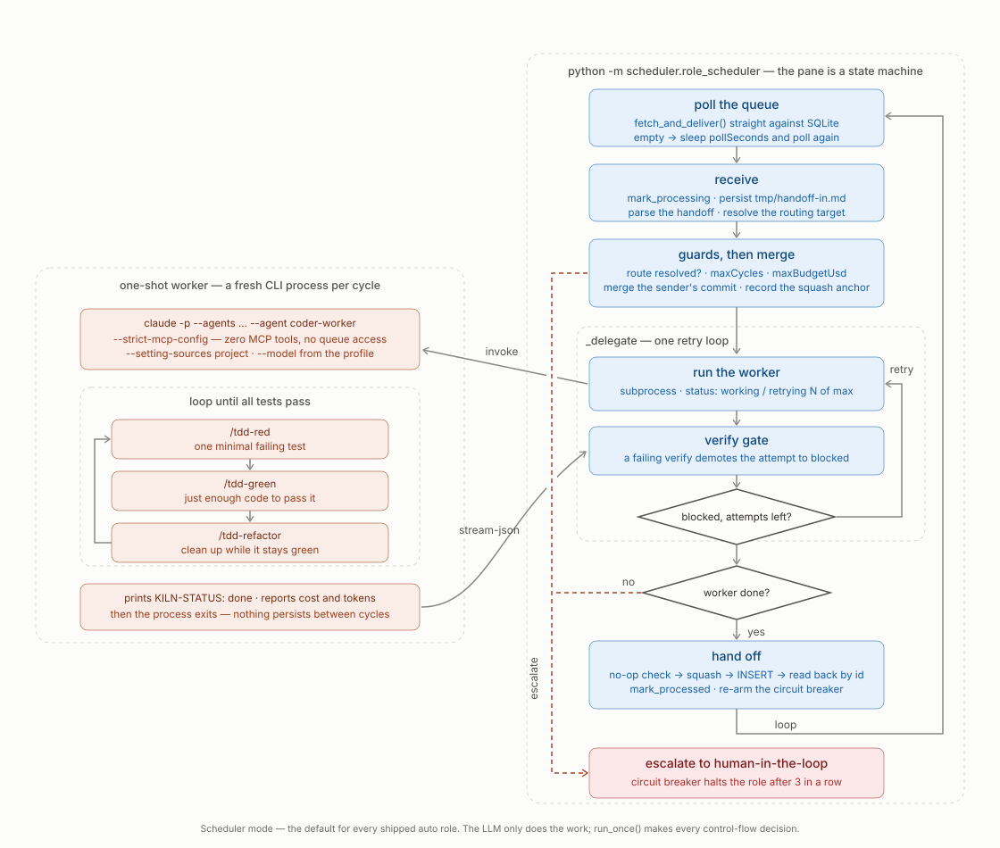
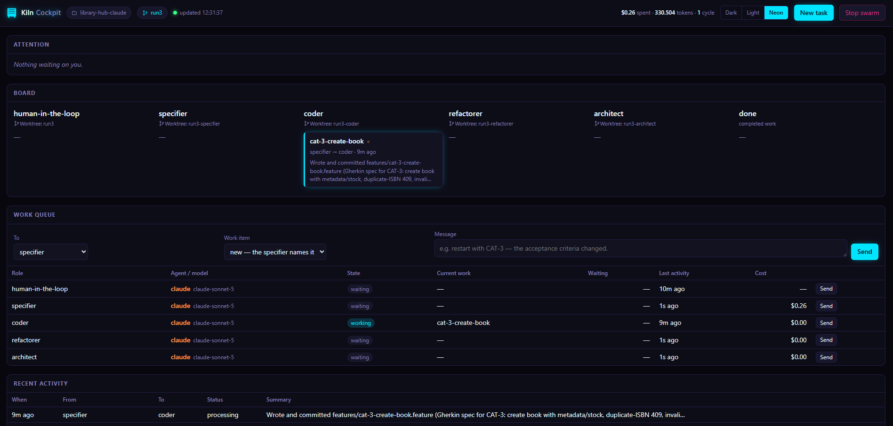

<p align="center">
  
</p>

# Kiln

Kiln runs local, role-based AI development swarms. Each autonomous role works in its own Git
worktree, receives project-specific instructions, and hands work to the next role through a
shared queue. A human-facing role starts the work, reviews results, and handles escalations.

Kiln is useful when a task benefits from explicit separation of concerns—for example,
specification, implementation, refactoring, and architectural review—and when you want those
steps to be observable and repeatable rather than managed in one long agent conversation.

## What users should know

- Kiln runs on your machine and operates directly on a Git repository.
- Agents can execute commands and modify files without interactive approval.
- Autonomous roles use separate Git worktrees and exchange structured handoffs.
- Profiles define the roles, routing, models, timeouts, and terminal layout.
- Claude, Codex, Copilot, and Grok are supported as role backends.
- The default profile is human-guided at intake and autonomous afterward.
- Failures are retried, then escalated to the human. Repeated escalation parks the role until
  you explicitly retry it.
- The dashboard and local web cockpit show role state, queues, work items, usage, and failures.

Kiln is an orchestration layer, not an AI provider. You install and authenticate the agent
CLI you intend to use.

## Requirements

- Python 3.11 or newer
- Git
- At least one supported agent CLI on `PATH`:
  - Claude Code
  - OpenAI Codex CLI
  - GitHub Copilot CLI
  - Grok CLI
- A terminal backend:
  - WezTerm is recommended on every platform
  - Windows Terminal is supported on Windows
  - tmux is supported on Linux and macOS

Wrapper-mode roles also require the MCP Python dependencies:

```bash
python -m pip install -r src/kiln/mcp_server/requirements.txt
```

Kiln warns at launch when the interpreter used by the agent CLI cannot import the required MCP
package.

## Quick start

Clone Kiln and run it in place:

```bash
git clone https://github.com/nsd0okernicke/kiln.git
cd kiln
```

### Windows

Create a project:

```powershell
.\bin\kiln.ps1 -Init -WorkingDir C:\path\to\my-project
```

Launch the default swarm:

```powershell
.\bin\kiln.ps1 -WorkingDir C:\path\to\my-project
```

### Linux and macOS

Create a project:

```bash
./bin/kiln.sh init /path/to/my-project
```

Launch the default swarm:

```bash
./bin/kiln.sh /path/to/my-project
```

Scaffolding initializes Git when necessary and creates the project constitution, roles, skills,
and runtime tools. Launching creates role worktrees, generated agent instructions, the message
queue, and terminal panes.

Before starting a real run, inspect the resolved topology without launching anything:

```bash
./bin/kiln.sh /path/to/my-project --dry-run
```

Use `.\bin\kiln.ps1` instead of `./bin/kiln.sh` in the remaining examples on Windows.

## The default workflow

The `full` profile runs this cycle:


The human-facing role gathers and confirms the request. The autonomous roles then:

1. turn the request into an implementable specification;
2. implement it;
3. improve tests, coverage, design, and mutation resistance;
4. review the result and either return it to the human or start another lap.

An inbox pane displays human-directed messages and escalations. The terminal dashboard and web
cockpit provide a swarm-wide view.

## Choosing a profile

Profiles describe the kind of work, independently of the AI backend.

| Profile | Use it for |
|---|---|
| `full` | New features that benefit from specification, implementation, hardening, and review |
| `fix` | Bugs and smaller changes; coder followed by architect review |
| `spike` | Short-lived exploration where the output is knowledge rather than production code |
| `harden` | Existing code that needs stronger tests, coverage, mutation resistance, or boundaries |
| `dry-run` | Learning the workflow with manual roles and human approval at each step |

List profiles:

```bash
./bin/kiln.sh --list-profiles
```

Launch a profile:

```bash
./bin/kiln.sh /path/to/project --profile fix
```

Run every agent-bearing role on another backend:

```bash
./bin/kiln.sh /path/to/project --profile harden --agent-override codex
```

Backend model names are not portable. An agent override therefore clears profile models unless
you explicitly provide one:

```bash
./bin/kiln.sh /path/to/project \
  --agent-override codex \
  --model-override gpt-5-codex
```

## Daily commands

### Launch

```bash
./bin/kiln.sh /path/to/project [--profile NAME]
```

Useful options:

| Option | Purpose |
|---|---|
| `--dry-run` | Print resolved commands without launching |
| `--terminal wezterm\|wt\|tmux\|none` | Select or disable terminal launching |
| `--agent-override BACKEND` | Replace every agent backend in the selected profile |
| `--model-override MODEL` | Model used with an agent override |
| `--proxy` | Enable local metadata capture for Claude and Codex traffic |
| `--capture full` | Also retain request and response bodies |
| `--verbose` | Enable detailed launcher logging |

Run `./bin/kiln.sh --help` for the complete list. PowerShell aliases such as `-WorkingDir` and
`-ProfileName` are accepted by the same Python CLI.

### Send work

Queue a new request while the swarm is running:

```bash
./bin/kiln.sh send "add pagination to GET /books" --to specifier
```

The launcher resolves the active project, branch, and message database. Use `--working-dir`
when running the command outside the project directory.

### Inspect and retry failures

List failed work:

```bash
./bin/kiln.sh retry
```

Retry an item with additional guidance:

```bash
./bin/kiln.sh retry 4f3a91c2 --guidance "the fixtures are beside the unit tests"
```

Retrying preserves the original work item, history, failure reason, and accumulated metrics.

### Stop

```bash
./bin/kiln.sh /path/to/project --stop
```

On Windows:

```powershell
.\bin\kiln.ps1 -WorkingDir C:\path\to\project -Stop
```

## Execution model

Kiln supports two agent execution modes.

### Scheduler mode

Autonomous roles normally use the deterministic Python scheduler. For each message it:

1. claims the message from SQLite;
2. merges the sender's commit;
3. invokes a one-shot worker with the role and project instructions;
4. runs the configured verification command, if any;
5. commits the role's changes;
6. sends a structured handoff to the next role.

The scheduler owns retries, timeouts, cost and cycle limits, status reporting, and escalation.
Workers cannot access the handoff queue directly.

<details>
<summary>See one scheduler cycle</summary>



</details>

### Wrapper mode

Manual roles use a persistent interactive agent session. The wrapper reads generated project
instructions and uses Kiln skills and MCP tools to receive and send work. Wrapper mode is most
appropriate for the human-facing role, where a continuing conversation is useful.

<details>
<summary>See the wrapper and delegated-worker cycle</summary>


</details>

## Git and project isolation

Kiln creates one worktree for each autonomous role under `.worktrees/`. The main project
directory is normally used by `human-in-the-loop`.

Each role receives incoming work through Git and produces a role-prefixed squash commit. Kiln
records provenance so later laps retain ancestry even though handoffs are squashed. Append-only
`logbook.md` files use Git's union merge driver.

Runtime files are stored under `.kiln/` and generated worktree files are ignored. Do not commit
`.kiln/`, `.worktrees/`, generated agent instructions, or per-role MCP configuration.

## Project files

After initialization, the important user-owned files are:

```text
my-project/
├── README.md                         # project brief
├── kiln.profiles.json                # optional project-specific profiles
└── kiln/
    └── project/
        ├── constitution.md            # instruction loading order
        ├── constitution/              # project and engineering rules
        ├── roles/                     # role responsibilities
        └── skills/                    # reusable agent workflows
```

Generated runtime state includes:

```text
.kiln/
├── messages.db                        # handoff queue and history
├── status/                            # current role state
├── logs/                              # scheduler and optional agent diagnostics
├── sessions                           # launched role inventory
├── traffic.db                         # present when proxy capture is used
└── cockpit.url                        # current local cockpit URL
```

Customize files under `kiln/project/`; Kiln copies them into role worktrees at launch.

## Profile configuration

Create `kiln.profiles.json` in the project root to replace the bundled profile set. Profile
files are JSON and are not merged with framework defaults, so copy
`src/kiln/resources/profiles.json` when you want to modify an existing profile.

Minimal example:

```json
{
  "default": "fix",
  "profiles": {
    "fix": {
      "description": "Coder followed by architecture review",
      "defaults": {
        "agent": "claude",
        "model": "claude-sonnet-5"
      },
      "terminals": [
        {
          "role": "human-in-the-loop",
          "worktree": "@current",
          "mode": "manual"
        },
        {
          "role": "coder",
          "worktree": "coder",
          "mode": "auto",
          "scheduler": "python",
          "workerTimeout": 1800
        },
        {
          "role": "architect",
          "worktree": "architect",
          "mode": "auto",
          "scheduler": "python",
          "workerTimeout": 2400
        }
      ],
      "routing": {
        "human-in-the-loop": "coder",
        "coder": "architect",
        "architect": "human-in-the-loop"
      }
    }
  }
}
```

Each handing-off role must have a valid routing target. Unknown keys, duplicate roles, missing
targets, and unsupported backend names fail at launch instead of being silently ignored.

### Role fields

| Field | Meaning |
|---|---|
| `role` | Stable role name used for routing, worktrees, status, and logs |
| `agent` | `claude`, `codex`, `copilot`, or `grok` |
| `title` | Optional display title |
| `model` | Model for the wrapper or one-shot worker |
| `workerModel` | Optional model specifically for delegated worker execution |
| `worktree` | `@current` or a name below `.worktrees/` |
| `mode` | `manual` or `auto` |
| `scheduler` | `python`, `inbox`, `dashboard`, or `cockpit`; omit for wrapper mode |
| `watches` | Role queue monitored by an inbox pane |
| `workerDebug` | Retain additional worker diagnostics |
| `verify` | Shell command that must pass before handoff |
| `verifyTimeout` | Maximum duration of verification |
| `pollInterval` | Scheduler polling interval |
| `workerTimeout` | Maximum duration of a worker invocation |
| `workerIdleTimeout` | Maximum silence before the worker is terminated; `0` disables it |
| `maxAttempts` | Worker attempts before escalation |
| `maxCycles` | Maximum visits by one work item to this role |
| `maxBudgetUsd` | Per-work-item cost cap where the backend reports cost |
| `escalationLimit` | Consecutive escalations before the role parks |
| `activityLimit` | Maximum scheduler activity before escalation |
| `bell` | Ring the terminal bell when an inbox receives work |
| `port` | Preferred cockpit port |
| `openBrowser` | Open the cockpit in a browser at launch |

Profiles may define `defaults` for repeated terminal fields. Values on a terminal entry override
the defaults.

## Dashboard and cockpit

The terminal dashboard shows:

- role state and elapsed time;
- queue depth and oldest wait;
- current work item and attempt;
- cycle, token, cache, and cost totals;
- recent handoffs and escalations;
- optional traffic-capture statistics.

The cockpit exposes the same state as a local web interface and adds actions for sending,
retrying, stopping roles, and tearing down the swarm. It binds only to `127.0.0.1` and probes
upward from its preferred port when necessary. The active URL is written to
`.kiln/cockpit.url`.



### Test health

The cockpit shows a **Test health** panel when a project describes where its test reports
live. Create `.kiln/test-metrics.json`:

```json
{
  "framework": "pytest",
  "command": "python -m pytest --junitxml={reports}/junit.xml --cov=yourpackage --cov-branch --cov-report=xml:{reports}/coverage.xml",
  "verificationRole": "architect",
  "reports": {
    "junit": "reports/junit.xml",
    "coverage": "reports/coverage.xml",
    "lint": "reports/ruff.sarif"
  },
  "maxAgeMinutes": 30
}
```

`verificationRole` makes that scheduler role run `command` after its worker succeeds and
before handoff. Use `{reports}` in the command when reports must be written to the shared
project rather than the role's worktree; Kiln creates and expands that directory portably.

Three **formats** are read, never three tools — which is what keeps the panel working in any
ecosystem:

| Key | Format | Written natively by |
| --- | --- | --- |
| `junit` | JUnit XML | pytest `--junitxml`, Maven, Gradle, Jest, Vitest, `dotnet test` |
| `coverage` | Cobertura XML | coverage.py `--cov-report=xml`, JaCoCo, Istanbul |
| `lint` | SARIF 2.1.0 | ruff, ESLint, PMD, SpotBugs, CodeQL |

"JUnit" and "Cobertura" name file formats, not the Java tools they came from; `--junitxml` is
a built-in pytest flag and coverage.py's XML is Cobertura by its own DTD reference. The same
config in a Java project differs only in paths:

```json
{
  "framework": "gradle",
  "command": "./gradlew test jacocoTestReport pmdMain",
  "reports": {
    "junit": "build/test-results/test",
    "coverage": "build/reports/jacoco/test/jacocoTestReport.xml",
    "lint": "build/reports/pmd"
  }
}
```

Two things about that pytest command are easy to get wrong: `--cov-report=xml:` writes nothing
unless `--cov=` also names a source, and branch coverage is only measured when `--cov-branch`
is passed. Write the reports somewhere durable — **not** under `.kiln/`, which is scratch state
and is wiped whenever the swarm is reset.

- Relative paths resolve from the project root. Any path may be a single file or a directory;
  a directory is summed in filename order — which is how Maven and Gradle write one file per
  test class, and how a Java build can point PMD and SpotBugs at one folder. Directory scans
  look for `*.xml` for results and coverage, `*.sarif` or `*.json` for lint; an explicitly
  named file is read whatever it is called.
- The coverage report supplies more than one number. Line coverage is shown as **coverage**;
  branch coverage is shown beside it *only when the project measured it* (coverage.py needs
  `--cov-branch`, and a tool that wrote `branches-valid="0"` is reporting a setting nobody
  switched on, not a disaster). **Statements** is the coverage tool's own count of executable
  lines — a size Kiln can state in any language precisely because it never counts them itself.
  Only the first coverage document is read: coverage is a ratio over a body of code, and
  summing two of them produces a number that is not the coverage of anything.
- Lint counts are grouped by SARIF severity, resolved the way the spec requires: the result's
  own `level`, then its rule's `defaultConfiguration.level`, then `warning`. Results marked
  `kind` other than `fail` — CodeQL's `pass` rows, for instance — are not counted as findings.
  The analyser names itself in the document, so the panel says "(ruff)" or "(PMD)" without
  either name appearing anywhere in Kiln.
- `command` is recorded for other workflows and is **never run by the cockpit**. The panel
  reads reports on the existing poll; producing them belongs to CI, a scheduler `verify` step,
  or you. A monitoring surface that shelled out to a build tool every two seconds would be a
  fault, not a feature.
- A report older than `maxAgeMinutes` (default 30) reads as **stale** rather than passed,
  because a green run from an hour ago describes code that has since moved on. Staleness is
  judged on the *oldest* configured report, so a coverage file rewritten a minute ago cannot
  disguise a JUnit report from yesterday; the displayed age is the most recent refresh.
- Missing, unreadable or malformed reports show an explanation in the panel. They are served
  by their own `GET /api/test-metrics`, so a broken report can never take `/api/state` — or
  the swarm — down with it.
- Metrics that are not configured stay unknown rather than being shown as zero: "no coverage
  configured" and "nothing is covered" must not look alike.

Without the file the panel names the path and says to create one. Two consequences of living
in `.kiln/` are worth knowing up front: the directory is gitignored — and the launcher re-adds
that rule on every start — so this file cannot be committed or shared through a clone, and a
teardown that clears `.kiln/` takes it with them. It is written by hand, and rewritten by hand
after a reset. Nothing creates it for you: `kiln init` cannot know your package name, test
layout or ecosystem, and a guessed config would replace a clear "not configured" with a
confusing "no report found at &lt;wrong path&gt;".

## Traffic capture

Traffic capture is off by default. Enable metadata capture with:

```bash
./bin/kiln.sh /path/to/project --proxy
```

Metadata mode records timing, sizes, model names, token usage, and per-request composition.
It does not retain prompt or response text.

Full capture is a separate opt-in:

```bash
./bin/kiln.sh /path/to/project --proxy --capture full
```

Full request bodies can contain source code, prompts, and model output. Treat `.kiln/traffic.db`
as sensitive. Credential, cookie, and stable account/session identifier values are redacted
before storage. Capture currently routes Claude and Codex roles; other backends continue
normally but do not appear in traffic statistics.

## Safety

Kiln is designed for autonomous execution and launches agents with broad permissions:

- Claude workers use bypassed permission prompts.
- Codex workers bypass approvals and the sandbox.
- Copilot workers allow tool execution and file access.
- Grok scheduler workers auto-approve tools.

Agents can run arbitrary commands available to your user account. Git worktrees separate role
branches, but they are not a security sandbox and do not prevent access outside the repository.

Recommended precautions:

- use a disposable or dedicated development directory;
- keep secrets and production credentials out of the project;
- review commits before pushing or merging them;
- run untrusted projects inside a VM or container;
- start required external services, such as a container engine, before launching agents that
  depend on them.

## Troubleshooting

### Nothing launches

Run a dry launch and verbose diagnostics:

```bash
./bin/kiln.sh /path/to/project --dry-run --verbose
```

Confirm Python, Git, the configured agent CLI, and the selected terminal are on `PATH`.

### A wrapper cannot receive messages

Install the MCP requirements into the interpreter resolved by the agent CLI. Kiln prints the
interpreter and install command when its startup probe fails.

### A role is blocked or halted

Inspect the dashboard, `.kiln/logs/`, and the failed-message list:

```bash
./bin/kiln.sh retry
```

Then retry with guidance. A halted scheduler remains alive specifically so it can receive that
retry.

### A worker appears stuck

Workers have total and idle timeouts. When a timeout fires, Kiln terminates the worker process
tree, records the failure, and follows the normal retry/escalation policy. Increase
`workerTimeout` only when the role's legitimate toolchain needs more time.

### Worktrees conflict

Kiln warns about stale worktrees before launch and automatically handles its own generated
files. Conflicts in project files still require ordinary Git resolution. Stop the swarm before
manual worktree surgery.

### Status or cockpit data looks stale

Check `.kiln/status/`, `.kiln/sessions`, and `.kiln/cockpit.url`. Restarting Kiln repairs
generated configuration and recovers messages left in `processing` by an interrupted cycle.

## Development

Install development dependencies:

```bash
python -m pip install -e ".[dev]"
```

Run the test and quality gates:

```bash
python -m pytest
ruff format --check src tests tools
ruff check src tests tools
pyright
python tools/quality_metrics.py --tier deterministic
```

The implementation lives under `src/kiln/` and follows domain/application/infrastructure
boundaries. Tests are split into unit, property, integration, system, and opt-in live tiers.

## Current limitations

- Kiln has been exercised primarily with small swarms; behavior at substantially larger role
  counts is not established.
- Copilot non-interactive workers can lose tool approval during long sessions due to an
  upstream CLI issue. Avoid Copilot for long scheduler-mode work until that behavior is fixed.
- Traffic capture supports Claude and Codex only.
- Grok wrapper mode is less extensively validated than its scheduler adapter.
- Linux/macOS share the Python core with Windows, but authenticated live-agent coverage varies
  by backend and environment.
- Windows symlink creation may require Developer Mode or elevation. Kiln falls back to copies,
  which reduces sharing between worktrees.

## License and status

Kiln is under active development. Treat profile formats and backend integrations as evolving
interfaces, pin a known working revision for important projects, and review release changes
before upgrading an active swarm.
