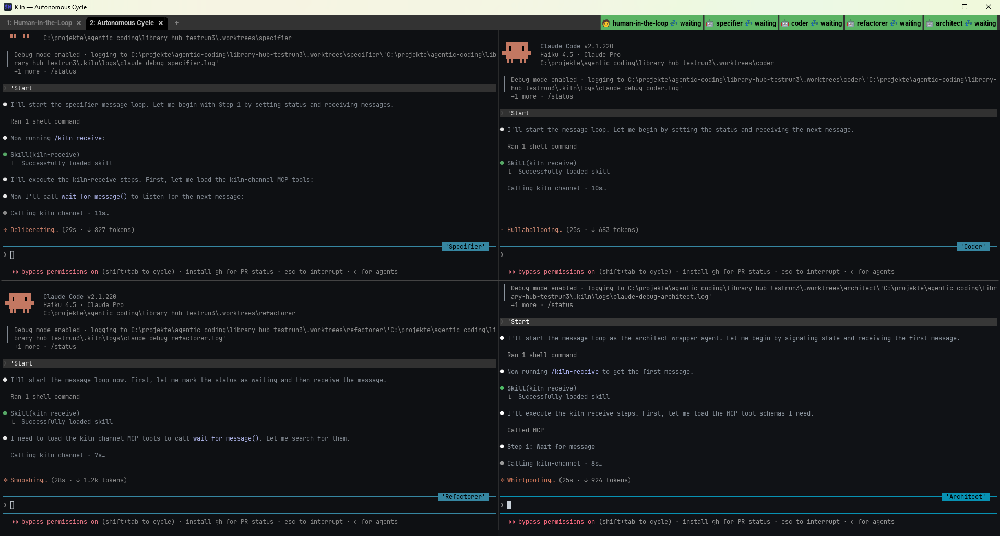
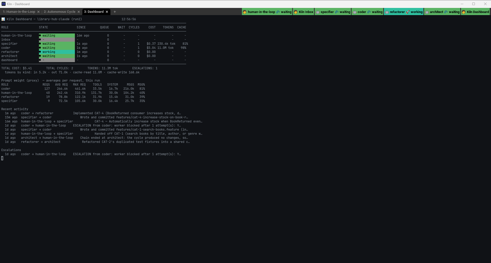

<p align="center">
  
</p>

# Kiln

**An orchestration platform that turns swarms of AI agents into reliable, professional software engineers.**

Kiln launches a config-driven multi-agent swarm, each agent working in its own git worktree with role-specific instructions and cross-agent communication. It is Git-aware: sub-branches are created per worktree, all state lives in `.kiln/`, and handoffs are tracked in `logbook.md`.

**Kiln is a Python application.** `bin/kiln.ps1` and `bin/kiln.sh` are thin shims that put `kiln/framework/` on `PYTHONPATH` and hand off to `python -m launcher.cli`; every platform runs the same code. Terminals are backend-specific (WezTerm, Windows Terminal, tmux), but nothing else is.

---

## Quick Start

The fastest way to get a working Kiln project: run the install script.

### 1. Create a New Project

**Windows (PowerShell):**
```powershell
.\bin\kiln.ps1 -Init -WorkingDir C:\path\to\my-project
cd C:\path\to\my-project
```

**Unix/macOS:**
```bash
./bin/kiln.sh init /path/to/my-project
cd /path/to/my-project
```

This scaffolds a complete Kiln project with configuration, role files, and git initialization.
(`-Init`/`init` used to be a separate `kiln-init.ps1`/`kiln-init.sh` script — that's now folded
into the main entrypoint, and the old scripts have been removed.)

### 2. (Optional) Use an Example

Include an example project brief by adding the `-Example` flag with any directory name under
`examples/` (e.g. `library-hub`, `library-hub-java`, `battlezone`):

**Windows:**
```powershell
.\bin\kiln.ps1 -Init -WorkingDir C:\path\to\library-hub -Example library-hub
```

**Unix/macOS:**
```bash
./bin/kiln.sh init /path/to/library-hub --example library-hub
```

This copies `examples/<name>/README.md` as the project brief, plus any files the example ships
under `examples/<name>/kiln/project/constitution/` (e.g. a Java-specific `project.md`/
`engineering.md`) over the scaffolded defaults — see **Examples** below for the full list.

### 3. Launch the Swarm

**Windows:**
```powershell
.\bin\kiln.ps1 -WorkingDir .
```

**Unix/macOS:**
```bash
./bin/kiln.sh .
```

That's it. Kiln will create git worktrees, generate role files, and launch agents in your configured terminal.

See **"Running Kiln"** below for more options and customization.

---

## What Kiln Does

Kiln is a lightweight orchestration layer that:

- Launches a **config-driven swarm** — specify each agent's role, AI tool/backend (claude/copilot/codex, `grok` configurable but not yet functional — see Known Limitations), and workspace (main directory or isolated worktree)
  - Uses framework defaults from `kiln/framework/profiles.json`
  - Projects can override by creating `kiln.profiles.json` at the root
  - Flexible terminal layouts: tabs, split panes, grids, or custom hierarchical arrangements
- Creates one **terminal window/tab per role** — observe all agents in real time
  - WezTerm (recommended, every platform) — full feature set: live tab-bar status badges,
    split-pane/grid layouts, the inbox-pane strip
  - Windows Terminal or tmux — basic fallback: launches the same swarm, but with no live
    status badge and no split-pane/grid layout support
- Reads role behavior from `kiln/project/roles/<role>.md` files and a layered `kiln/project/constitution/` (workflow, engineering, project)
- Creates one **git worktree per agent** (except those using `@current`) under `.worktrees/` so agents don't collide — agents using `@current` work in the project root on the current branch
- Supports per-role **agent backends**: `claude`, `copilot`, `codex`, or `grok` — configure via `agent` field in profiles
- Creates **inter-agent messaging** via SQLite at `.kiln/messages.db` with full message lifecycle tracking, exposed through two MCP servers:
  - **`kiln-db`** — SQL read/write for sending handoffs (`query`)
  - **`kiln-channel`** — blocking `wait_for_message()` tool that each agent calls to receive its next handoff; the channel polls the database and returns as soon as a message arrives, already marked `delivered`. Also provides `mark_processing()` and `mark_processed()` to transition messages through their full lifecycle
  - **Message lifecycle**: `queued` (created) → `delivered` (retrieved by agent) → `processing` (work started) → `processed` (handoff sent)
- Keeps all swarm state in `.kiln/` (logs, sessions, message database) — gitignored and ephemeral



*The default profile in WezTerm — one tab for the human-facing intake role, one tab with the autonomous four-role cycle running as a grid.*

### Project Structure Created by `bin/kiln.ps1 -Init` / `bin/kiln.sh init`

When you run init, it scaffolds a new Kiln project with:

```text
my-project/
├── kiln/                         # Kiln configuration (version-controlled)
│   └── project/                  # Everything here is yours to customize — see kiln/project/README.md
│       ├── constitution.md
│       ├── constitution/
│       │   ├── workflow.md           # Handoff protocol
│       │   ├── engineering.md        # Engineering practices & quality standards
│       │   └── project.md            # Project-specific rules (language, architecture, constraints)
│       ├── roles/                    # Role definitions for your agents
│       │   ├── specifier.md
│       │   ├── coder.md
│       │   ├── refactorer.md
│       │   ├── architect.md
│       │   └── ...
│       └── skills/                   # Optional: custom agent skills
├── .kiln/                        # Runtime state (ephemeral, gitignored)
│   ├── messages.db              # SQLite message queue
│   ├── logs/                    # Agent logs
│   ├── status/                  # Live per-role state (<role>.json), read by the WezTerm status bar
│   └── ...
├── .worktrees/                   # Git worktrees (gitignored)
│   ├── coder/
│   ├── refactorer/
│   ├── architect/
│   └── ...
├── .claude/                      # Claude Code configuration
│   ├── settings.json             # MCP and permission settings
│   └── .gitignore
├── .mcp.json                     # MCP server configuration (kiln-db + kiln-channel, for Claude agents)
├── .gitignore                    # Git exclusions
└── README.md                     # Project brief (optional, from example)
```

**Key points:**
- `kiln/project/` is version-controlled (constitution, roles, skills) — customize freely, this is your project's own copy
- `.kiln/` and `.worktrees/` are runtime/ephemeral (gitignored)
- Profiles are inherited from the framework; create `kiln.profiles.json` at the root to override

---

## Platform Support

One Python implementation runs on every platform. The shell scripts are shims — they locate
the framework, set `PYTHONPATH`, and forward their arguments to `python -m launcher.cli`
unchanged. There is no second implementation to fall behind.

**Shared requirements (all platforms):**

- Python 3.11+ — the launcher, the scheduler and the MCP servers are all Python
- Git
- One or more agent CLIs (Claude Code, GitHub Copilot, Codex) depending on configured agents
- `pip install -r kiln/framework/mcp-server/requirements.txt` if you use wrapper-mode roles
  (the `kiln-db` / `kiln-channel` MCP servers). Scheduler-mode roles need no MCP server.

### Windows

```powershell
.\bin\kiln.ps1 -WorkingDir "C:\path\to\project"
```

- PowerShell 7+ (included with Windows 11) — only to run the shim
- WezTerm (recommended, full feature set) or Windows Terminal (basic fallback — see
  "Terminal Behavior" below for exactly what it's missing)

### Unix/Linux/macOS

```sh
./bin/kiln.sh /path/to/project
```

- Any POSIX shell — the shim is `#!/usr/bin/env bash`; zsh is no longer required
- WezTerm (recommended, full feature set — WezTerm is cross-platform, so Linux/macOS get the
  exact same tab-bar badges and layout support Windows does) or tmux (basic fallback — one
  detached session per role, no split-pane/grid layouts, no live status badge)

**Terminal selection (both platforms):** `--terminal wezterm | wt | tmux | none`, or set
`KILN_TERMINAL`. Omit it and Kiln auto-detects, preferring WezTerm over the platform's
built-in fallback (Windows Terminal on Windows, tmux on Unix/Linux/macOS) whenever `wezterm`
is on `PATH` — see "Terminal Behavior" below. `none` prints the commands without launching
anything, which pairs well with `--dry-run`.

---

## Framework Structure

The Kiln repository is organized for clarity and maintainability:

```text
kiln/
├── bin/                          # Entry points
│   ├── kiln.ps1                  # Windows shim -> python -m launcher.cli
│   ├── kiln.sh                   # Unix shim -> python -m launcher.cli
│   ├── kiln-cleanup.ps1          # Full project reset (Windows only — see Cleanup)
│   ├── clear-messages.ps1 / .sh  # Empty the message queue (testing utility)
│   └── kiln-db.ps1               # Inspect/manage messages.db (Windows only)
│
├── kiln/
│   ├── project/                  # Copied into every new project's kiln/project/ — customize freely
│   │   ├── constitution.md
│   │   ├── constitution/         # Shared constitution rules
│   │   │   ├── workflow.md           # Handoff protocol + the Handoff Routing table
│   │   │   ├── engineering.md        # Engineering practices & quality standards
│   │   │   └── project.md            # Project rules starter template
│   │   ├── roles/                    # Role prompts
│   │   └── skills/                   # Agent skills (optional)
│   │
│   └── framework/                # Never copied — read directly from this install
│       ├── launcher/                 # The launcher. Everything bin/ used to do.
│       │   ├── cli.py                    # Argument parsing and the launch sequence
│       │   ├── config.py                 # Profile loading, inheritance, validation
│       │   ├── paths.py                  # Every path Kiln touches, in one place
│       │   ├── commands.py               # The command injected into each pane
│       │   ├── generate.py               # CLAUDE.md / AGENTS.md / .mcp.json / worker files
│       │   ├── workspace.py              # gitignore, hooks, worktrees, skills
│       │   ├── scaffold.py               # `init` project scaffolding
│       │   ├── stop.py                   # `--stop` process teardown
│       │   └── terminals/                # One module per backend
│       │       ├── wezterm.py                # Generates the Lua config; WezTerm builds the panes
│       │       ├── windows_terminal.py       # Builds `wt.exe` argument lists
│       │       └── tmux.py                   # new-session / send-keys
│       │
│       ├── scheduler/                # The deterministic role loop (see "Scheduler Mode")
│       │   ├── role_scheduler.py         # One cycle = run_once(); main() is the only loop
│       │   ├── db.py                     # Every message-queue SQL statement
│       │   ├── routing.py                # Parses the Handoff Routing table
│       │   ├── handoff.py                # Handoff message format
│       │   ├── status_contract.py        # The KILN-STATUS: done|blocked contract
│       │   ├── worker_prompt.py          # Builds the one-shot worker invocation
│       │   ├── git_ops.py                # Merge, squash-to-anchor, local excludes
│       │   ├── pane_status.py            # The pinned status bar in each pane
│       │   ├── inbox.py                  # The human's notification pane (`kiln inbox`)
│       │   ├── dashboard.py              # Swarm-wide live view (`"scheduler": "dashboard"`)
│       │   ├── send.py                   # Queue a handoff from the CLI (`kiln send`)
│       │   └── adapters/claude_adapter.py  # One-shot `claude -p` invocation
│       │
│       ├── profiles.json             # Default configuration profiles
│       ├── templates/                # Loop/runtime templates for wrapper-mode roles
│       ├── mcp-server/               # kiln-channel: blocking wait_for_message() receiver
│       └── tools/                    # set-status.py — re-seeded into .kiln/tools/ every launch
│
├── examples/                     # Example project briefs
├── tests/                        # pytest suite for launcher/ and scheduler/
└── docs/                         # Documentation & assets
```

**`bin/`** holds entry points. The two `kiln` scripts are shims with no logic in them; the rest are standalone utilities that were never part of the launcher. **`kiln/framework/launcher/` and `kiln/framework/scheduler/`** are the actual implementation. **`kiln/project/`** is copied to new projects during scaffolding and is meant to be customized. **`kiln/framework/`** is never copied — it's read directly from this install at launch time, so edits there affect every project using this install.

> The pre-port implementation lived in `lib/` as parallel PowerShell and shell trees
> (`profile-loader.{ps1,sh}`, `terminal-adapter.sh`, `terminal-adapters/*`). Those are deleted;
> they are in git history if you need to compare behaviour.

---

## Core Features

- **Config-Driven Topology** — The swarm shape comes from `kiln/framework/profiles.json`, not hardcoded variables.
- **Flexible Terminal Layouts** — Define custom tab and pane arrangements in your profile: simple tabs, split panes, 2×2 grids, hierarchical trees, or focus layouts (e.g., 1 full tab + 3-way split below).
- **Role Injection** — Constitution (`workflow.md`, `engineering.md`, `project.md`) and role instructions (`roles/<role>.md`) are merged into each agent's instruction file (`CLAUDE.md` or `.github/copilot-instructions.md`), giving full context immediately.
- **Project-Local Constitution** — Customize architecture, tech stack, and quality gates via `kiln/project/constitution/project.md`.
- **Layered Rules** — `kiln/project/constitution/` contains `workflow.md` (handoffs), `engineering.md` (tools/practices), and `project.md` (arch/quality) — all applied to every agent.
- **Backend Selection Per Role** — Each role can launch `claude`, `copilot`, `codex`, or `grok` via the `agent` field in profiles.
- **Two Execution Modes Per Role** — a role's cycle is driven either by an LLM following prose (**wrapper mode**) or by a Python state machine (**scheduler mode**). See below.
- **Observable Swarm** — Watch all agents in one window. Each scheduler pane carries a colour-coded status bar pinned to its bottom row, and on WezTerm a live status badge per role appears in the tab bar regardless of which tab or pane is focused.
- **Cross-Platform** — One Python implementation on Windows, macOS and Linux. Only terminal backends differ.

---

## Execution Modes: Wrapper vs Scheduler

Every `auto`-mode role runs a receive → merge → work → squash → hand-off cycle. Kiln can drive
that cycle two ways, chosen per role with the `scheduler` field in a profile.

### Wrapper mode (default)

A persistent LLM session sits in the pane and follows the loop written in
`kiln/framework/templates/loop-auto-<agent>.md`. It reaches the message queue through two MCP
servers (`kiln-db` for SQL, `kiln-channel` for a blocking `wait_for_message()`), decides when a
turn is finished, and delegates the actual work to a disposable worker subagent.

Works with `claude`, `copilot` and `codex`. The mechanics are prose, so the model can
misread them — a turn that ends early, a merge step that gets skipped.

### Scheduler mode (`"scheduler": "python"`)

A Python process owns the pane instead. It polls SQLite directly, merges, invokes the agent CLI
**once per handoff** as a subprocess, reads the result, squashes and inserts the next handoff —
then loops. The LLM only does the work; it makes none of the control-flow decisions.

```jsonc
{ "role": "coder", "agent": "claude", "worktree": "coder",
  "mode": "auto", "model": "claude-sonnet-5",
  "scheduler": "python" }        // <- this line is the whole opt-in
```

What changes when a role is scheduled:

| | Wrapper mode | Scheduler mode |
| --- | --- | --- |
| Pane runs | a persistent LLM session | `python -m scheduler.role_scheduler` |
| Loop control | prose in a loop template | `role_scheduler.run_once()` |
| Queue access | `kiln-db` + `kiln-channel` MCP | direct SQLite |
| Turn is done when | the model decides | the worker prints `KILN-STATUS: done` |
| Routing target | model reads the routing table | `routing.py` resolves it |
| Retry / escalation | model judgement | one retry, then escalate to `human-in-the-loop` |
| MCP servers needed | yes | **no** |
| Generated `CLAUDE.md` | yes | **no** — deleted if a role switches over |

The contract between them is a sentinel. A worker's last line must be:

```text
KILN-STATUS: done <one-line summary>
KILN-STATUS: blocked <what stopped it>
```

Anything missing or malformed counts as `blocked`, so a confused worker escalates rather than
silently reporting success.

**Trade-offs.** The scheduler cannot get bored, skip a merge, or forget to hand off, and its
whole cycle is unit-testable without an LLM. But each invocation is one-shot: the worker starts
fresh every handoff with no memory of the last one, so anything it must remember has to be in
the handoff, the repo, or the constitution. Currently `claude` only — `copilot` and `codex`
adapters are not written yet, and those roles stay in wrapper mode.

### Inbox mode (`"scheduler": "inbox"`)

A third kind of pane, and the human's half of the same idea. It runs `scheduler.inbox`: it
watches another role's queue, prints each arriving message, marks it processed and rings the
terminal bell. No agent, no worktree, no generated instructions, no MCP.

```jsonc
{ "role": "inbox", "worktree": "@current", "title": "Kiln Inbox",
  "mode": "manual", "scheduler": "inbox",
  "watches": "human-in-the-loop" }    // whose queue to show
```

It exists because a single LLM session cannot be both a listener and an entry point. The
wrapper `human-in-the-loop` role blocks in `wait_for_message()`, which polls `while True:` with
**no timeout** — so a session that is listening is not available to type into, and a session
talking to you is not listening. Escalations landed in neither state and simply sat in the
queue. Splitting the two jobs is what fixes it: the inbox listens, your Claude session talks.

The outbound half is the `send` command, which inserts a handoff directly with no MCP and no
LLM in the path — so you can start or unblock a cycle even when the agents are what is broken:

```powershell
.\bin\kiln.ps1 send --to specifier "Add CAT-4: search the catalog by author."
.\bin\kiln.ps1 inbox        # or run the watcher yourself, outside a swarm
```

Both resolve the queue path and current branch from the project. Branch matters more than it
looks — messages are branch-scoped, so an inbox on the wrong branch is indistinguishable from
an empty one.

### Dashboard mode (`"scheduler": "dashboard"`)

A fourth kind of pane, and the swarm-wide counterpart to the inbox's one-role view. It runs
`scheduler.dashboard`: a `top`-style live view that aggregates every role at once instead of
watching one — no agent, no worktree, no generated instructions, no MCP, same "no agent" shape
as `inbox`.

```jsonc
{ "role": "dashboard", "worktree": "@current", "title": "Kiln Dashboard",
  "mode": "manual", "scheduler": "dashboard" }
```

Each poll (every 2s by default, `--poll-interval` to change it) it clears the pane and redraws
a full frame — unlike the inbox and the pane status bar, which deliberately preserve
scrollback, there is nothing here worth scrolling back through:

```text
Kiln Dashboard — library-hub-testrun5 (run1)                    17:42:11
──────────────────────────────────────────────────────────────────────
ROLE                 STATE            SINCE      QUEUE  CYCLES     COST
human-in-the-loop    ● waiting        2m ago         0       -       -
specifier            ● working       12s ago         1       4   $0.82
coder                ● working        3s ago         2       7   $3.41
refactorer           ● idle           1m ago         0       5   $1.15
architect            ● idle           4m ago         0       3   $0.94
──────────────────────────────────────────────────────────────────────
TOTAL COST: $6.32        TOTAL CYCLES: 19        ESCALATIONS: 1

Recent activity
  17:41:58  coder → refactorer            [Coder] Implement CAT-3 endpoint
  17:40:12  specifier → coder             [Specifier] Wrote acceptance criteria
  17:38:44  human-in-the-loop → specifier Approved request for CAT-3

Escalations
  (none in the recent window)
```

State per role comes from `.kiln/sessions` (the static role inventory) joined with each
role's `.kiln/status/<role>.json`; queue depth and recent activity come straight from
`messages.db`. Cost and cycles are only shown for roles that report them — scheduler roles
do (see "Pane Status Bar" below for where those numbers come from), wrapper roles don't track
either today, so their cells read `-` rather than a misleading `$0.00`.

Run it standalone against any project with `python -m scheduler.dashboard --once ...` (see
`--help` for the required paths), or just launch a profile that includes it.

**Try it:** the shipped `scheduler-all` profile runs all four `auto` roles on the scheduler,
keeps `human-in-the-loop` as an interactive session, puts an inbox strip beneath it in the same
tab, and gives the dashboard its own dedicated tab. `scheduler-coder` schedules only the coder
and has no dashboard pane.

```powershell
.\bin\kiln.ps1 -WorkingDir . -Profile scheduler-all
```

Each scheduled pane opens with a configuration banner (role, branch, resolved worker and model,
**resolved routing**, worktree, queue, timeouts, log path), then narrates every cycle. Per-role
logs are written to `.kiln/logs/scheduler-<role>.log` so a crashed scheduler still leaves
evidence after its pane is gone.

---

## Constitution and Roles

The recommended project layout is:

```text
kiln/
  project/
    roles/
      architect.md             # Architect role (design review, approval)
      coder.md                 # Coder role (TDD implementation)
      refactorer.md            # Refactorer role (quality gates, refactoring)
      specifier.md             # Specifier role (Gherkin acceptance tests)
      reviewer.md              # Reviewer role (batch review alternative to refactorer)
      human-in-the-loop.md    # Human-in-the-loop role (human-facing intake and approval checkpoint)
    constitution/
      workflow.md              # Handoff protocol, branch discipline, queue format
      engineering.md           # Language, tools, dependencies, practices
      project.md               # Project-specific architecture, tech stack, quality gates

# Optional: Override default profiles (framework uses kiln/framework/profiles.json)
kiln.profiles.json           # Project-specific profiles (optional, at root)
```

**Note:** Configuration profiles are inherited from the framework default (`kiln/framework/profiles.json`). Projects can optionally override by creating `kiln.profiles.json` at the project root if they need custom profile definitions.

### Profile Loading

Configuration profiles define which agents run, which roles they take, and where they work. Kiln searches these locations in order and uses the **first file that exists**:

1. **Project root** (`kiln.profiles.json`) — Project-level overrides
2. **Project config** (`kiln/profiles.json`) — Searched, but scaffolding never creates it. Not to be confused with `kiln/project/`, the customizable constitution/roles/skills bucket
3. **Project state** (`.kiln/profiles.json`) — Searched, but scaffolding never creates it
4. **Framework** (`kiln/framework/profiles.json`) — Default profiles for all projects
5. **User home** (`~/.kiln/profiles.json`) — User-level defaults (optional)
6. **System** — `/etc/kiln/profiles.json` on Unix, `C:\ProgramData\kiln\profiles.json` on Windows (optional)

The first file that exists wins outright; profiles are **not** merged across locations.
Locations 2 and 3 were previously documented as "Not used" — they are genuinely searched, so a
file dropped there *will* override the framework defaults.

By default, **all projects use the framework's `kiln/framework/profiles.json`**, which defines the standard 4-agent workflow (specifier, coder, refactorer, architect). This means new projects work immediately without configuration.

**To customize profiles for a specific project**, create `kiln.profiles.json` at the project root.

> ⚠️ That file **replaces** the framework's profile set rather than extending it. There is no
> `extends` mechanism: once `kiln.profiles.json` exists, `default`, `compact`, `scheduler-all`
> and the rest are no longer available unless you copy the ones you want into it. Start by
> copying `kiln/framework/profiles.json` and editing, rather than writing a file with a single
> profile in it.

### Layered Constitution

- **`constitution/workflow.md`** — Defines handoff protocol, git worktree discipline, and cross-agent communication rules.
- **`constitution/engineering.md`** — Specifies language, build tools, test frameworks, quality tools, and coding practices.
- **`constitution/project.md`** — Project-specific rules: language, architecture constraints, quality thresholds. Initialized from the framework starter template; fill in or extend for your project. Example projects keep detailed technical rules in their `README.md` as the project brief, and can also ship their own `project.md`/`engineering.md` under `examples/<name>/kiln/project/constitution/` — `-Example <name>` copies those over the scaffolded defaults (e.g. `library-hub-java` overrides both to point at its Maven/Spring toolchain instead of the framework's Python defaults).

**Agent Instruction Assembly:** Constitution and role instructions are **always combined** at startup:

- Constitution files (`workflow.md`, `engineering.md`, `project.md`) provide shared rules and context for all agents
- Role file (`roles/<role>.md`) provides role-specific instructions and behavior
- Both are merged into each agent's generated instruction file:
  - **Claude agents**: `CLAUDE.md` in the worktree root
  - **Copilot agents**: `.github/copilot-instructions.md` in the worktree root
  - **Codex agents**: `AGENTS.md` in the worktree root — Codex CLI's own project-instructions convention (confirmed against the installed binary's string table)
  - **Grok**: not yet supported — see Known Limitations

This ensures every agent operates with full constitutional context plus its specific role directives.

**Worker Subagent Assembly (`auto`-mode roles):** each of these agents is a thin, persistent **wrapper** — it only listens, merges, commits, and hands off. The actual role work is delegated each cycle to a disposable **worker**, built from the role file (`roles/<role>.md`) plus the `engineering.md` and `project.md` constitution — **not** `workflow.md`, since handoff/messaging protocol stays the wrapper's concern, not the worker's.

Concretely, here's what that looks like for the coder — the wrapper receives and merges the handoff, delegates to a fresh `coder-worker` subagent that runs the actual red → green → refactor TDD cycle, then hands the result onward:


*The wrapper half (right) is identical for every role; only the worker's inner loop (left) changes — a refactorer-worker would run coverage → CRAP → mutation gates instead of TDD.*

The dispatch mechanism differs per backend:

- **Claude**: worker defined in a generated `.claude/agents/<role>-worker.md`, dispatched via Claude Code's `Agent` tool (blocking, deterministic — the wrapper explicitly invokes `subagent_type: "<role>-worker"`). No access to the `Agent` tool itself (no recursive subagent spawning) and no MCP messaging tools — it can only read/write/edit/test in its worktree. Its full working transcript never enters the wrapper's own context — only its final report does, which is what keeps the wrapper's context small and repetitive cycle over cycle, rather than filling up with the noise of the actual implementation work.
- **Copilot**: worker defined in a generated `.github/agents/<role>-worker.agent.md` (GitHub Copilot CLI's custom-agent format), dispatched by prose instruction — the wrapper's loop template tells it to delegate to the named custom agent, and Copilot CLI's own harness resolves that to a subagent call with its own isolated context window. `tools:` is scoped to `read, write, shell` — no MCP server names listed, so it has no messaging access, mirroring the Claude worker's isolation. Unlike Claude's `Agent` tool, this delegation is the model's own judgment call rather than a guaranteed deterministic invocation — GitHub has tuned Copilot CLI to be more selective about delegating on its own, so the wrapper prompt explicitly instructs it to always delegate even when it judges it could finish faster itself.
- **Codex**: worker defined in a generated `.codex/agents/<role>-worker.toml` (Codex CLI's own project-scoped custom-agent format — required fields `name`, `description`, `developer_instructions`; confirmed against official docs at `developers.openai.com/codex/subagents`), dispatched via Codex's built-in multi-agent spawn tools (`spawn_agent`/`assign_agent_task`/`wait_agent`/`close_agent` — the `multi_agent` feature, stable and enabled by default, confirmed directly against a live `codex.exe` install). `mcp_servers = {}` in the worker's TOML excludes messaging access, mirroring the Claude/Copilot worker's isolation.

### Default Workflow

The default four-agent workflow runs in a continuous loop. Each Claude wrapper agent's generated `CLAUDE.md` combines a role file with a **loop template** that drives the cycle through two skills — `/kiln-receive` and `/kiln-handoff` (`kiln/project/skills/kiln-receive`, `kiln/project/skills/kiln-handoff`) — plus a delegated dispatch to that role's worker subagent in between:

1. **`/kiln-receive`** — calls `wait_for_message()` via the `kiln-channel` MCP server (blocks until a handoff arrives), persists the message to `tmp/handoff-in.md` (survives auto-compact), merges the sender's commit (`git merge <commit>`), and logs a `[RECEIVED]` entry to `logbook.md`
2. **Delegate the work** — the wrapper does not implement anything itself. It invokes the `Agent` tool (`subagent_type: "<role>-worker"`, blocking) with the handoff content and current branch/worktree; the worker subagent does the actual role-specific task (see below) and reports back what it did. `specifier` still additionally requires explicit user approval before continuing — it runs in `manual` mode and is not yet part of this delegation pattern (see Known Limitations).
3. **Retry or escalate on failure** — if the worker reports it couldn't finish, the wrapper re-dispatches it once more with the failure as feedback; a second failure escalates to a handoff that reports the blocker instead of silently stalling.
4. **`/kiln-handoff`** — logs a `[SENT]` entry, squashes work commits into one, `INSERT`s the handoff into `.kiln/messages.db` via `query`, then reads it back to verify the row landed — retrying the INSERT if it didn't
5. **Immediately return to step 1, in the same turn** — a sent and verified handoff is not the end of the cycle; the loop template is explicit that the turn isn't over until `/kiln-receive` has run again (this closes a stall we found in live testing, where an agent would finish a verified handoff and simply stop instead of waiting for the next message)

**Copilot follows the same shape** (receive → delegate → retry-once-on-failure → handoff → loop again in the same turn) but via its own inline polling loop (`loop-auto-copilot.md`) rather than the `/kiln-receive`/`/kiln-handoff` skills — it polls `messages` directly via SQL (`query`), since Copilot has no blocking `kiln-channel` MCP tool, and squashes/logs the same way inline rather than through a shared skill file.

**Codex follows the same shape too** (`loop-auto-codex.md`) — but unlike Copilot, it uses the same `/kiln-receive`/`/kiln-handoff` skills as Claude (Codex CLI supports skill-style slash commands), just delegating to the `<role>-worker` custom agent via Codex's built-in multi-agent spawn tools (`spawn_agent`/`assign_agent_task`/`wait_agent`/`close_agent`) instead of Claude Code's `Agent` tool, and retrying once on failure the same way. `manual` mode is also available for Codex (e.g. for a human-supervised role like `specifier`) using `loop-manual-codex.md`, same as any other backend.

The cycle flows: **specifier → coder → refactorer → architect → specifier**

- **`specifier`** — runs in **manual** mode: at startup, asks the user what feature to specify, writes Gherkin acceptance tests, and requires explicit user approval before sending the handoff to coder. All other roles run in **auto** mode (no human approval step in the loop).
- **`coder`** — Implements behavior slices using strict TDD until all tests pass, then sends handoff to refactorer.
- **`refactorer`** — Runs quality gates (coverage → CRAP → DRY → mutation site count), refactors for testability, sends handoff to architect.
- **`architect`** — Reviews module structure, runs pre-handoff verification (mutation → DRY → soft Gherkin), sends completion back to specifier.

> **Optional role:** `reviewer` is an alternative to `refactorer` with a focus on batch processing and review pipelines. Add it to your profile in `kiln/framework/profiles.json` to use it instead. See `kiln/project/roles/reviewer.md`.
>
> **Optional role:** `human-in-the-loop` is a human-facing intake and approval checkpoint ahead of the cycle, for profiles where `specifier` itself runs in `auto` mode with no user present. The framework's **`default` profile** (`kiln/framework/profiles.json`) pairs it with an autonomous specifier: `human-in-the-loop` (manual, `@current`) gathers and confirms a request with the user, hands it to `specifier` (now `auto`, its own worktree), which runs its normal Gherkin workflow non-interactively and forwards the eventual architect completion report back to `human-in-the-loop` for the user to see. See `kiln/project/roles/human-in-the-loop.md` and `kiln/project/roles/specifier.md` → "Auto-Mode Worker Entry Point".

---

## Running Kiln

### Quick Reference

| Platform | Command |
|---|---|
| **Windows** | `.\bin\kiln.ps1 -WorkingDir .` |
| **Unix/macOS** | `./bin/kiln.sh .` |

Both shims forward every argument to the same Python CLI, so **all flags work on both
platforms in either spelling** — `-ProfileName compact`, `-Profile compact` and
`--profile compact` are the same flag.

| Flag | Aliases | Effect |
|---|---|---|
| `--working-dir <path>` | `-WorkingDir`, `-Target`, `--target` | Project directory (default: `.`) |
| `--profile <name>` | `-Profile`, `-ProfileName` | Which profile to launch |
| `--terminal <backend>` | `-Terminal` | `wezterm`, `wt`, `tmux` or `none` (default: auto-detect) |
| `--stop` | `-Stop` | Stop a running swarm |
| `--list-profiles` | `-ListProfiles` | List available profiles and exit |
| `--init` | `-Init` | Scaffold a new project instead of launching (or the `init` subcommand) |
| `--example <name>` | `-Example` | Seed the scaffold from `examples/<name>` |
| `--no-git` | `-NoGit` | Skip git initialisation when scaffolding |
| `--dry-run` | | Print what would launch, start nothing |
| `--verbose` | `-Debug` | Verbose output |

Kiln will create a git repository if one doesn't exist, initialize worktrees, and launch agents.

`--dry-run` is the fastest way to see exactly what a profile will do — it prints the resolved
command line and working directory for every role without spawning a terminal.

### Windows (PowerShell)

1. **Create a new project** from the Kiln repository root:

   ```powershell
   .\bin\kiln.ps1 -Init -WorkingDir C:\path\to\my-project
   cd C:\path\to\my-project
   ```

   This scaffolds the project with all necessary files: constitution, roles, tools, and git initialization.

2. **Optional: Include an example brief** (`library-hub`, `library-hub-java`, or `battlezone` — see **Examples** below):

   ```powershell
   .\bin\kiln.ps1 -Init -WorkingDir C:\path\to\library-hub -Example library-hub
   ```

   This adds the example README.md as your project brief so agents immediately know what to build.

3. **Run Kiln**:

   ```powershell
   .\bin\kiln.ps1 -WorkingDir .
   ```

   Optional profile and terminal control:

   ```powershell
   # Run the default 'default' profile (human-in-the-loop intake feeding an autonomous specifier -> coder -> refactorer -> architect cycle)
   .\bin\kiln.ps1 -WorkingDir .

   # Run a different profile (e.g., 'compact' with different layout or agent configuration)
   .\bin\kiln.ps1 -WorkingDir . -ProfileName compact

   # Use Windows Terminal instead of WezTerm (default)
   .\bin\kiln.ps1 -WorkingDir . -Terminal wt

   # Enable debug mode (verbose output for troubleshooting MCP issues)
   .\bin\kiln.ps1 -WorkingDir . -Debug

   # Kill orphaned MCP server processes after closing the terminal
   .\bin\kiln.ps1 -Stop
   ```

4. **Startup creates**:
   - Git worktrees under `.worktrees/` (one per non-@current role)
   - Generated `CLAUDE.md` (Claude agents) or `.github/copilot-instructions.md` (Copilot agents) in each worktree with embedded constitution + project + role content
   - Generated worker agent definitions for `auto`-mode roles — `.claude/agents/<role>-worker.md` (Claude) or `.github/agents/<role>-worker.agent.md` (Copilot) — the worker definition the wrapper delegates its actual work to each cycle
   - Per-worktree `.mcp.json` with both `kiln-db` and `kiln-channel` configured (correct role and branch env vars injected)
   - Channel log files at `.kiln/logs/channel-<role>.log` for debugging
   - Claude Code debug log files at `.kiln/logs/claude-debug-<role>.log` (`--debug-file`) for diagnosing stalls after the fact
   - WezTerm tabs/panes (or Windows Terminal tabs) for each role
   - `.kiln/messages.db` SQLite database for inter-agent messaging via MCP

5. **Verify**: Each agent's tab shows a prompt. Ask it: `pwd` to confirm it's in the correct worktree.

### Unix/macOS (zsh)

1. **Create a new project** from the Kiln repository root:

   ```sh
   ./bin/kiln.sh init /path/to/my-project
   cd /path/to/my-project
   ```

   This scaffolds the project with all necessary files: constitution, roles, tools, and git initialization.

2. **Optional: Include an example brief** (`library-hub`, `library-hub-java`, or `battlezone` — see **Examples** below):

   ```sh
   ./bin/kiln.sh init /path/to/library-hub --example library-hub
   ```

   This adds the example README.md as your project brief so agents immediately know what to build.

3. **Run Kiln**:

   ```sh
   ./bin/kiln.sh .
   ```

4. **What happens**:
   - Creates git worktrees under `.worktrees/`
   - Launches tmux sessions (one per role)
   - Creates Terminal.app windows or WezTerm tabs (auto-detected)
   - Each agent gets a tmux pane to run in
   - Generates `CLAUDE.md` files with full constitution and role content
   - Generates `.claude/agents/<role>-worker.md` for Claude agents (see Known Limitations — the receive/delegate/handoff loop that dispatches to this worker is currently Windows-validated only)

---

## Configuration Profiles

Kiln uses JSON profiles to define swarm topology. The default profile is `default`, whose name is set by the top-level `"default"` key in `kiln/framework/profiles.json` (`load_profile()` in `kiln/framework/launcher/config.py` resolves it at launch if no `--profile` is given). All projects inherit the framework's default profiles from `kiln/framework/profiles.json` automatically.

**To customize profiles for a specific project**, create `kiln.profiles.json` at your project root. Kiln will use your custom profiles instead of the framework defaults.

### Framework Default Profile

The framework's `default` profile pairs a human-facing intake role with a fully autonomous specifier → coder → refactorer → architect cycle: `human-in-the-loop` runs `manual` in the main directory (`@current`) to gather and confirm the request with you, then the other four roles run `auto` in their own worktrees with no human input needed. Each `auto` role's wrapper and worker both run on Sonnet by default — see "Decoupling wrapper and worker models" below if you want to split a role's wrapper onto a cheaper/faster model than its worker:



*What the JSON below configures: one manual, human-facing role feeding a fully autonomous 4-role cycle.*

```json
{
  "profiles": {
    "default": {
      "description": "Human-guided request intake (human-in-the-loop) feeding a fully autonomous specifier -> coder -> refactorer -> architect cycle",
      "terminals": [
        {
          "role": "human-in-the-loop",
          "agent": "claude",
          "worktree": "@current",
          "mode": "manual",
          "model": "claude-sonnet-5"
        },
        {
          "role": "specifier",
          "agent": "claude",
          "worktree": "specifier",
          "mode": "auto",
          "model": "claude-sonnet-5"
        },
        {
          "role": "coder",
          "agent": "claude",
          "worktree": "coder",
          "mode": "auto",
          "model": "claude-sonnet-5"
        },
        {
          "role": "refactorer",
          "agent": "claude",
          "worktree": "refactorer",
          "mode": "auto",
          "model": "claude-sonnet-5"
        },
        {
          "role": "architect",
          "agent": "claude",
          "worktree": "architect",
          "mode": "auto",
          "model": "claude-sonnet-5"
        }
      ],
      "layout": {
        "tabs": [
          {
            "title": "Human-in-the-Loop",
            "panes": [{"role": "human-in-the-loop"}]
          },
          {
            "title": "Autonomous Cycle",
            "gridRows": 2,
            "gridCols": 2,
            "panes": [
              {"role": "specifier"},
              {"role": "coder"},
              {"role": "refactorer"},
              {"role": "architect"}
            ]
          }
        ]
      }
    }
  }
}
```

### Other Bundled Profiles

`kiln/framework/profiles.json` also ships:

- **`compact`** — the standard 4-agent swarm (specifier, coder, refactorer, architect; no `human-in-the-loop`), all in one tab as a 2×2 grid.
- **`tabs`** — the same 4-agent swarm, one role per tab instead of a grid.
- **`dual-pane`** — the same 4-agent swarm across two tabs, two roles side-by-side per tab.
- **`scheduler-coder`** — same shape as `default`, but `coder` runs in scheduler mode instead of wrapper mode (opt-in validation profile for the scheduler rollout).
- **`scheduler-all`** — every `auto`-mode role runs in scheduler mode; `human-in-the-loop` stays an interactive wrapper session with an inbox strip beneath it, plus a dedicated `dashboard` tab. See **Inbox mode** and **Dashboard mode** below.

Switch to any of these with `-ProfileName <name>` (Windows) or `--profile <name>` (Unix).

**Terminal fields:**

- **role** — maps to `kiln/project/roles/<role>.md` (must exist)
- **agent** — which AI tool to use: `claude`, `copilot`, `codex`, or `grok` (accepted but not yet functional — see Known Limitations)
- **worktree** — `@current` to work in the main directory, or any name (creates `.worktrees/<name>/`)
  - Use `@current` for coordinator/review roles that work on the current branch
  - Use separate worktree names for roles that need isolation (e.g., each agent on its own branch)
- **model** — (Claude agents only) which Claude model to use, e.g., `claude-haiku-4-5-20251001`, `claude-sonnet-5`, `claude-opus-5`
- **workerModel** — (Claude agents only, `mode: "auto"` roles only, optional) pins the `<role>-worker` subagent this wrapper dispatches each cycle to a different model than the wrapper itself. If omitted, the worker subagent inherits the wrapper's model (Claude Code's default behavior for subagents with no `model` frontmatter).

**Decoupling wrapper and worker models:** In Phase 6 (Wrapper + Worker-Subagent Delegation), the persistent wrapper only does `LISTEN → DELEGATE → SEND` — it never reasons about the actual task, that's entirely the worker subagent's job. This means the wrapper can run on a cheap/fast model (e.g. Haiku) while the worker that does the real TDD/implementation work runs on a stronger model (e.g. Sonnet):

```json
{
  "role": "coder",
  "agent": "claude",
  "worktree": "coder",
  "mode": "auto",
  "model": "claude-haiku-4-5-20251001",
  "workerModel": "claude-sonnet-5"
}
```

This is wired via Claude Code's subagent `model:` frontmatter field: `write_worker_file()` in `kiln/framework/launcher/generate.py` writes `model: <workerModel>` into the generated `.claude/agents/<role>-worker.md` file when `workerModel` is set. In scheduler mode the same field is read back by `worker_prompt.py` to pick the one-shot worker's model. Claude Code resolves a dispatched subagent's model from its own frontmatter, independent of the parent session's model — so a Haiku-pinned wrapper genuinely dispatches a Sonnet worker, not Haiku. The framework's `default` profile (`kiln/framework/profiles.json`) currently runs both wrapper and worker on Sonnet for every role (`workerModel` omitted, so the worker just inherits the wrapper's model) — set `workerModel` explicitly per role if you want this cheaper/faster split instead.

### Layout Configurations

The `layout` field defines how agents are displayed in the terminal. Kiln supports multiple layout types:

**Tabs Layout** (default):

```json
"layout": {
  "type": "tabs",
  "roles": ["specifier", "coder", "refactorer", "architect"]
}
```

Each role gets its own tab.

**Grid Layout** (2×2, 3×3, etc.):

```json
"layout": {
  "tabs": [
    {
      "title": "All Roles",
      "gridRows": 2,
      "gridCols": 2,
      "panes": [
        {"role": "specifier"},
        {"role": "coder"},
        {"role": "refactorer"},
        {"role": "architect"}
      ]
    }
  ]
}
```

All agents visible simultaneously in a grid within a single tab.

**Split Panes Layout**:

```json
"layout": {
  "tabs": [
    {
      "panes": [
        {"role": "specifier"},
        {"role": "coder"}
      ]
    },
    {
      "panes": [
        {"role": "refactorer"},
        {"role": "architect"}
      ]
    }
  ]
}
```

Multiple tabs, each with side-by-side panes.

**Focus Layout** (1 top, multiple bottom):

```json
"layout": {
  "tabs": [
    {
      "panes": [{"role": "specifier"}]
    },
    {
      "panes": [
        {"role": "coder"},
        {"role": "refactorer"},
        {"role": "architect"}
      ]
    }
  ]
}
```

### Per-Role Agent Selection

You can mix different agents in a single swarm:

```json
{
  "profiles": {
    "mixed": {
      "description": "Swarm with different agent backends per role",
      "terminals": [
        {
          "role": "specifier",
          "agent": "copilot",
          "worktree": "@current"
        },
        {
          "role": "coder",
          "agent": "claude",
          "worktree": "coder",
          "model": "claude-sonnet-5"
        },
        {
          "role": "refactorer",
          "agent": "claude",
          "worktree": "refactorer",
          "model": "claude-haiku-4-5-20251001"
        },
        {
          "role": "architect",
          "agent": "grok",
          "worktree": "architect"
        }
      ],
      "layout": {
        "type": "tabs",
        "roles": ["specifier", "coder", "refactorer", "architect"]
      }
    }
  }
}
```

Each agent backend requires the corresponding CLI tool to be installed and available in `PATH`. (The `architect: grok` line above illustrates the config shape only — `grok` isn't a working backend yet; see Known Limitations.)

### Running a Different Profile

Launch a specific profile with the `-ProfileName` (Windows) or `--profile` (Unix) flag:

```powershell
# Windows
.\kiln.ps1 -WorkingDir . -ProfileName staging
```

```bash
# Unix/macOS
./kiln.sh . --profile staging
```

If no profile is specified, the framework's `default` profile is used. The working directory argument is required.

### Gitflow-Aware Branch Naming

Sub-branches are named `<current-branch>-<worktreeName>` — Kiln automatically mirrors the active branch namespace. On `feature/ABC123` they become `feature/ABC123-coder`, `feature/ABC123-refactorer`, etc. On `main` they become `main-coder`, `main-refactorer`, etc.

**Roles with `@current` worktree** work directly on the current branch in the main project directory and do not create sub-branches.

Sub-branches are **local-only and cannot be pushed** — Kiln enforces this via a git pre-push hook. Attempting to push a sub-branch will fail. This is by design: sub-branches are orchestration-internal and ephemeral.

---

## Terminal Behavior

Kiln opens terminal windows or tabs through a small terminal backend adapter.

### Auto-Detection (both platforms)

One rule, `detect_backend()` in `launcher/terminals/__init__.py`, no per-OS branching until
the very end:

1. `--terminal <backend>` was passed explicitly → use it
2. `KILN_TERMINAL` is set → use it
3. `WEZTERM_PANE` is set and `wezterm` is on `PATH` (i.e. you're already inside a WezTerm
   pane) → WezTerm
4. `wezterm` is on `PATH` at all → WezTerm, on any OS — this is what makes WezTerm-on-Linux
   or -macOS work with zero extra configuration
5. Otherwise, the platform's built-in fallback: Windows Terminal (`wt.exe`) on Windows, tmux
   (if installed) on Unix/Linux/macOS
6. Nothing found → `none` (prints commands without launching anything)

### Override the Default

Set `KILN_TERMINAL` to force a specific backend:

**Unix:**
```sh
KILN_TERMINAL=wezterm ./kiln.sh .
KILN_TERMINAL=none ./kiln.sh .
```

**Windows:**
```powershell
$env:KILN_TERMINAL = "wezterm"
.\kiln.ps1 -WorkingDir .
```

### Layout Examples

Kiln supports flexible layout configurations that can be defined in your profile. Layouts can range from simple (tabs) to complex (hierarchical splits, grids, focus layouts).

#### Supported Layout Types

**Tabs layout** (default):

- One terminal tab per agent (e.g., 4 agents = 4 tabs)
- Each tab runs independently with its own color scheme
- Clear visual separation of roles
- Easy to click between agents
- Use when: you want simple visual separation

**Grid layout** (2×2, 3×3, etc.):

- All agents visible simultaneously in one window
- Configurable rows and columns (e.g., `gridRows: 2, gridCols: 2`)
- Compact view; observe all roles at once
- Useful for rapid-fire coordination
- Use when: you want all agents visible and have few enough roles to fit in a grid

**Split panes layout**:

- Multiple tabs, each with their own pane arrangement
- E.g., Tab 1: specifier + coder side-by-side; Tab 2: refactorer + architect side-by-side
- Balances visibility and organization
- Use when: you want to group related agents together

**Focus layout** (top-focused):

- Top tab shows the current focus role at full height
- Bottom tab shows supporting roles in a multi-pane split
- E.g., specifier at top, coder/refactorer/architect split at bottom
- Use when: you want to focus on one agent while monitoring others

All layouts work on **WezTerm**, on any platform — grid/split/focus arrangements are driven
by the profile's `layout` config, which WezTerm's generated Lua reads directly. **Windows
Terminal** approximates tabs and simple splits with `wt.exe split-pane`, but does not read
per-pane `direction`/`size` layout hints, so grid/focus layouts render as its own generic
alternating split rather than the arrangement you configured. **tmux ignores the `layout`
config entirely** — every role becomes its own independent detached session
(`kiln-<role>`), regardless of what layout the profile specifies; see "tmux Behavior" below.

### WezTerm Config Behavior

Kiln dynamically generates a WezTerm configuration file at runtime to set up the multi-agent layout (when WezTerm is used, which is the default whenever it's on `PATH`, on any platform). **Important:**

- When you run `kiln.ps1`, Kiln writes a generated `~/.wezterm.lua` file to your home directory
- This config is tailored to your specific agents and layout (tabs or panes)
- **Your existing `~/.wezterm.lua` is backed up** to `~/.wezterm.lua.kiln-backup` before writing
- **The backup is automatically restored** ~500ms after WezTerm starts (when Kiln detects the window has opened)
- Your personal config is preserved; Kiln's generated config is temporary and session-specific

**If something goes wrong:** If the restore fails or you need to manually restore your config, run:

```powershell
Move-Item ~/.wezterm.lua.kiln-backup ~/.wezterm.lua -Force
```

### Live Agent Status (WezTerm)

Each `auto`-mode role's wrapper cycles through four states — **waiting** (idle, blocked on the next message), **receiving** (a message just arrived; persisting/merging/logging it before delegating), **delegating** (the worker has been dispatched and is doing the actual work), and **handoff** (sending the result) — signaled at each transition by `python .kiln/tools/set-status.py <role> <state> [detail]`. This writes two things:

- **`.kiln/status/<role>.json`** — `{"role", "state", "detail", "since", "title"}`. Always reliable, readable on any platform/terminal.
- **A terminal title OSC sequence** — unreliable on its own: the agent CLI running in that same pane also writes its own title on every render tick (spinner frames, idle icon, ...) and, updating far more often, usually wins the race.

On WezTerm, Kiln's generated Lua config polls the status JSON files directly (not the contested pane title) roughly once a second and renders a live, color-coded status bar in the top-right of the window — one badge per role, background colored by state (green = waiting, blue = receiving, teal = delegating, violet = handoff), visible regardless of which tab or pane is focused. This is what makes state visible even in grid/pane layouts like `compact`, where multiple roles share a single tab and would otherwise have no per-pane title of their own.



*The specifier's badge mid-cycle: `delegating: specifier-worker` — the wrapper has dispatched its worker subagent and is blocked waiting on the result.*

Neither Windows Terminal nor tmux has an equivalent scripting hook for a composite status bar — you can still read the JSON files directly (e.g. `Get-Content .kiln/status/coder.json`, or `cat .kiln/status/coder.json` on Unix) to see live state. This is one of the two concrete things you lose by not using WezTerm; the other is layout fidelity (see "Layout Examples" above).

**Scheduler roles report a wider set of states** — `starting`, `waiting`, `receiving`,
`working`, `retrying`, `handing-off`, `idle`, `blocked`, `halted` — through the same
`set-status.py` call, so the WezTerm badges work identically for them. Colour follows an
attention-need gradient, not a strict "green good / red bad" reading: green/teal/blue cover
the normal cycle (including `working`, deliberately calm rather than alarming — it's the
state an operator most wants to see), amber (`retrying`) flags a recoverable hiccup, and
`blocked` → `escalated` → `halted` step from amber-red to pure red as trouble compounds. The
full table — the single source of truth both this badge and the pane status bar below read
from — is `STATE_COLORS_HEX` in `kiln/framework/scheduler/pane_status.py`.

### Pane Status Bar (scheduler roles, every backend)

A scheduler pane also pins its own colour-coded status line to its **bottom** row, showing
role, state, cycle count, accumulated cost, handoff target and the last summary:

```text
 SPECIFIER   ● working   cycle 3   $1.24   → coder   wrote features/catalog/create_book.feature
```

Unlike the WezTerm badges, this needs no terminal scripting hook and works anywhere. It is
drawn with a VT scrolling region, so the pane remains an ordinary terminal — selection,
copy/paste and scrollback all keep working, and only the last row is reserved. Disable it with
`--no-status-bar`; it disables itself automatically when output is piped rather than shown in a
terminal, and in panes shorter than six rows.

> The bar is at the bottom for a technical reason. Terminals push scrolled-off lines into
> scrollback only when the scrolling region starts at row 1 — a top bar would need a region
> starting at row 2, and the pane would then scroll but retain no history.

The cost figure is the sum of `total_cost_usd` as reported by the agent CLI for every worker
invocation this pane has made, including retries. It is per-pane, resets when the process
restarts, and is priced at API list rates — read it as a relative signal, not a bill.

### tmux Behavior (Unix Only)

Each role gets its own detached session named `kiln-<role>`, created in that role's worktree,
with the agent command sent via `send-keys`. Attach to one with `tmux attach -t kiln-coder`;
`--stop` kills them all. The profile's `layout` config (grid/split/focus) is not read at all —
every role is always its own independent session, one `tmux new-session` per role, regardless
of what the profile specifies. If you want roles visually grouped together the way the
`layout` config describes (e.g. the `human-in-the-loop` + `inbox` pane pairing in
`scheduler-all`), install WezTerm instead — it runs natively on Linux/macOS and reads the
same `layout` config Windows does; there is no Unix-specific limitation on that path, only on
this one.

> Earlier versions used a project-specific socket, honoured `base-index`/`pane-base-index`, and
> ran a window watchdog that reopened closed surfaces. **None of that survived the Python port** —
> `terminals/tmux.py` is deliberately minimal. If you relied on the watchdog, it is in git
> history under `lib/kiln-window-watchdog.sh`.

### Adding A Terminal Backend

Backends live in `kiln/framework/launcher/terminals/`, one module per backend. A backend
receives a resolved list of panes and is responsible only for getting each command running in
its own surface:

```python
# kiln/framework/launcher/terminals/mybackend.py
from . import PaneSpec

def launch(panes: list[PaneSpec], layout: dict | None, dry_run: bool = False) -> list[str]:
    """Start every pane. Returns the command(s) that were (or would be) run."""
```

A `PaneSpec` carries `role`, `name`, `path` (the worktree), `cmd` (already rendered for the
host shell), `mode` and `agent`. Register the module in `terminals/__init__.py` by adding a
constant to `VALID_BACKENDS` and a branch in `launch()`.

Two conventions worth following, both learned the hard way:

- **Honour `dry_run`** by returning the command without spawning anything. Every backend is
  tested through this path, so no test ever opens a real terminal.
- **If your backend types the command into a live shell** (as WezTerm's `send_text` and tmux's
  `send-keys` do, unlike `wt.exe`), pass `clear=True` when rendering, so the pane does not open
  on the echoed command line. See `build_panes()` in `launcher/cli.py`.

---

## Cleanup

There are two levels, and they are very different in consequence.

### Stopping a swarm (both platforms)

```powershell
.\bin\kiln.ps1 -Stop          # Windows
./bin/kiln.sh --stop          # Unix/macOS
```

Kills the processes this swarm started — schedulers, MCP servers, tmux sessions — identified by
their command lines. **It does not touch your files, worktrees or branches**, and it does not
close the terminal window itself; close that yourself, or its panes will sit at dead prompts.

### Full project reset (Windows only)

```powershell
.\bin\kiln-cleanup.ps1 -ProjectDir <path-to-project>
```

Destructive. Removes:

- Git worktrees (`.worktrees/`) and associated branches
- Swarm state (`.kiln/`)
- Generated instruction files (`CLAUDE.md`, `.github/copilot-instructions.md`)
- Generated worker agent files (`.claude/agents/*-worker.md`, `.github/agents/*-worker.agent.md`) — hand-authored custom agents alongside them are preserved
- Root `.mcp.json` (generated for `@current`-mode roles)
- Git hooks installed for swarm discipline
- Terminal window/tab records

**Note:** Cleanup is **optional and manual** — it only runs when you explicitly call it. This gives you full control and the ability to inspect or debug your project state before cleaning up.

> **Known gap:** there is no Unix equivalent of the full reset. `bin/kiln-cleanup.sh` existed but
> had been broken since before the Python port — it sourced `bin/terminal-adapter.sh`, a path
> that never existed (the file was in `lib/`), so it aborted immediately under `set -euo
> pipefail`. It has been removed rather than left looking like a working feature. Porting
> `kiln-cleanup.ps1` to Python would close the gap for both platforms at once.

---

## Examples

The repository includes example project briefs under `examples/`. These are intended to be used with the install scripts via `-Example <name>` / `--example <name>`, where `<name>` is any directory under `examples/`.

Each example directory can contain:

- `README.md` — the project brief, copied to the new project's root
- `kiln/project/constitution/*.md` (optional) — example-specific overrides (e.g. `project.md`, `engineering.md`) copied over the scaffolded defaults, so an example can point agents at its own toolchain instead of the framework's generic starter rules

### LibraryHub (Python/FastAPI)

- `examples/library-hub/README.md` — LibraryHub, a FastAPI microservices project with hexagonal architecture, RabbitMQ event-driven communication, and full TDD/mutation-testing quality gates. Includes architecture & layering rules, tech stack, quality gates, and testing strategy — all as part of the project brief so agents have complete technical context. This serves as the reference implementation for Kiln.

**Windows:**
```powershell
.\bin\kiln.ps1 -Init -WorkingDir C:\my-library-hub -Example library-hub
```

**Unix/macOS:**
```bash
./bin/kiln.sh init /path/to/my-library-hub --example library-hub
```

### LibraryHub (Java/Spring Boot)

- `examples/library-hub-java/README.md` — the same LibraryHub domain, bounded contexts, and user stories, reimplemented on Java 21 + Spring Boot 3 (Spring MVC, Spring Data JPA, Spring AMQP), Maven multi-module, JUnit 5 + Cucumber-JVM + Testcontainers + jqwik, JaCoCo/PIT/Checkstyle/ArchUnit for quality gates. Ships its own `constitution/project.md` and `constitution/engineering.md` overriding the framework's Python-flavored defaults with this stack's tooling.

**Windows:**
```powershell
.\bin\kiln.ps1 -Init -WorkingDir C:\my-library-hub-java -Example library-hub-java
```

**Unix/macOS:**
```bash
./bin/kiln.sh init /path/to/my-library-hub-java --example library-hub-java
```

### BattleZone (Python/pygame — not a CRUD service)

- `examples/battlezone/README.md` — a from-scratch, single-player reimplementation of Atari's 1980 vector-graphics tank combat arcade game: a first-person wireframe tank simulator built on Python + `pygame`. Deliberately a different shape from LibraryHub — one real-time application with a fixed-timestep game loop instead of networked services — but keeps the same layering discipline: a fully unit/mutation/property-tested `domain`+`application` simulation core (movement, collision, AI, 3D-to-screen projection math, scoring), with the pygame window/input/rendering shell as the one environment-bound boundary, verified by manual playtest instead of automated gates. Ships its own `constitution/project.md` and `constitution/engineering.md`.

**Windows:**
```powershell
.\bin\kiln.ps1 -Init -WorkingDir C:\my-battlezone -Example battlezone
```

**Unix/macOS:**
```bash
./bin/kiln.sh init /path/to/my-battlezone --example battlezone
```

Any of these commands creates a complete, ready-to-run project with the corresponding brief and constitution overrides included.

---

## Communication Health Check (`/kiln-ping`)

Once the swarm is running, you can verify inter-agent communication is working without any special
profile or role — just ask `human-in-the-loop` for a health check.

### Running it

In the `human-in-the-loop` tab, ask something like:

```
Run a health check.
```

This invokes the `kiln-ping` skill, which sends a ping through the normal
specifier → coder → refactorer → architect chain — the exact same handoff path a real request
takes. Every role along the way skips its normal work, appends a one-line status to a running
trail, and forwards to its usual next hop. The trail comes back to `human-in-the-loop` the same
way a real completion report does, and gets presented directly:

```
Kiln-Ping: true
Trail:
- human-in-the-loop (main)
- specifier (main-specifier)
- coder (main-coder)
- refactorer (main-refactorer)
- architect (main-architect)
```

Because it rides the real chain, this exercises the same message lifecycle
(`queued` → `delivered` → `processing` → `processed`), the same git-merge-per-hop mechanics, and
the same routing rules real work uses — not a separate, parallel test path.

### Requirements

Any profile with a `manual`, `@current` role at the front of the chain works — the framework's
`default` profile already qualifies, so there's nothing to configure.

### Inspection

`bin/kiln-db.ps1` (Windows) wraps the common queries so you don't have to hand-write SQL:

```powershell
.\bin\kiln-db.ps1 stats                     # message counts by status (queued/delivered/processed)
.\bin\kiln-db.ps1 list-messages specifier   # all messages for a role, optionally -Status <status>
.\bin\kiln-db.ps1 show-message <id>         # full content of one message
```

Or query directly (any platform):

```bash
sqlite3 .kiln/messages.db "SELECT status, COUNT(*) as count FROM messages GROUP BY status;"
grep "kiln-ping" logbook.md
```

### Troubleshooting

If the ping never comes back:

1. **Check agent status**: Make sure all configured agents are running (or check
   `.kiln/status/<role>.json` for each role's live state).
2. **Check MCP configuration**: Verify `.mcp.json` is present in the project Kiln directory.
3. **Review agent console**: Each agent window shows what it received and did.
4. **Check logbook.md**: Look for the `[SENT]`/`[RECEIVED]` trail of `kiln-ping` entries to see
   where it stalled.
5. **Check the agent's own reasoning**: `.kiln/logs/claude-debug-<role>.log` captures what the
   agent was actually doing/deciding, if it stalled without an obvious cause in the message queue
   or channel log.

---

## Project Maturity & Status

### Kiln v0.3 — Phase 7: Python Core + Deterministic Scheduler

Phase 7 replaced the dual PowerShell/shell launcher with a single Python implementation and
added the deterministic scheduler as an opt-in execution mode. Phases 1-6 below describe the
wrapper architecture, which is still the default and still supported.

- ✓ **Python launcher** (`kiln/framework/launcher/`) — ~3,200 lines of parallel PowerShell and
  shell collapsed into one implementation plus ~95 lines of shim. Profile loading, scaffolding,
  worktrees, generation, terminal backends and process teardown are all shared across platforms.
- ✓ **Deterministic scheduler** (`kiln/framework/scheduler/`) — see **Execution Modes** above.
  Opt in per role with `"scheduler": "python"`; the `scheduler-all` profile enables it for every
  `auto` role. Claude only so far.
- ✓ **Conditional handoff routing** — `workflow.md`'s routing table gained an optional
  `When Sender` column, so sender-dependent routing is data both the wrapper and the scheduler
  can follow rather than prose only an LLM could interpret.
- ✓ **Per-pane status bar** and a configuration banner for scheduler roles.
- ✓ **Swarm-wide dashboard** (`"scheduler": "dashboard"`, `scheduler/dashboard.py`) — a
  `top`-style pane aggregating role state, queue depth, cost/cycle totals and recent
  activity/escalations across every role at once. Shipped as its own tab in `scheduler-all`.
  See **Dashboard mode** above.
- ✓ **Cost/cycle persistence** — `.kiln/status/<role>.json` now carries optional
  `cycles`/`cost_usd` fields (threaded from the pane status bar through `set-status.py`), so
  spend and cycle count survive the process that tracked them and are readable by anything
  else polling status, not just the bar that produced them.
- ✓ **Test suite** — pytest over `launcher/` and `scheduler/`, with mutation testing on the
  pure modules. `pip install -e .` then `pytest`.

**Live validation status:** a full specifier cycle (receive → merge → one-shot worker → sentinel
→ squash → handoff) has been validated end to end. The complete four-role loop returning to
`human-in-the-loop` has **not** yet been observed in one run. Concurrent access to the SQLite
queue by four schedulers is untested.

### ✓ Completed Features

- **Phase 1: Framework Architecture** — Config-driven swarm orchestration, role injection, git worktree isolation
- **Phase 2: Cross-Platform Infrastructure** — Windows (PowerShell/Windows Terminal/WezTerm), Unix/macOS (zsh/tmux)
- **Phase 3: Auto-Agent Communication** — SQLite message queues with MCP server, automated role-based message forwarding, full agent chain test passing
- **Phase 4: Channel-Based Messaging** — Replaced SQL inbox polling with a blocking `wait_for_message()` Channel
  - ✓ `kiln-channel` Python MCP server (`kiln/framework/mcp-server/channel.py`) — polls SQLite and blocks until a message arrives, returns it already marked delivered
  - ✓ Per-worktree `.mcp.json` generated with `kiln-db` + `kiln-channel`, correct `KILN_ROLE`/`KILN_BRANCH` env vars injected per agent
  - ✓ Channel debug logs at `.kiln/logs/channel-<role>.log`
  - ✓ `-Stop` flag on `kiln.ps1` to kill orphaned MCP server processes after terminal close
- **Phase 5: Skill-Based Handoff Hardening** — Moved the raw receive/handoff mechanics out of the loop templates into two dedicated skills, and closed stall/merge failure modes found through live multi-cycle testing against the LibraryHub example
  - ✓ `/kiln-receive` and `/kiln-handoff` skills (`kiln/project/skills/kiln-receive`, `kiln/project/skills/kiln-handoff`) own the full receive/send sequence, including verify-and-retry on the handoff INSERT
  - ✓ Loop templates' "not end-of-turn" guardrail now explicitly covers looping back to `/kiln-receive`, not just the handoff-sent step — closes a confirmed stall where an agent finished a verified handoff and simply stopped instead of waiting for the next message
  - ✓ `.gitignore` fixes for symlinked/regenerated paths (`.kiln`, `CLAUDE.md`, `.mcp.json`, `tmp/`) that were getting accidentally committed and causing every `/kiln-receive` merge to hit conflicts
  - ✓ `.gitignore` is now committed before any worktree is created, even in a pre-existing repo, so new worktrees actually inherit it
  - ✓ Per-agent Claude Code debug logs (`--debug-file`) at `.kiln/logs/claude-debug-<role>.log`
  - ✓ `kiln-db.ps1` CLI (`list-messages`, `show-message`, `stats`, `retry-message`, `clear-old`) for inspecting the message queue without hand-writing SQL
- **Phase 6: Wrapper + Worker-Subagent Delegation** — Makes Claude, `auto`-mode role agents thin wrappers that delegate their actual work to a disposable worker subagent each cycle, keeping the wrapper's context small and repetitive instead of accumulating the full working transcript
  - ✓ Worker-agent generation (then `Write-GeneratedWorkerAgent` in `kiln.ps1`, now `write_worker_file()` in `launcher/generate.py`) produces `.claude/agents/<role>-worker.md` — role file + `engineering.md` + `project.md`, no `workflow.md`, no `Agent`/MCP tools
  - ✓ `loop-auto-claude.md` implements 7-step receive→mark→delegate→handle-failure→handoff→mark-processed→loop cycle with explicit message state transitions
  - ✓ **Live-validated** through 8+ cycles of LibraryHub multi-agent workflow with 50 tests, clean commits, zero stalls or message loss
- **Phase 6a: Message Lifecycle Tracking** — Full visibility into agent work and recovery from interruptions
  - ✓ `kiln-channel` MCP server adds `mark_processing()` and `mark_processed()` tools for state transitions
  - ✓ Message states: `queued` (created) → `delivered` (retrieved) → `processing` (work started) → `processed` (complete)
  - ✓ `wait_for_message()` checks for both `queued` and `delivered` messages, allowing recovery of unprocessed messages if an agent times out
  - ✓ Full state visibility via `kiln-db.ps1 stats` and database queries

### Current Capabilities

- ✓ Multi-agent swarms (2-5 agents typical)
- ✓ Per-role configuration and role injection
- ✓ Isolated git worktrees with branch naming (e.g., `feature/ABC-coder`, `main-refactorer`)
- ✓ Blocking Channel messaging with full lifecycle tracking — agents call `wait_for_message()` and transition messages through `queued` → `delivered` → `processing` → `processed` states
- ✓ Message recovery — if an agent times out after receiving, the next agent can pick up the message (still in `delivered` state)
- ✓ Skill-based receive/handoff sequence (`/kiln-receive`, `/kiln-handoff`) with verify-and-retry on the handoff INSERT
- ✓ Layered constitution system (workflow, engineering, project)
- ✓ Cross-platform terminal support (Windows Terminal, WezTerm, tmux)
- ✓ Flexible terminal layouts (tabs, split panes, grids, focus layouts)
- ✓ Per-agent model configuration for Claude agents
- ✓ Built-in communication health check (`/kiln-ping` skill, on request from `human-in-the-loop`)
- ✓ Swarm-wide live dashboard (`"scheduler": "dashboard"`) — role state, queue depth, cost/cycle totals, recent activity and escalations in one pane
- ✓ Logbook tracking of all handoffs and agent actions
- ✓ Wrapper + worker-subagent delegation for Claude `auto`-mode roles — persistent thin wrappers dispatch work to disposable worker subagents, keeping wrapper context at ~140 lines through unlimited cycles
- ✓ Codex agent support, including worker-subagent delegation via Codex's own multi-agent spawn tools — generated `AGENTS.md` + `.codex/agents/<role>-worker.toml`, isolated per-role `CODEX_HOME` MCP config, `--dangerously-bypass-approvals-and-sandbox` launch flag

### ⚠️ Security Considerations

**Agent Permissions:** Kiln agents run with **full permission rights by default** to enable seamless autonomous operation:

- **Claude agents**: `--permission-mode bypassPermissions` (auto-approve all MCP tools and file operations)
- **Copilot agents**: `--allow-all` (auto-approve GitHub Copilot tools and file access)
- **Codex agents**: `--dangerously-bypass-approvals-and-sandbox` (auto-approve all tool calls and disable the sandbox — Codex's own explicitly-named equivalent). Each Codex role also gets its own isolated config directory via the `CODEX_HOME` env var (`.kiln/codex-home/<role>/`), so Kiln never overwrites your real `~/.codex/config.toml`.
- **Grok**: not implemented — see Known Limitations

This means agents can read/write/execute any file in their worktree without prompting. This is intentional for autonomous development workflows but should be understood as a security trade-off.

**Risk mitigation:**

- Keep Kiln projects in isolated, non-production directories
- Do not run agents with sensitive data (credentials, secrets, PII) in the project
- Use git worktrees for isolation — agents can only access their assigned worktree and shared `.kiln/` directory
- Review agent outputs and commits before merging to main branch
- Consider running Kiln in a sandbox/VM for untrusted code or high-security scenarios

### Known Limitations & Future Work

- **Real feature workflows are continuously validated** — multi-cycle specifier → coder → refactorer → architect chains run successfully against the LibraryHub example; 8+ cycle test runs show stable state flow with 34+ processed messages and zero stalls or message loss
- **Error handling** — Minimal error recovery in agent workflows; graceful degradation not yet implemented
- **Scaling** — Tested with 4 agents over 8+ cycles with stable performance; behavior with 10+ agents unknown
- **Multi-agent backend validation** — Framework supports `claude` (validated, including Phase 6 wrapper+worker delegation live-tested through 8+ cycles), `copilot` (worker delegation implemented and confirmed against a live CLI session, but not yet exercised through a full multi-cycle swarm run the way Claude has been), and `codex` (worker delegation via Codex's own multi-agent spawn tools — MCP config, `AGENTS.md`/worker-`.toml` generation, and TOML validity verified directly against a live `codex.exe` install and official docs, but not yet exercised through a full multi-cycle swarm run or live spawn_agent call, since that requires `codex login` first). `grok` is not implemented: the actual installed `grok` CLI in this environment turned out to be a third-party project (`grok-cli-hurry-mode`, not an official xAI tool) whose persistent/interactive session has no non-interactive auto-approve path in its current build (confirmed by reading its bundled source) — only its one-shot `-p` headless mode auto-approves, which can't sustain Kiln's persistent per-role session model without a fundamentally different poll-and-relaunch design.
- **Unix parity is no longer a gap.** The former "`kiln.sh` has no loop/runtime template injection" limitation is resolved: both shims call the same Python `generate.py`, so template injection, `auto`/`manual` modes and worker delegation are identical on every platform. What remains platform-specific is only the terminal backend.
- **Scheduler mode is Claude-only.** `copilot` and `codex` adapters are not written; those roles fall back to wrapper mode.
- **No Unix full-reset script** — see the Known gap under **Cleanup**.
- **Symlink creation needs Developer Mode on Windows.** Without it (`WinError 1314`), worktrees fall back to *copying* `.kiln` instead of sharing it. The swarm still runs, but shared state is not actually shared.

### Recommended Next Steps

1. **Validate the full scheduler loop** — one uninterrupted specifier → coder → refactorer → architect → human-in-the-loop cycle, plus concurrent SQLite access by four schedulers
2. **Copilot and Codex scheduler adapters** — the adapter interface is one function; the work is establishing each CLI's one-shot flags and sentinel behaviour
3. **Port `kiln-cleanup.ps1` to Python** — closes the Unix cleanup gap and removes the last non-shim PowerShell in the launch path
4. **Add error handling** — graceful failure modes when agents can't process messages
5. **Multi-language projects** — test beyond the LibraryHub FastAPI example
6. **CI/CD integration** — how Kiln agents fit into GitHub Actions / GitLab CI

---

## Acknowledgments

Kiln was inspired by [Uncle Bob's swarm-forge](https://github.com/unclebob/swarm-forge), a framework for multi-agent development. While taking cues from that design philosophy, Kiln evolves the concept with a focus on TDD-driven workflows, MCP messaging standards, and production-ready orchestration for AI agents across multiple languages and platforms.


