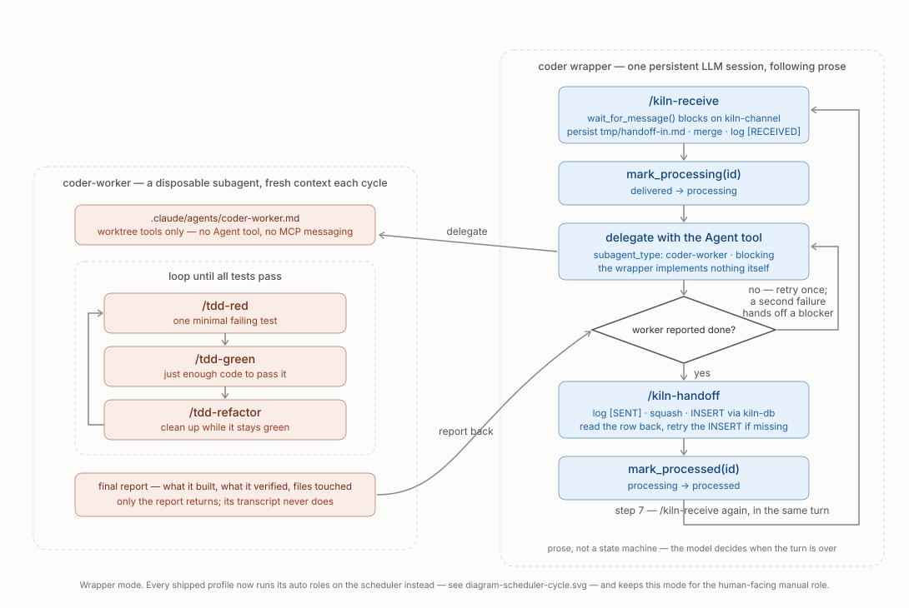
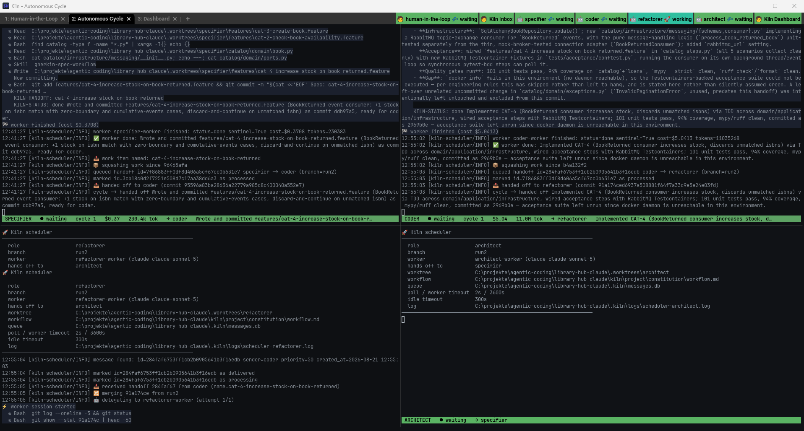

<p align="center">
  
</p>

# Kiln

**An orchestration platform that turns swarms of AI agents into reliable, professional software engineers.**

Kiln launches a config-driven multi-agent swarm, each agent working in its own git worktree with role-specific instructions and cross-agent communication. It is Git-aware: sub-branches are created per worktree, all state lives in `.kiln/`, and handoffs are tracked in `logbook.md`.

**Kiln is a Python application.** `bin/kiln.ps1` and `bin/kiln.sh` are thin shims that put `src/` on `PYTHONPATH` and hand off to `python -m kiln.launcher.infrastructure.cli`; every platform runs the same code. Terminals are backend-specific (WezTerm, Windows Terminal, tmux), but nothing else is.

---

## Quick Start

Kiln is not installed — it is cloned and run in place. `bin/kiln.ps1` / `bin/kiln.sh` are run
from the clone, and they scaffold and launch projects that live anywhere else on disk.

```bash
git clone https://github.com/nsd0okernicke/kiln.git
cd kiln
```

Everything below is run from that directory. See **Platform Support** for the prerequisites
(Python 3.11+, git, at least one agent CLI).

### 1. Create a New Project

**Windows (PowerShell):**
```powershell
.\bin\kiln.ps1 -Init -WorkingDir C:\path\to\my-project
cd C:\path\to\my-project
```

**Unix/macOS:**
```bash
./bin/kiln.sh init /path/to/my-project
cd /path/to/my-project
```

This scaffolds a complete Kiln project with configuration, role files, and git initialization.
(`-Init`/`init` used to be a separate `kiln-init.ps1`/`kiln-init.sh` script — that's now folded
into the main entrypoint, and the old scripts have been removed.)

### 2. (Optional) Use an Example

Include an example project brief by adding the `-Example` flag with any directory name under
`examples/` (e.g. `library-hub`, `library-hub-java`, `battlezone`):

**Windows:**
```powershell
.\bin\kiln.ps1 -Init -WorkingDir C:\path\to\library-hub -Example library-hub
```

**Unix/macOS:**
```bash
./bin/kiln.sh init /path/to/library-hub --example library-hub
```

This copies `examples/<name>/README.md` as the project brief, plus any files the example ships
under `examples/<name>/kiln/project/constitution/` (e.g. a Java-specific `project.md`/
`engineering.md`) over the scaffolded defaults — see **Examples** below for the full list.

### 3. Launch the Swarm

**Windows:**
```powershell
.\bin\kiln.ps1 -WorkingDir .
```

**Unix/macOS:**
```bash
./bin/kiln.sh .
```

That's it. Kiln will create git worktrees, generate role files, and launch agents in your configured terminal.

See **"Running Kiln"** below for more options and customization.

---

## What Kiln Does

Kiln is a lightweight orchestration layer that:

- Launches a **config-driven swarm** — specify each agent's role, AI tool/backend (claude/copilot/codex/grok, all four capable of both execution modes), and workspace (main directory or isolated worktree)
  - Uses framework defaults from `src/kiln/resources/profiles.json`
  - Projects can override by creating `kiln.profiles.json` at the root
  - Flexible terminal layouts: tabs, split panes, grids, or custom hierarchical arrangements
- Creates one **terminal window/tab per role** — observe all agents in real time
  - WezTerm (recommended, every platform) — full feature set: live tab-bar status badges,
    split-pane/grid layouts, the inbox-pane strip
  - Windows Terminal or tmux — basic fallback: launches the same swarm, but with no live
    status badge and no split-pane/grid layout support
- Reads role behavior from `kiln/project/roles/<role>.md` files and a layered `kiln/project/constitution/` (workflow, engineering, project)
- Creates one **git worktree per agent** (except those using `@current`) under `.worktrees/` so agents don't collide — agents using `@current` work in the project root on the current branch
- Supports per-role **agent backends**: `claude`, `copilot`, `codex`, or `grok` — configure via `agent` field in profiles
- Creates **inter-agent messaging** via SQLite at `.kiln/messages.db` with full message lifecycle tracking, exposed through two MCP servers:
  - **`kiln-db`** — SQL read/write for sending handoffs (`query`)
  - **`kiln-channel`** — blocking `wait_for_message()` tool that each agent calls to receive its next handoff; the channel polls the database and returns as soon as a message arrives, already marked `delivered`. Also provides `mark_processing()` and `mark_processed()` to transition messages through their full lifecycle
  - **Message lifecycle**: `queued` (created) → `delivered` (retrieved by agent) → `processing` (work started) → `processed` (handoff sent)
- Keeps all swarm state in `.kiln/` (logs, sessions, message database) — gitignored and ephemeral


*The default profile's first tab. The badge strip top-right tracks every role at once; the `inbox` pane pinned beneath the session is the half that listens, so the session above it stays free to type into — see **Inbox mode** below for why that split is necessary.*

### Project Structure Created by `bin/kiln.ps1 -Init` / `bin/kiln.sh init`

When you run init, it scaffolds a new Kiln project with:

```text
my-project/
├── kiln/                         # Kiln configuration (version-controlled)
│   └── project/                  # Everything here is yours to customize — see kiln/project/README.md
│       ├── constitution.md
│       ├── constitution/
│       │   ├── workflow.md           # Handoff protocol
│       │   ├── engineering.md        # Engineering practices & quality standards
│       │   └── project.md            # Project-specific rules (language, architecture, constraints)
│       ├── roles/                    # Role definitions for your agents
│       │   ├── specifier.md
│       │   ├── coder.md
│       │   ├── refactorer.md
│       │   ├── architect.md
│       │   └── ...
│       └── skills/                   # Optional: custom agent skills
├── .kiln/                        # Runtime state (ephemeral, gitignored)
│   ├── messages.db              # SQLite message queue
│   ├── logs/                    # Agent logs
│   ├── status/                  # Live per-role state (<role>.json), read by the WezTerm status bar
│   ├── traffic.db               # Captured API traffic — only with --proxy, see "Traffic Capture"
│   └── ...
├── .worktrees/                   # Git worktrees (gitignored)
│   ├── coder/
│   ├── refactorer/
│   ├── architect/
│   └── ...
├── .claude/                      # Claude Code configuration
│   ├── settings.json             # MCP and permission settings
│   └── .gitignore
├── .mcp.json                     # MCP server configuration (kiln-db + kiln-channel, for Claude agents)
├── .gitignore                    # Git exclusions
└── README.md                     # Project brief (optional, from example)
```

**Key points:**
- `kiln/project/` is version-controlled (constitution, roles, skills) — customize freely, this is your project's own copy
- `.kiln/` and `.worktrees/` are runtime/ephemeral (gitignored)
- Profiles are inherited from the framework; create `kiln.profiles.json` at the root to override

---

## Platform Support

One Python implementation runs on every platform. The shell scripts are shims — they locate
the framework, set `PYTHONPATH`, and forward their arguments to `python -m kiln.launcher.infrastructure.cli`
unchanged. There is no second implementation to fall behind.

**Shared requirements (all platforms):**

- Python 3.11+ — the launcher, the scheduler and the MCP servers are all Python
- Git
- One or more agent CLIs (Claude Code, GitHub Copilot, Codex, Grok) depending on configured agents
- `pip install -r src/kiln/mcp_server/requirements.txt` if you use wrapper-mode roles
  (the `kiln-db` / `kiln-channel` MCP servers). Scheduler-mode roles need no MCP server.
  On Debian/Ubuntu that exact command fails with `error: externally-managed-environment`
  (PEP 668) — use `python3 -m pip install --user --break-system-packages -r ...` instead.
  A virtualenv will *not* work here: the agent CLI spawns the channel server as a bare
  interpreter name resolved from its own PATH, so the SDK must be importable by that
  interpreter. Kiln prints the correct command for your platform if the import check fails.

### Windows

```powershell
.\bin\kiln.ps1 -WorkingDir "C:\path\to\project"
```

- PowerShell 7+ (included with Windows 11) — only to run the shim
- WezTerm (recommended, full feature set) or Windows Terminal (basic fallback — see
  "Terminal Behavior" below for exactly what it's missing)

### Unix/Linux/macOS

```sh
./bin/kiln.sh /path/to/project
```

- Any POSIX shell — the shim is `#!/usr/bin/env bash`; zsh is no longer required
- WezTerm (recommended, full feature set — WezTerm is cross-platform, so Linux/macOS get the
  exact same tab-bar badges and layout support Windows does) or tmux (basic fallback — one
  detached session per role, no split-pane/grid layouts, no live status badge)

**Terminal selection (both platforms):** `--terminal wezterm | wt | tmux | none`, or set
`KILN_TERMINAL`. Omit it and Kiln auto-detects, preferring WezTerm over the platform's
built-in fallback (Windows Terminal on Windows, tmux on Unix/Linux/macOS) whenever `wezterm`
is on `PATH` — see "Terminal Behavior" below. `none` prints the commands without launching
anything, which pairs well with `--dry-run`.

---

## Framework Structure

The Kiln repository is organized for clarity and maintainability:

```text
kiln/
├── bin/                          # Entry points
│   ├── kiln.ps1                  # Windows shim -> python -m kiln.launcher.infrastructure.cli
│   ├── kiln.sh                   # Unix shim -> python -m kiln.launcher.infrastructure.cli
│   ├── kiln-cleanup.ps1          # Full project reset (Windows only — see Cleanup)
│   ├── clear-messages.ps1 / .sh  # Empty the message queue (testing utility)
│   └── kiln-db.ps1               # Inspect/manage messages.db (Windows only)
│
├── src/kiln/                     # Installable Python package; never copied into projects
│   ├── resources/project/        # Scaffold source copied to a new project's kiln/project/
│   │   ├── constitution.md
│   │   ├── constitution/         # Shared constitution rules
│   │   ├── roles/                # Role prompts
│   │   └── skills/               # Agent skills
│   ├── launcher/                 # Process/worktree/profile orchestration
│       │   ├── cli.py                    # Argument parsing and the launch sequence
│       │   ├── config.py                 # Profile loading, inheritance, validation
│       │   ├── paths.py                  # Every path Kiln touches, in one place
│       │   ├── commands.py               # The command injected into each pane
│       │   ├── generate.py               # CLAUDE.md / AGENTS.md / .mcp.json / worker files
│       │   ├── templates.py              # Loads templates/constitution/roles, fills placeholders
│       │   ├── workspace.py              # gitignore, hooks, worktrees, skills
│       │   ├── scaffold.py               # `init` project scaffolding
│       │   ├── stop.py                   # `--stop` process teardown
│       │   └── terminals/                # One module per backend
│       │       ├── wezterm.py                # Generates the Lua config; WezTerm builds the panes
│       │       ├── windows_terminal.py       # Builds `wt.exe` argument lists
│       │       └── tmux.py                   # new-session / send-keys
│   ├── scheduler/                # Hexagonal scheduler
│       │   ├── domain/                   # Models, policies, routing and handoff rules
│       │   ├── application/
│       │   │   ├── ports/                # Contracts required by application use cases
│       │   │   └── use_cases/            # Scheduler orchestration
│       │   ├── infrastructure/
│       │   │   ├── persistence/          # SQLite queue implementation
│       │   │   ├── vcs/                  # Git worktree implementation
│       │   │   ├── agents/               # Claude, Codex, Copilot and Grok adapters
│       │   │   ├── terminal/             # Pane status presentation
│       │   │   └── diagnostics/          # Verification and worker debug output
│       │       └── cli/                  # Scheduler, inbox, dashboard, send and retry CLIs
│   ├── cockpit/                  # Browser-based swarm operations
│   ├── proxy/                    # Opt-in traffic capture (`--proxy`, see "Traffic Capture")
│       │   ├── server.py                 # Forwarding proxy; streams through, never buffers
│       │   └── capture.py                # Redaction, composition split, traffic.db schema
│   ├── mcp_server/               # kiln-channel: blocking wait_for_message() receiver
│   └── resources/
│       ├── profiles.json             # Default configuration profiles
│       ├── templates/                # Loop/runtime templates for wrapper-mode roles
│       └── tools/                    # Re-seeded into .kiln/tools/ every launch
│
├── examples/                     # Example project briefs
├── tests/
│   ├── unit/kiln/               # Fast tests mirroring src/kiln/
│   ├── integration/kiln/        # Real SQLite, Git, subprocess and HTTP adapters
│   ├── conftest.py              # Shared fixtures
│   └── mutation/                # Cosmic Ray configurations
└── docs/                         # Documentation & assets
```

**`bin/`** holds entry points. The two `kiln` scripts are shims with no logic in them; the rest are standalone utilities that were never part of the kiln.launcher. **`src/kiln/launcher/` and `src/kiln/scheduler/`** are the actual implementation. **`src/kiln/resources/project/`** is the bundled scaffold copied to a generated project's editable **`kiln/project/`** directory. Runtime implementation is read directly from the install.

> The pre-port implementation lived in `lib/` as parallel PowerShell and shell trees
> (`profile-loader.{ps1,sh}`, `terminal-adapter.sh`, `terminal-adapters/*`). Those are deleted;
> they are in git history if you need to compare behaviour.

---

## Core Features

- **Config-Driven Topology** — The swarm shape comes from `src/kiln/resources/profiles.json`, not hardcoded variables.
- **Flexible Terminal Layouts** — Define custom tab and pane arrangements in your profile: simple tabs, split panes, 2×2 grids, hierarchical trees, or focus layouts (e.g., 1 full tab + 3-way split below).
- **Role Injection** — Constitution (`workflow.md`, `engineering.md`, `project.md`) and role instructions (`roles/<role>.md`) are merged into each agent's instruction file (`CLAUDE.md` or `.github/copilot-instructions.md`), giving full context immediately.
- **Project-Local Constitution** — Customize architecture, tech stack, and quality gates via `kiln/project/constitution/project.md`.
- **Layered Rules** — `kiln/project/constitution/` contains `workflow.md` (handoffs), `engineering.md` (tools/practices), and `project.md` (arch/quality) — all applied to every agent.
- **Backend Selection Per Role** — Each role can launch `claude`, `copilot`, `codex`, or `grok` via the `agent` field in profiles.
- **Two Execution Modes Per Role** — a role's cycle is driven either by an LLM following prose (**wrapper mode**) or by a Python state machine (**scheduler mode**). See below.
- **Observable Swarm** — Watch all agents in one window. Each scheduler pane carries a colour-coded status bar pinned to its bottom row, and on WezTerm a live status badge per role appears in the tab bar regardless of which tab or pane is focused.
- **Measurable Token Spend** — Per-role token and cache accounting in the dashboard, and an opt-in local capture proxy (`--proxy`) that records what each role actually puts on the wire, split into tools/instructions/conversation.
- **Cross-Platform** — One Python implementation on Windows, macOS and Linux. Only terminal backends differ.

---

## Execution Modes: Wrapper vs Scheduler

Every `auto`-mode role runs a receive → merge → work → squash → hand-off cycle. Kiln can drive
that cycle two ways, chosen per role with the `scheduler` field in a profile — and now that
every accepted backend (`claude`, `copilot`, `codex`, `grok`) has a one-shot scheduler adapter,
every shipped profile's `auto`-mode roles default to scheduler mode. Wrapper mode remains for
whichever single role is a profile's human-facing `manual` entry point — that role needs a real
conversation, which the scheduler's one-shot model has no room for.

All four backends now implement **both** modes, so the choice is purely about what the role
does, never about what its CLI can be driven to do.

### Scheduler mode (`"scheduler": "python"`, the default for `auto` roles)

A Python process owns the pane. It polls SQLite directly, merges, invokes the agent CLI
**once per handoff** as a subprocess, reads the result, squashes and inserts the next handoff —
then loops. The LLM only does the work; it makes none of the control-flow decisions.


*One `run_once()` cycle for the coder. Note where the verify gate sits — **inside** `_delegate`'s
retry loop, not between it and the handoff: a failing verify demotes the attempt to `blocked`, so
"the worker said it was blocked" and "the worker said it was done but the tests disagree" go
through the same `should_retry` rule and the same escalation counter.*

```jsonc
{ "role": "coder", "agent": "claude", "worktree": "coder",
  "mode": "auto", "model": "claude-sonnet-5",
  "scheduler": "python" }        // <- what every shipped `auto` role sets
```


*The same cycle in real panes. Every line the coder pane prints — deliver, mark processing, merge,
delegate — is `run_once()` narrating itself; there is no LLM session in that pane to narrate it.
The header above each log is the scheduler's own config dump: worker, hands-off target, queue
path, poll and worker timeouts.*

### Wrapper mode (manual roles, and any backend without an adapter)

A persistent LLM session sits in the pane and follows the loop written in
`src/kiln/resources/templates/loop-auto-<agent>.md`. It reaches the message queue through two MCP
servers (`kiln-db` for SQL, `kiln-channel` for a blocking `wait_for_message()`), decides when a
turn is finished, and delegates the actual work to a disposable worker subagent. The mechanics
are prose, so the model can misread them — a turn that ends early, a merge step that gets
skipped — which is exactly the class of failure scheduler mode was built to remove for
anything that doesn't structurally need a live conversation.



*The same role, driven by prose instead. Compare the two: the scheduler's guards, cost caps and
circuit breaker have no counterpart here, the queue is reached through MCP rather than SQLite, and
the turn ends when the model judges it has — which is the step that stalled in live testing, and
the reason step 7 is written the way it is.*

What changes when a role is scheduled:

| | Wrapper mode | Scheduler mode |
| --- | --- | --- |
| Pane runs | a persistent LLM session | `python -m kiln.scheduler.infrastructure.cli.role_scheduler` |
| Loop control | prose in a loop template | `role_scheduler.run_once()` |
| Queue access | `kiln-db` + `kiln-channel` MCP | direct SQLite |
| Turn is done when | the model decides | the worker prints `KILN-STATUS: done` |
| Routing target | model reads the routing table | `routing.py` resolves it |
| Retry / escalation | model judgement | one retry, then escalate to `human-in-the-loop` |
| MCP servers needed | yes | **no** |
| Generated `CLAUDE.md` | yes | **no** — deleted if a role switches over |

The contract between them is a sentinel. A worker's last line must be:

```text
KILN-STATUS: done <one-line summary>
KILN-STATUS: blocked <what stopped it>
```

Anything missing or malformed counts as `blocked`, so a confused worker escalates rather than
silently reporting success.

**Trade-offs.** The scheduler cannot get bored, skip a merge, or forget to hand off, and its
whole cycle is unit-testable without an LLM. But each invocation is one-shot: the worker starts
fresh every handoff with no memory of the last one, so anything it must remember has to be in
the handoff, the repo, or the constitution. All four adapters
(`src/kiln/scheduler/infrastructure/agents/{claude,copilot,codex,grok}_adapter.py`) are one-shot,
subprocess-based invocations, verified live against each CLI's actual non-interactive flags —
`copilot`/`codex` report no dollar cost (only token/request counts), `claude`/`grok` do. Every
adapter parses token usage out of the stream it is already reading, so a role that reports no
dollars still reports tokens — and the dashboard marks the cost total partial rather than
letting a missing role look like a cheap one.

Each CLI needed one accommodation, all of them in the adapter rather than in the scheduler:
`copilot` reads MCP config from `~/.copilot/mcp-config.json` rather than a per-call flag, so its
globally-registered `kiln-db` server is disabled per invocation; `codex exec` has no
`--agent`-by-name flag, so the worker's persona is embedded directly in the prompt, and a
per-role isolated `CODEX_HOME` has no `auth.json` and 401s, so the scheduler's worker call
deliberately reuses the ambient authenticated one while wrapper-mode roles get the credential
copied in at launch (see below); `grok`'s `--output-format streaming-messages-json` turned out
to be Anthropic-Messages-API-compatible, making it close to a drop-in twin of the Claude
adapter.

**Codex credentials and the isolated home.** A wrapper-mode Codex role runs with
`CODEX_HOME` pointed at `.kiln/codex-home/<role>/`, so Kiln's per-role trust and MCP entries
never touch your real `~/.codex/config.toml`. That isolation was never meant to cover your
*identity*, but with no `auth.json` in the directory it did — the role sent an unauthenticated
request and the upstream answered `401 Unauthorized`. The launcher now copies `auth.json` from
your real `CODEX_HOME` (`$CODEX_HOME`, else `~/.codex`) into each Codex role's home, per launch
so a refreshed token is picked up. **This means a credential file is written into `.kiln/`** —
that directory is gitignored, but it is worth knowing it is there. Not logged in is a warning,
not a launch failure: `codex login` says it better than the launcher can.

### Inbox mode (`"scheduler": "inbox"`)

A third kind of pane, and the human's half of the same idea. It runs `kiln.scheduler.infrastructure.cli.inbox`: it
watches another role's queue, prints each arriving message, marks it processed and rings the
terminal bell. No agent, no worktree, no generated instructions, no MCP.

```jsonc
{ "role": "inbox", "worktree": "@current", "title": "Kiln Inbox",
  "mode": "manual", "scheduler": "inbox",
  "watches": "human-in-the-loop" }    // whose queue to show
```

It exists because a single LLM session cannot be both a listener and an entry point. The
wrapper `human-in-the-loop` role blocks in `wait_for_message()`, which polls `while True:` with
**no timeout** — so a session that is listening is not available to type into, and a session
talking to you is not listening. Escalations landed in neither state and simply sat in the
queue. Splitting the two jobs is what fixes it: the inbox listens, your Claude session talks.

The outbound half is the `send` command, which inserts a handoff directly with no MCP and no
LLM in the path — so you can start or unblock a cycle even when the agents are what is broken:

```powershell
.\bin\kiln.ps1 send --to specifier "Add CAT-4: search the catalog by author."
.\bin\kiln.ps1 inbox        # or run the watcher yourself, outside a swarm
```

Both resolve the queue path and current branch from the project. Branch matters more than it
looks — messages are branch-scoped, so an inbox on the wrong branch is indistinguishable from
an empty one.

### Dashboard mode (`"scheduler": "dashboard"`)

A fourth kind of pane, and the swarm-wide counterpart to the inbox's one-role view. It runs
`kiln.scheduler.infrastructure.cli.dashboard`: a `top`-style live view that aggregates every role at once instead of
watching one — no agent, no worktree, no generated instructions, no MCP, same "no agent" shape
as `inbox`.

```jsonc
{ "role": "dashboard", "worktree": "@current", "title": "Kiln Dashboard",
  "mode": "manual", "scheduler": "dashboard" }
```

Each poll (every 2s by default, `--poll-interval` to change it) it clears the pane and redraws
a full frame — unlike the inbox and the pane status bar, which deliberately preserve
scrollback, there is nothing here worth scrolling back through:


*A live run: two completed cycles, $5.41 spent, 11.3M tokens — 11.0M of them cache reads, which
is what the CACHE column is reporting. The prompt-weight panel below the totals comes from the
capture proxy — see [The prompt-weight panel](#the-prompt-weight-panel) under **Traffic Capture** —
and appears only when a run is proxied; the annotated layout is unpacked here:*

```text
📊 Kiln Dashboard — library-hub-testrun (main)                     13:36:57
────────────────────────────────────────────────────────────────────────────────────────
ROLE                 STATE                SINCE        QUEUE     WAIT  CYCLES     COST    TOKENS  CACHE
──────────────────────────────────────────────────────────────────────────────────────────────────
human-in-the-loop    ● waiting            1h ago           0        -       -        -         -      -
specifier            ● waiting            1s ago           0        -       2    $0.35 238.4k tok    84%
coder                ● retrying 2/2       4m ago           0        -       1    $2.29  4.4M tok    97%
refactorer           ● working        ⚠ 22m ago            1      18m       1    $2.10  4.5M tok    98%
architect            ● waiting            1s ago           0        -       1    $0.67  1.2M tok    97%
────────────────────────────────────────────────────────────────────────────────────────
TOTAL COST: $5.41        TOTAL CYCLES: 5        TOKENS: 10.3M tok        ESCALATIONS: 0
  tokens by kind: in 412 · out 71.1k · cache-read 10.0M · cache-write 219.2k
  ⚠ past its worker timeout, so the worker may be hung: refactorer

Recent activity
  17:41:58  coder → refactorer            [Coder] Implement CAT-3 endpoint
  17:40:12  specifier → coder             [Specifier] Wrote acceptance criteria
  17:38:44  human-in-the-loop → specifier Approved request for CAT-3

Escalations
  (none in the recent window)
```

State per role comes from `.kiln/sessions` (the static role inventory) joined with each
role's `.kiln/status/<role>.json`; queue depth and recent activity come straight from
`messages.db`. Cost and cycles are only shown for roles that report them — scheduler roles
do (see "Pane Status Bar" below for where those numbers come from), wrapper roles don't track
either today, so their cells read `-` rather than a misleading `$0.00`.

**Stateless panes are omitted.** `inbox`, `dashboard` and `cockpit` run no agent and are
never given a `--status-script`, so they cannot write a status file at all — their row was
dashes in every column, permanently. The sessions file records each pane's kind (a fifth
column, added for this) and the grid, the cockpit's Work Queue and the WezTerm tab-bar badges
all skip them. They are still launched, still listed in `.kiln/sessions`, and still stopped
by `kiln --stop`; only the state tables leave them out. In WezTerm this also removed a
falsehood: a `manual` role with no status file is badged `waiting`, so a perfectly healthy
cockpit pane used to advertise itself as waiting for something.

**`CACHE` is the column to read first.** Tokens tell you a role is expensive; the cache hit
rate tells you whether that is real work or a prompt being re-sent uncached every cycle. In
the run above the four scheduler roles fed 10.3M input tokens to the model and only ~0.3M of
it was billed as fresh. A role sitting well below its peers there is the one worth
investigating — cost per token varied 2.7x between roles on an earlier run, and the entire
gap was cache behaviour, not volume.

`TOTAL COST` is marked partial (`$5.41+`) when any role in the run uses a backend that
reports tokens but no dollars (`codex`, `copilot`) — a total that excludes a role is labelled
as such rather than quietly under-reporting.

#### Early warning

Three signals exist to make a swarm in trouble look different from a busy one, because until
they existed it did not.

- **⚠ on `SINCE`** — this role has been working longer than the worker timeout it was launched
  with, so the worker may be hung. The timeout travels in the role's own status file rather
  than being re-read from the profile, so the dashboard measures against what the scheduler
  actually got, not what a config file says it should have. Only `working`/`retrying`/
  `delegating` can stall; an `idle` role with an old `SINCE` is unemployed, not stuck. The
  legend under the totals appears only while something is stalled.
- **`WAIT`** — how long this role's *oldest* queued message has been waiting. Queue depth
  alone cannot distinguish one message unserved for an hour (something downstream is dead)
  from five that arrived a minute ago (the swarm is busy). `-` means nothing is waiting.
- **`2/2` in `STATE`** — which attempt is running. `retrying` was already a distinct state,
  but without the count a role one failure away from escalating looked like a healthy one.
  A first attempt shows nothing, since every cycle starts there.

The dashboard and the pane status bar now report the same cycle and cost numbers for the same
cycle. They used to differ by one: the status file is written during the cycle, and the totals
were only folded in after it returned.

Run it standalone against any project with `python -m kiln.scheduler.infrastructure.cli.dashboard --once ...` (see
`--help` for the required paths), or just launch a profile that includes it.

**Try it:** the shipped `full` profile runs all four `auto` roles on the scheduler, keeps
`human-in-the-loop` as an interactive session, puts an inbox strip beneath it in the same tab,
and gives the dashboard its own dedicated tab.

```powershell
.\bin\kiln.ps1 -WorkingDir .
```

Each scheduled pane opens with a configuration banner (role, branch, resolved worker and model,
**resolved routing**, worktree, queue, timeouts, log path), then narrates every cycle. Per-role
logs are written to `.kiln/logs/scheduler-<role>.log` so a crashed scheduler still leaves
evidence after its pane is gone.

### Cockpit mode (`"scheduler": "cockpit"`)

A fifth kind of pane, and the only one you read in a browser. It runs `kiln.cockpit.infrastructure.http.server`: a
stdlib HTTP server bound to `127.0.0.1` that serves one page over the *same*
`.kiln/messages.db`, `.kiln/status/<role>.json` and `.kiln/sessions` the dashboard reads.
No agent, no worktree, no generated instructions, no MCP — the same passive shape as `inbox`
and `dashboard`.

```jsonc
{ "role": "cockpit", "worktree": "@current", "title": "Kiln Cockpit",
  "mode": "manual", "scheduler": "cockpit" }
```

**It is an addition, not a replacement.** The terminal dashboard stays, and keeps its tab in
the shipped `full` profile. The two answer different questions:

| | Terminal dashboard | Web cockpit |
|---|---|---|
| Job | Observe the swarm | Operate the swarm |
| Lives | WezTerm / tmux tab | localhost browser |
| Needs a TTY | Yes | No |
| Starts / stops work | No | Yes |

SSH sessions, headless boxes and no-browser setups still need the TTY view, so it is never
going away.

What the page gives you:

- **Attention** — failed cycles first (each with a Retry button, the same `kiln retry`
  path), then escalations, then completed cycles waiting in the human's queue.
- **Board** — one swimlane per role that participates in routing, plus **Done**. Cards are
  work items, grouped by the `KILN-HANDOFF:` name; a card sits in the lane of whichever role
  holds its latest unprocessed message, so it moves on its own as the cycle advances.

  A brand-new request has no work-item name yet — the specifier is the role that invents one
  (see **Work items** below) — so it appears as a *dashed, italic* placeholder card titled
  with its opening line. When the specifier names the work and hands off, the placeholder is
  replaced by the real card in the next lane. Until that happens, the placeholder is how you
  know the request is queued and not lost.
- **Work queue** — the dashboard's per-role table (state, since, queue depth, wait, cycles,
  cost, tokens, cache rate), plus what each role is currently holding, and which backend and
  model it runs. Lists the same roles the terminal grid does, through the same
  `visible_roles` rule, so the two cannot disagree about which roles exist — stateless panes
  are left out of both.

  The **Agent** column colours each backend distinctly (one hue per `claude` / `codex` /
  `copilot` / `grok`), which is what makes a mixed-backend swarm readable at a glance. It is
  coloured text rather than a vendor logo on purpose: the page is served offline and must
  stay self-contained, so a mark would have to be hand-drawn, and a not-quite-right vendor
  logo is worse than an accurate word.

  The model beside it is the **resolved** one — the `--model` flag, else the worker
  definition's frontmatter, else the backend's own default (`role_scheduler.resolve_model`).
  It reaches the browser through the role's status file rather than the profile, for the
  same reason `worker_timeout_sec` does: a reader consulting the profile would show nothing
  for a role whose model comes from frontmatter. A role that has not reported a cycle yet
  shows `—`, because until then there genuinely is no answer.
- **Send** — one composer for every outbound message: pick a **target role**, optionally a
  **work item**, and type. This is the same insert `kiln send --to <role>` makes, so it
  really does start (or restart) a cycle. **New task** in the header is a shortcut that
  presets the target to whatever the profile's routing says the human hands off to
  (`specifier` in `full`); each Work Queue row has its own **Send** button that presets that
  role and whatever it is currently holding — the direct path for "specifier, restart with
  CAT-3".
- **Stop swarm** — `kiln --stop`, behind a typed `TEARDOWN` confirmation.

Three things about **Send** worth knowing:

- **Pick the work item from the list rather than retyping it.** The name is the database
  grouping key, so a near-miss (`cat3` for `CAT-3`) silently forks one feature into two
  buckets and breaks its cost total, its lap count and its board card. The composer offers
  the run's known items; `new (pending)` leaves the naming to the specifier, which is right
  for a loosely described request. Names are validated against the same rule the worker's
  `KILN-HANDOFF:` sentinel uses.
- **Re-sending an existing work item costs a lap.** `count_work_item_arrivals` counts every
  message for that item and target, so a `maxCycles` guard on the receiving role fires one
  lap sooner. That is correct — it genuinely is another lap — but it is worth knowing before
  you restart a role three times.
- **A halted role will not read it.** After the circuit breaker trips (three consecutive
  escalations) a role polls only for messages `kiln retry` re-queued, so an ordinary send
  sits unread. The composer warns you when the chosen target is halted; use **Retry** on its
  failed message in Attention to wake it. Sending anyway is allowed — queueing work for after
  it recovers is legitimate.

Sending to the human role puts a note in its queue, which in a profile with an `inbox` pane
is shown there rather than reaching the LLM session: that pane polls the human's queue every
couple of seconds unattended and marks what it finds processed, while the agent only reads
the queue while blocked in `wait_for_message`.

Clicking any card, activity row or Attention row opens the full handoff body.

**Themes.** Three, switchable from the header: **Dark** (the default), **Light**, and **Neon**
— a dark background with cyan/magenta accents. The choice is remembered per browser in
`localStorage` and applied before the page paints, so a reload does not flash the default
palette first. Themes are a pure token swap on `:root`, so adding a fourth means adding one
`:root[data-theme="…"]` block and one button — no rule needs to change. Every palette is
checked against WCAG AA (4.5:1) for the text pairs on the page; the tightest is the 12px
state pill, which is why the light theme's blue and red are a shade deeper than they need to
be as button fills.

The pane prints the URL it bound and opens a browser tab; set `KILN_COCKPIT_NO_BROWSER=1` (or
`"openBrowser": false`) to suppress the tab. The URL is also written to `.kiln/cockpit-url`,
which matters because the port is a *preference*: the cockpit probes upward from 8765 when the
port is taken, so two projects can be open at once without either silently attaching to the
other's swarm.

**Security posture.** The cockpit binds loopback only — there is deliberately no `--host`
flag — and has no authentication, because it can start work, retry failed cycles and kill
every Kiln process on the machine. Mutating requests additionally require an `X-Kiln-Cockpit`
header, which a hostile page in your browser cannot set against `127.0.0.1` without a
preflight the server never approves. Do not put it behind a tunnel or a reverse kiln.proxy.

Run it standalone against any project with `python -m kiln.cockpit.infrastructure.http.server --db-path ... --status-dir
... --sessions-file ...` (see `--help`), or just launch a profile that includes it.

---

## Traffic Capture (`--proxy`)

Token counts tell you *that* a role is expensive. Only the request body tells you *why* — how
much of it is tool schemas, how much is generated instructions, how much is conversation being
re-sent. Kiln can route agent API traffic through a local capture proxy to answer that.

**Off by default; `--proxy` turns it on.** Enabled, it records metadata only — sizes, timings,
model names and token counts, about 2.9 KB per request. **It does not record prompt text**;
that needs a second, explicit opt-in.

```powershell
.\bin\kiln.ps1 -WorkingDir .                         # no proxy, no capture store
.\bin\kiln.ps1 -WorkingDir . --proxy                 # metadata capture
.\bin\kiln.ps1 -WorkingDir . --proxy --capture full  # + request/response bodies
```

Note what you *don't* give up by leaving it off — `COST`, `TOKENS` and `CACHE` come from each
adapter parsing its own CLI stream, not from the kiln.proxy. Only the prompt-weight panel below
needs it.

And what turning it on costs, beyond the store: every routed request then passes through a
local Python process, so if that process dies the routed roles lose their API access until the
swarm is restarted. Nothing supervises it.

### How it routes

The proxy is a **base-URL override, not a MITM** — no certificates, no TLS interception, no
system trust store changes. Each role is pointed at `http://127.0.0.1:8787/kiln/<role>`, so
every captured request is attributable to a role by its path prefix. That path is injected
through the existing `AgentCommand.env` plumbing, which means one-shot workers inherit it from
their pane.

`claude` and `codex` roles are routed today, **both verified live** — each CLI honours the
override and still attaches its own subscription credential to a local host, so no API key is
needed for either. They get there differently: Claude reads `ANTHROPIC_BASE_URL`, while Codex
has no base-URL variable at all and receives `-c model_providers.…` overrides on its command
line instead. Roles on `grok` or `copilot` run untouched and are simply absent from the
capture; the launcher logs which roles it routed so an empty panel is never a mystery.

One proxy serves both vendors. Because the path prefix identifies a *role* rather than a
backend, each non-Anthropic role gets a `--route <role>=<host>/<base-path>` telling the proxy
where that role's traffic actually belongs — the launcher derives these from the profile.

The port defaults to 8787 and **probes upward if that is taken**, so two Kiln projects can run
at once without colliding. The launcher then waits for the proxy to actually accept a
connection and aborts the launch if it never does — a swarm pointed at a port that is silently
serving *another* project would record its traffic into that project's store while everything
appeared to work. `--proxy-port` pins an exact port instead, and fails rather than drifting if
it is busy.

`python -m kiln.proxy.infrastructure.http.server --stub` answers requests locally instead of forwarding, which makes
the whole wiring dry-runnable without spending a token.

### What it stores

`.kiln/traffic.db`, deliberately **not** `messages.db` — that file is the swarm's live state
and people open it in a SQLite browser; request bodies are orders of magnitude larger and
would wreck that.

| Mode | Recorded |
|---|---|
| `metadata` (default) | timing, status, byte sizes, model, token usage, and the tools/system/messages split |
| `full` | the above plus request and response bodies, capped at 256 KiB each |

Bodies are also the only part that grows: measured on a real store, 107.6 MB across 676
requests was **98.3% bodies**. So `full` mode carries a budget — once stored bodies pass
256 MB, the oldest rows have their bodies cleared while the rows themselves stay. Composition
and token counts are computed at capture time, so a degraded row still feeds every panel; only
the prompt text goes. Metadata mode never reaches the budget, because it writes no bodies.

Both vendors' wire formats are read into the same columns. Anthropic sends `tools`/`system`/
`messages` as top-level keys; the Responses API Codex uses has none of them and packs
everything into one flat `input` array, so it is bucketed by item type instead. Token usage
needs the same care in reverse — Anthropic reports `input_tokens` as the *fresh* remainder
with cache reads counted separately, while OpenAI reports it as the total *including* them,
so the cached portion is subtracted on the way in. Storing either number under the other's
meaning would roughly halve the reported cache hit rate.

`Authorization` and API-key header **values are never written** — header names are kept so you
can see what was sent, values are replaced. Bodies in `full` mode contain the complete source
the agent read, in plaintext, so treat that store accordingly.

The composition split works in `metadata` mode: sizes are computed at capture time, so you can
measure what a prompt is made of without keeping anyone's source code.

### The prompt-weight panel

With a traffic store present, the dashboard grows a panel:

```text
Prompt weight (proxy)  — averages per request, this run
ROLE                   REQS   AVG REQ   MAX REQ    TOOLS   SYSTEM     MSGS  MSG%
architect                36    117.5k    208.2k    33.3k     5.0k    56.3k   48%
coder                    73    203.6k    366.8k    33.8k     5.9k   133.2k   65%
human-in-the-loop        18    211.1k    250.3k   136.6k    30.7k    43.9k   21%
refactorer               93    139.1k    242.3k    33.9k     5.2k   108.6k   78%
specifier                12     91.3k    183.9k    28.5k     5.4k    22.9k   25%
```

Scoped to the current run by default. The store outlives a run, and averaging across runs
blends configurations that are not comparable — `--traffic-all-history` opts into that, and
the heading always states which you are reading. Columns read `-` where nothing recorded
them, never a misleading `0`.

### What it has actually found

The panel above is not hypothetical. Measured against real runs:

- **Tool schemas were 81% of a trivial request.** `build_agents_payload` parsed each worker's
  declared `tools` list and then never sent it, so every worker was handed the full default
  tool set. Sending the declared list cut tools from 30 to 9, tool bytes from 98.4k to 33.2k,
  and **tokens per request by 40%** (71.9k → 43.4k). Wire traffic for a cycle went 43.4 MB →
  24.0 MB.
- **Worker instructions are 3–5% of a request** — the `SYSTEM` column above. The intuitive
  optimization ("slim the `*-worker.md` files") is a rounding error; `MSGS` is 60–78%.
- **96.8% of all input tokens are cache reads.** 11.5M tokens fed, ~370k billed fresh. Any
  optimization that shrinks the cached prefix rather than the uncached remainder buys far less
  than its size suggests.
- **Duplication inside a request is 0.3–2.4%.** Workers re-read almost nothing; conversation
  growth is the cost of the work, not sloppiness.

### Using it to optimize *your* project

Everything above was measured against Kiln's own shipped scaffolding, but the constitution,
roles, skills and worker files that actually run are **yours** — `kiln/project/` is copied into
your repo precisely so you can rewrite it. The proxy exists to tell you which of your edits are
worth making. Kiln measures; what to slim is a question about your project, not about Kiln.

A workable loop:

1. **Run a cycle with `--proxy`** and read the prompt-weight panel. `SYSTEM` is your merged
   constitution and role file; `TOOLS` is the tool set your worker declared; `MSGS` is the
   conversation.
2. **Attack the biggest column, not the most editable one.** These are very different things,
   and confusing them is the trap the numbers above document.
3. **Change one thing, then re-measure** on comparable work.

Where the levers usually are, based on the measurements above:

| If the big column is… | The lever is… |
|---|---|
| `TOOLS` | the `tools:` list in your worker frontmatter — declare only what the role needs |
| `SYSTEM` | your `constitution/` and `roles/` files, but see the warning below |
| `MSGS` | how much work you give a role per handoff, and how much file content it must read |

**Two warnings, both learned the expensive way.**

Slimming instructions is the intuitive move and it is usually the wrong one — `SYSTEM` was
3–5% of a request here, so halving it changes almost nothing while costing you rules the
workers actually follow. Check the column before you edit anything.

And watch **`CACHE` on the main dashboard grid**, not just prompt weight. At a 97% hit rate,
shrinking a *cached* prefix saves far less than its byte count suggests, while an edit that
invalidates the cache every cycle can cost more than it saves. A role sitting well below its
peers on `CACHE` is a better lead than a role with a large `AVG REQ`.

**On re-measuring honestly:** Kiln has no way to replay a fixed workload against two
configurations, so a before/after across two runs is comparing different work. Treat a single
comparison as indicative, not proof — repeat it, or prefer changes whose effect is large enough
to survive the noise. The 40% tool-schema result above was worth acting on because it was
enormous; a 5% result measured the same way would not be.

---

## Constitution and Roles

The recommended project layout is:

```text
kiln/
  project/
    roles/
      architect.md             # Architect role (design review, approval)
      coder.md                 # Coder role (TDD implementation)
      refactorer.md            # Refactorer role (quality gates, refactoring)
      specifier.md             # Specifier role (Gherkin acceptance tests)
      reviewer.md              # Reviewer role (batch review alternative to refactorer)
      human-in-the-loop.md    # Human-in-the-loop role (human-facing intake and approval checkpoint)
    constitution/
      workflow.md              # Handoff protocol, branch discipline, queue format
      engineering.md           # Language, tools, dependencies, practices
      project.md               # Project-specific architecture, tech stack, quality gates

# Optional: Override default profiles (framework uses src/kiln/resources/profiles.json)
kiln.profiles.json           # Project-specific profiles (optional, at root)
```

**Note:** Configuration profiles are inherited from the framework default (`src/kiln/resources/profiles.json`). Projects can optionally override by creating `kiln.profiles.json` at the project root if they need custom profile definitions.

### Profile Loading

Configuration profiles define which agents run, which roles they take, and where they work. Kiln searches these locations in order and uses the **first file that exists**:

1. **Project root** (`kiln.profiles.json`) — Project-level overrides
2. **Project config** (`kiln/profiles.json`) — Searched, but scaffolding never creates it. Not to be confused with `kiln/project/`, the customizable constitution/roles/skills bucket
3. **Project state** (`.kiln/profiles.json`) — Searched, but scaffolding never creates it
4. **Framework** (`src/kiln/resources/profiles.json`) — Default profiles for all projects
5. **User home** (`~/.kiln/profiles.json`) — User-level defaults (optional)
6. **System** — `/etc/kiln/profiles.json` on Unix, `C:\ProgramData\kiln\profiles.json` on Windows (optional)

The first file that exists wins outright; profiles are **not** merged across locations.
Locations 2 and 3 were previously documented as "Not used" — they are genuinely searched, so a
file dropped there *will* override the framework defaults.

By default, **all projects use the framework's `src/kiln/resources/profiles.json`**, which defines the standard 4-agent workflow (specifier, coder, refactorer, architect). This means new projects work immediately without configuration.

**To customize profiles for a specific project**, create `kiln.profiles.json` at the project root.

> ⚠️ That file **replaces** the framework's profile set rather than extending it. There is no
> `extends` mechanism: once `kiln.profiles.json` exists, `full`, `fix`, `spike`, `harden`,
> `dry-run` and the rest are no longer available unless you copy the ones you want into
> it. Start by copying `src/kiln/resources/profiles.json` and editing, rather than writing a file
> with a single profile in it.

### Layered Constitution

- **`constitution/workflow.md`** — Defines handoff protocol, git worktree discipline, and cross-agent communication rules.
- **`constitution/engineering.md`** — Specifies language, build tools, test frameworks, quality tools, and coding practices.
- **`constitution/project.md`** — Project-specific rules: language, architecture constraints, quality thresholds. Initialized from the framework starter template; fill in or extend for your project. Example projects keep detailed technical rules in their `README.md` as the project brief, and can also ship their own `project.md`/`engineering.md` under `examples/<name>/kiln/project/constitution/` — `-Example <name>` copies those over the scaffolded defaults (e.g. `library-hub-java` overrides both to point at its Maven/Spring toolchain instead of the framework's Python defaults).

**Agent Instruction Assembly:** Constitution and role instructions are **always combined** at startup:

- Constitution files (`workflow.md`, `engineering.md`, `project.md`) provide shared rules and context for all agents
- Role file (`roles/<role>.md`) provides role-specific instructions and behavior
- Both are merged into each agent's generated instruction file:
  - **Claude agents**: `CLAUDE.md` in the worktree root
  - **Copilot agents**: `.github/copilot-instructions.md` in the worktree root
  - **Codex agents**: `AGENTS.md` in the worktree root — Codex CLI's own project-instructions convention (confirmed against the installed binary's string table)
  - **Grok agents**: `AGENTS.md` in the worktree root. Grok has no instruction filename of its own — verified against grok 1.0.5 with `grok inspect`, it discovers `AGENTS.md` and `CLAUDE.md` and ignores `GROK.md` entirely — so it reuses the cross-vendor name, the one it lists first. Sharing that name with Codex costs nothing: a worktree belongs to exactly one role, so no directory is ever written by two backends.

This ensures every agent operates with full constitutional context plus its specific role directives.

**Worker Subagent Assembly (`auto`-mode roles):** each of these agents is a thin, persistent **wrapper** — it only listens, merges, commits, and hands off. The actual role work is delegated each cycle to a disposable **worker**, built from the role file (`roles/<role>.md`) plus the `engineering.md` and `project.md` constitution — **not** `workflow.md`, since handoff/messaging protocol stays the wrapper's concern, not the worker's.

Concretely, here's what that looks like for the coder — the wrapper receives and merges the handoff, delegates to a fresh `coder-worker` subagent that runs the actual red → green → refactor TDD cycle, then hands the result onward:


*This is **wrapper mode** — the persistent-LLM-session variant, which shipped profiles now keep only for the human-facing `manual` role. The wrapper half (right) is identical for every role; only the worker's inner loop (left) changes — a refactorer-worker would run coverage → CRAP → mutation gates instead of TDD. For the scheduler-mode equivalent, see [Execution Modes: Wrapper vs Scheduler](#execution-modes-wrapper-vs-scheduler).*

The dispatch mechanism differs per backend:

- **Claude**: worker defined in a generated `.claude/agents/<role>-worker.md`, dispatched via Claude Code's `Agent` tool (blocking, deterministic — the wrapper explicitly invokes `subagent_type: "<role>-worker"`). No access to the `Agent` tool itself (no recursive subagent spawning) and no MCP messaging tools — it can only read/write/edit/test in its worktree. Its full working transcript never enters the wrapper's own context — only its final report does, which is what keeps the wrapper's context small and repetitive cycle over cycle, rather than filling up with the noise of the actual implementation work.
- **Copilot**: worker defined in a generated `.github/agents/<role>-worker.agent.md` (GitHub Copilot CLI's custom-agent format), dispatched by prose instruction — the wrapper's loop template tells it to delegate to the named custom agent, and Copilot CLI's own harness resolves that to a subagent call with its own isolated context window. `tools:` is scoped to `read, write, shell` — no MCP server names listed, so it has no messaging access, mirroring the Claude worker's isolation. Unlike Claude's `Agent` tool, this delegation is the model's own judgment call rather than a guaranteed deterministic invocation — GitHub has tuned Copilot CLI to be more selective about delegating on its own, so the wrapper prompt explicitly instructs it to always delegate even when it judges it could finish faster itself.
- **Codex**: worker defined in a generated `.codex/agents/<role>-worker.toml` (Codex CLI's own project-scoped custom-agent format — required fields `name`, `description`, `developer_instructions`; confirmed against official docs at `developers.openai.com/codex/subagents`), dispatched via Codex's built-in multi-agent spawn tools (`spawn_agent`/`assign_agent_task`/`wait_agent`/`close_agent` — the `multi_agent` feature, stable and enabled by default, confirmed directly against a live `codex.exe` install). `mcp_servers = {}` in the worker's TOML excludes messaging access, mirroring the Claude/Copilot worker's isolation.
- **Grok**: worker defined in a generated `.grok/agents/<role>-worker.md` — the same frontmatter-markdown format as Claude's, and discovered the same way (`grok inspect` reports it as a *project* agent), dispatched via Grok's `spawn_subagent` tool. Like Copilot's, this is a prose-driven delegation rather than a deterministic tool invocation, so the wrapper prompt insists on delegating even when the model judges it could finish faster itself. The worker's isolation comes from the invocation rather than the file: in scheduler mode the adapter passes `--no-subagents` (no recursive spawning) and the worker gets no MCP server of its own, mirroring the other three.

### Default Workflow

The default four-agent workflow runs in a continuous loop. Each Claude wrapper agent's generated `CLAUDE.md` combines a role file with a **loop template** that drives the cycle through two skills — `/kiln-receive` and `/kiln-handoff` (`kiln/project/skills/kiln-receive`, `kiln/project/skills/kiln-handoff`) — plus a delegated dispatch to that role's worker subagent in between:

1. **`/kiln-receive`** — calls `wait_for_message()` via the `kiln-channel` MCP server (blocks until a handoff arrives), persists the message to `tmp/handoff-in.md` (survives auto-compact), merges the sender's commit (`git merge <commit>`), and logs a `[RECEIVED]` entry to `logbook.md`
2. **Delegate the work** — the wrapper does not implement anything itself. It invokes the `Agent` tool (`subagent_type: "<role>-worker"`, blocking) with the handoff content and current branch/worktree; the worker subagent does the actual role-specific task (see below) and reports back what it did. A role configured `"mode": "manual"` additionally requires explicit user approval before continuing, and is not part of this delegation pattern (see Known Limitations) — but in every shipped profile except `dry-run`, `specifier` is not one: it runs `auto` on the scheduler.
3. **Retry or escalate on failure** — if the worker reports it couldn't finish, the wrapper re-dispatches it once more with the failure as feedback; a second failure escalates to a handoff that reports the blocker instead of silently stalling.
4. **`/kiln-handoff`** — logs a `[SENT]` entry, squashes work commits into one, `INSERT`s the handoff into `.kiln/messages.db` via `query`, then reads it back to verify the row landed — retrying the INSERT if it didn't
5. **Immediately return to step 1, in the same turn** — a sent and verified handoff is not the end of the cycle; the loop template is explicit that the turn isn't over until `/kiln-receive` has run again (this closes a stall we found in live testing, where an agent would finish a verified handoff and simply stop instead of waiting for the next message)

**Copilot follows the same shape** (receive → delegate → retry-once-on-failure → handoff → loop again in the same turn) but via its own inline polling loop (`loop-auto-copilot.md`) rather than the `/kiln-receive`/`/kiln-handoff` skills — it polls `messages` directly via SQL (`query`), since Copilot has no blocking `kiln-channel` MCP tool, and squashes/logs the same way inline rather than through a shared skill file.

**Codex follows the same shape too** (`loop-auto-codex.md`) — but unlike Copilot, it uses the same `/kiln-receive`/`/kiln-handoff` skills as Claude (Codex CLI supports skill-style slash commands), just delegating to the `<role>-worker` custom agent via Codex's built-in multi-agent spawn tools (`spawn_agent`/`assign_agent_task`/`wait_agent`/`close_agent`) instead of Claude Code's `Agent` tool, and retrying once on failure the same way. `manual` mode is also available for Codex (e.g. for a human-supervised role like `specifier`) using `loop-manual-codex.md`, same as any other backend.

**Grok sits closest to Codex** (`loop-auto-grok.md`). It uses the same `/kiln-handoff` skill — verified with `grok inspect`, it discovers project skills from `.claude/skills` and `.agents/skills`, both of which Kiln already populates — and delegates to `<role>-worker` via `spawn_subagent`. Like Copilot and Codex it *polls* `kiln-db` rather than blocking on `kiln-channel`, because no spike has established that this CLI tolerates a long-blocking MCP call. Grok reads the worktree's `.mcp.json` directly (the same file Claude does), so rather than registering a channel the loop is told never to call, Kiln withholds it entirely for grok roles — see `generate.BLOCKING_CHANNEL_AGENTS`. `manual` mode uses `loop-manual-grok.md`, same as any other backend.

The cycle flows: **specifier → coder → refactorer → architect → specifier**

- **`specifier`** — turns an approved request into Gherkin acceptance tests, then hands off to coder. In the shipped profiles it runs **auto** on the scheduler, taking its request from `human-in-the-loop` rather than from a user directly; the human approval step lives one hop earlier, in `human-in-the-loop`. (A profile *may* configure it `manual`, in which case it asks the user what to specify at startup and waits for approval before handing off — that is what `dry-run` does with every role.)
- **`coder`** — Implements behavior slices using strict TDD until all tests pass, then sends handoff to refactorer.
- **`refactorer`** — Runs quality gates (coverage → CRAP → DRY → mutation site count), refactors for testability, sends handoff to architect.
- **`architect`** — Reviews module structure, runs pre-handoff verification (mutation → DRY → soft Gherkin), sends completion back to specifier.

> **Unsupported role:** `reviewer` sketches a batch-processing alternative to `refactorer`, but it does not run — no profile routes it, so the scheduler escalates `NO_ROUTE` on its first handoff, and it wants to notify two roles at once, which routing cannot express. See the warning at the top of `kiln/project/roles/reviewer.md`. Use `refactorer` + `architect`, which own these gates and are routed.
>
> **`human-in-the-loop`** is the human-facing intake and approval checkpoint ahead of the cycle, and every framework-shipped profile includes it — it is what lets `specifier` run `auto` with no user present. The **`full` profile** (`src/kiln/resources/profiles.json`) pairs it with an autonomous specifier: `human-in-the-loop` (manual, `@current`) gathers and confirms a request with the user, hands it to `specifier` (now `auto`, its own worktree), which runs its normal Gherkin workflow non-interactively and forwards the eventual architect completion report back to `human-in-the-loop` for the user to see. See `kiln/project/roles/human-in-the-loop.md` and `kiln/project/roles/specifier.md` → "Auto-Mode Worker Entry Point".

---

## Running Kiln

### Quick Reference

| Platform | Command |
|---|---|
| **Windows** | `.\bin\kiln.ps1 -WorkingDir .` |
| **Unix/macOS** | `./bin/kiln.sh .` |

Both shims forward every argument to the same Python CLI, so **all flags work on both
platforms in either spelling** — `-ProfileName harden`, `-Profile harden` and
`--profile harden` are the same flag.

| Flag | Aliases | Effect |
|---|---|---|
| `--working-dir <path>` | `-WorkingDir`, `-Target`, `--target` | Project directory (default: `.`) |
| `--profile <name>` | `-Profile`, `-ProfileName` | Which profile to launch |
| `--terminal <backend>` | `-Terminal` | `wezterm`, `wt`, `tmux` or `none` (default: auto-detect) |
| `--agent-override <backend>` | `-AgentOverride` | Run every agent-bearing role on this backend instead. Drops each role's model — see "Backend is a flag, not a profile" |
| `--model-override <model>` | `-ModelOverride` | Model to use with `--agent-override` (default: let that CLI choose) |
| `--stop` | `-Stop` | Stop a running swarm |
| `--list-profiles` | `-ListProfiles` | List available profiles and exit |
| `--all-profiles` | `-AllProfiles` | With `--list-profiles`, also show profiles marked as test fixtures |
| `--init` | `-Init` | Scaffold a new project instead of launching (or the `init` subcommand) |
| `--example <name>` | `-Example` | Seed the scaffold from `examples/<name>` |
| `--no-git` | `-NoGit` | Skip git initialisation when scaffolding |
| `--dry-run` | | Print what would launch, start nothing |
| `--proxy` / `--no-proxy` | `-Proxy` | Route agent API traffic through the local capture proxy (off by default) |
| `--proxy-port <n>` | | Pin the capture proxy to an exact port (default: `8787`, probed upward if busy) |
| `--capture <mode>` | | `metadata` (default) or `full` — capture depth, see "Traffic Capture" |
| `--verbose` | `-Debug` | Verbose output |

Kiln will create a git repository if one doesn't exist, initialize worktrees, and launch agents.

`--dry-run` is the fastest way to see exactly what a profile will do — it prints the resolved
command line and working directory for every role without spawning a terminal.

#### The human entry points: `send`, `inbox`, `retry`

Three subcommands are for you rather than for the swarm. They are the first argument, and they
take the project from `--working-dir` (default `.`) — the message database and the branch are
filled in for you, since a queue is branch-scoped and an inbox watching the wrong branch is
indistinguishable from an empty one.

| Command | What it does |
|---|---|
| `send <summary> --to <role>` | Queue a handoff from the CLI. `--from` (default `human-in-the-loop`), `--commit`, `--priority`, `--escalation` |
| `inbox` | The human's notification pane. `--once` drains and exits; `--role`, `--no-bell`, `--no-status-bar` |
| `retry [id] [--guidance <text>]` | List escalated work, or send one item back to the role that failed it |

Written out in full, the way you would actually type them:

```powershell
# Windows
.\bin\kiln.ps1 send "add pagination to GET /books" --to specifier
.\bin\kiln.ps1 retry
```

```bash
# Unix/macOS
./bin/kiln.sh send "add pagination to GET /books" --to specifier
./bin/kiln.sh retry
```

> **On the shorthand.** The rest of this README writes these as `kiln send` / `kiln inbox` /
> `kiln retry` for readability. There is no `kiln` on your `PATH` — substitute
> `.\bin\kiln.ps1` or `./bin/kiln.sh`, or make yourself an alias:
>
> ```bash
> alias kiln='/path/to/kiln/bin/kiln.sh'          # bash/zsh
> ```
>
> ```powershell
> function kiln { & C:\path\to\kiln\bin\kiln.ps1 @args }   # PowerShell profile
> ```
>
> The subcommands' own `--help` output already calls itself `kiln send` / `kiln retry`, so the
> alias is the spelling they assume.

### Windows (PowerShell)

1. **Create a new project** from the Kiln repository root:

   ```powershell
   .\bin\kiln.ps1 -Init -WorkingDir C:\path\to\my-project
   cd C:\path\to\my-project
   ```

   This scaffolds the project with all necessary files: constitution, roles, tools, and git initialization.

2. **Optional: Include an example brief** (`library-hub`, `library-hub-java`, or `battlezone` — see **Examples** below):

   ```powershell
   .\bin\kiln.ps1 -Init -WorkingDir C:\path\to\library-hub -Example library-hub
   ```

   This adds the example README.md as your project brief so agents immediately know what to build.

3. **Run Kiln**:

   ```powershell
   .\bin\kiln.ps1 -WorkingDir .
   ```

   Optional profile and terminal control:

   ```powershell
   # Run the default 'full' profile (human-in-the-loop intake feeding an autonomous specifier -> coder -> refactorer -> architect cycle)
   .\bin\kiln.ps1 -WorkingDir .

   # Run a different kind of job (see 'Other Bundled Profiles' for all five)
   .\bin\kiln.ps1 -WorkingDir . -ProfileName fix
   .\bin\kiln.ps1 -WorkingDir . -ProfileName harden

   # Use Windows Terminal instead of WezTerm (default)
   .\bin\kiln.ps1 -WorkingDir . -Terminal wt

   # Enable debug mode (verbose output for troubleshooting MCP issues)
   .\bin\kiln.ps1 -WorkingDir . -Debug

   # Kill orphaned MCP server processes after closing the terminal
   .\bin\kiln.ps1 -Stop
   ```

4. **Startup creates**:
   - Git worktrees under `.worktrees/` (one per non-@current role)
   - Generated instructions in each worktree with embedded constitution + project + role content — `CLAUDE.md` (Claude), `.github/copilot-instructions.md` (Copilot), or `AGENTS.md` (Codex and Grok)
   - Generated worker agent definitions for `auto`-mode roles — `.claude/agents/<role>-worker.md` (Claude), `.github/agents/<role>-worker.agent.md` (Copilot), `.codex/agents/<role>-worker.toml` (Codex) or `.grok/agents/<role>-worker.md` (Grok) — the worker definition the wrapper delegates its actual work to each cycle
   - Per-worktree `.mcp.json` with `kiln-db` and, for a role whose loop blocks on it, `kiln-channel` (correct role and branch env vars injected). Claude and Grok both read this file; Copilot and Codex read their own config instead
   - Channel log files at `.kiln/logs/channel-<role>.log` for debugging
   - CLI debug log files at `.kiln/logs/<agent>-debug-<role>.log` (`--debug-file`, written by the Claude and Grok CLIs) for diagnosing stalls after the fact
   - WezTerm tabs/panes (or Windows Terminal tabs) for each role
   - `.kiln/messages.db` SQLite database for inter-agent messaging via MCP

5. **Verify**: Each agent's tab shows a prompt. Ask it: `pwd` to confirm it's in the correct worktree.

### Unix/macOS (zsh)

1. **Create a new project** from the Kiln repository root:

   ```sh
   ./bin/kiln.sh init /path/to/my-project
   cd /path/to/my-project
   ```

   This scaffolds the project with all necessary files: constitution, roles, tools, and git initialization.

2. **Optional: Include an example brief** (`library-hub`, `library-hub-java`, or `battlezone` — see **Examples** below):

   ```sh
   ./bin/kiln.sh init /path/to/library-hub --example library-hub
   ```

   This adds the example README.md as your project brief so agents immediately know what to build.

3. **Run Kiln**:

   ```sh
   ./bin/kiln.sh .
   ```

4. **What happens**:
   - Creates git worktrees under `.worktrees/`
   - Launches tmux sessions (one per role)
   - Creates Terminal.app windows or WezTerm tabs (auto-detected)
   - Each agent gets a tmux pane to run in
   - Generates `CLAUDE.md` files with full constitution and role content
   - Generates `.claude/agents/<role>-worker.md` for Claude agents (see Known Limitations — the receive/delegate/handoff loop that dispatches to this worker is currently Windows-validated only)

---

## Configuration Profiles

Kiln uses JSON profiles to define swarm topology. The profile used when you pass no `--profile` is `full`, named by the top-level `"default"` key in `src/kiln/resources/profiles.json` (`load_profile()` in `src/kiln/launcher/domain/profile.py` resolves it at launch). All projects inherit the framework's profiles from `src/kiln/resources/profiles.json` automatically.

**To customize profiles for a specific project**, create `kiln.profiles.json` at your project root. Kiln will use your custom profiles instead of the framework defaults.

### The `full` Profile (the default)

The framework's `full` profile pairs a human-facing intake role with a fully autonomous specifier → coder → refactorer → architect cycle: `human-in-the-loop` runs `manual` in the main directory (`@current`) to gather and confirm the request with you, with a live `inbox` strip beneath it for escalations, then the other four roles run `auto` **on the deterministic scheduler** in their own worktrees with no human input needed, and a dedicated `dashboard` tab gives a swarm-wide view. Each `auto` role's scheduler pane and worker both run on Sonnet by default — see "Decoupling wrapper and worker models" below if you want to split a role's pane onto a cheaper/faster model than its worker:


*What the JSON below configures: one manual, human-facing role (with an inbox strip for escalations) feeding a fully autonomous 4-role cycle, plus a dashboard tab and a cockpit tab. See **Inbox mode**, **Dashboard mode** and **Cockpit mode** below for what those extra panes do.*

```json
{
  "default": "full",
  "profiles": {
    "full": {
      "description": "New feature, spec-first. Human-guided intake feeding the full autonomous cycle: specifier -> coder -> refactorer -> architect, on the deterministic scheduler, plus a dashboard tab and the local web kiln.cockpit.",
      "defaults": {
        "agent": "claude",
        "model": "claude-sonnet-5"
      },
      "terminals": [
        {
          "role": "human-in-the-loop",
          "worktree": "@current",
          "title": "Kiln Human-in-the-Loop",
          "mode": "manual"
        },
        {
          "role": "inbox",
          "worktree": "@current",
          "title": "Kiln Inbox",
          "mode": "manual",
          "scheduler": "inbox",
          "watches": "human-in-the-loop"
        },
        {
          "role": "specifier",
          "worktree": "specifier",
          "title": "Kiln Specifier",
          "mode": "auto",
          "scheduler": "python",
          "workerTimeout": 1800
        },
        {
          "role": "coder",
          "worktree": "coder",
          "title": "Kiln Coder",
          "mode": "auto",
          "scheduler": "python",
          "workerTimeout": 1800
        },
        {
          "role": "refactorer",
          "worktree": "refactorer",
          "title": "Kiln Refactorer",
          "mode": "auto",
          "scheduler": "python",
          "workerTimeout": 1800
        },
        {
          "role": "architect",
          "worktree": "architect",
          "title": "Kiln Architect",
          "mode": "auto",
          "scheduler": "python",
          "workerTimeout": 2400
        },
        {
          "role": "dashboard",
          "worktree": "@current",
          "title": "Kiln Dashboard",
          "mode": "manual",
          "scheduler": "dashboard"
        },
        {
          "role": "cockpit",
          "worktree": "@current",
          "title": "Kiln Cockpit",
          "mode": "manual",
          "scheduler": "cockpit"
        }
      ],
      "routing": {
        "human-in-the-loop": "specifier",
        "specifier": {"default": "coder", "architect": "human-in-the-loop"},
        "coder": "refactorer",
        "refactorer": "architect",
        "architect": "specifier"
      },
      "layout": {
        "tabs": [
          {
            "title": "Human-in-the-Loop",
            "panes": [
              {"role": "human-in-the-loop"},
              {"role": "inbox", "direction": "Bottom", "size": 0.22}
            ]
          },
          {
            "title": "Autonomous Cycle",
            "gridRows": 2,
            "gridCols": 2,
            "panes": [
              {"role": "specifier"},
              {"role": "coder"},
              {"role": "refactorer"},
              {"role": "architect"}
            ]
          },
          {
            "title": "Dashboard",
            "panes": [{"role": "dashboard"}]
          },
          {
            "title": "Cockpit",
            "panes": [{"role": "cockpit"}]
          }
        ]
      }
    }
  }
}
```

Three blocks in there are easy to skim past and are the ones a hand-written profile most often
gets wrong:

- **`defaults`** holds `agent` and `model` once instead of five times — see **Saying it once**
  below. A terminal's own key still wins.
- **`routing`** is **mandatory**, not decorative. A profile that launches any handing-off role
  and declares no `routing` is refused at launch — see **Every profile carries its own routing**
  below.
- **`workerTimeout`** is raised per role because the module default of 900s is sized for an LLM
  session, not for the toolchain each role actually runs — see **Terminal fields** below.

This block is kept honest by `tests/integration/kiln/test_docs_consistency.py`, which parses it
out of this file
and compares it to `src/kiln/resources/profiles.json`.

### Other Bundled Profiles

**Profiles are named for the kind of work they do, not for a vendor.** Picking one should
answer "what am I about to do?" — the backend is a separate axis, set per role with `agent`.

| Profile | Roles | For |
|---|---|---|
| **`full`** (default) | HITL + inbox + specifier → coder → refactorer → architect + dashboard | A new feature, spec-first |
| **`fix`** | HITL + inbox + coder → architect + dashboard | Bugs and small changes. No Gherkin ceremony, but the architect still reviews |
| **`spike`** | HITL + inbox + coder + dashboard | Throwaway exploration. No gates — the output is knowledge, not code you keep |
| **`harden`** | HITL + inbox + refactorer → architect + dashboard | Point it at code that already exists: coverage, CRAP, mutation, boundaries. No new behaviour |
| **`dry-run`** | same shape as `full`, every role `manual` | Learning or demoing the flow with a human approving each hop |

`harden` is the one worth knowing about: it needs no specifier, so it is the only profile that
offers something on a codebase Kiln did not write.

Switch to any of these with `-ProfileName <name>` (Windows) or `--profile <name>` (Unix).

One test fixture also ships, and it is **hidden from `--list-profiles`** — pass `--all-profiles`
to see it. It exists to validate Kiln itself, not for production use:

- **`mixed-backends`** — `specifier` and `refactorer` on Codex, the rest on Claude. It stays a
  profile because mixing backends *per role* is the one thing `--agent-override` cannot express.
  Copilot is parked out of scheduler-mode rotation — see [Known Limitations & Future Work](#known-limitations--future-work).

#### Backend is a flag, not a profile

Every profile above describes a **kind of work**. Which AI backend runs it is a separate
question, and `--agent-override` answers it:

```bash
kiln --profile full --agent-override codex
kiln --profile harden --agent-override codex --model-override gpt-5-codex
kiln --profile full --agent-override grok
```

Any of the four accepted backends works as an override target — `claude`, `copilot`, `codex`
or `grok` — since all four have both a scheduler adapter and a wrapper implementation. `grok`
is additionally one of the two backends that reports a real dollar figure, so unlike Copilot
and Codex it can carry a `maxBudgetUsd` cap through an override unharmed.

This replaces the old `codex-only` profile, which was `full` with one word changed on five
roles — a vendor name sitting on the menu users pick production work from.

**The override drops each role's model**, and that is the point rather than an oversight. Model
names belong to one vendor: `full` sets `claude-sonnet-5` on every role, and rewriting only
`agent` would hand each one a model the Codex CLI rejects — with an error blaming the model
instead of the override that caused it. An empty model is the correct configuration for a
switched backend; the scheduler already reads it as *"let the CLI pick its own default"*. Pass
`--model-override` when you know which model you want.

It also refuses to strand a cost cap: overriding a role with `maxBudgetUsd` onto Copilot or
Codex fails the launch, because those backends report `$0.00` and the cap could never fire.

#### Saying it once: the `defaults` block

A profile may declare values every terminal inherits, with a terminal's own key still winning:

```jsonc
{
  "defaults": { "agent": "claude", "model": "claude-sonnet-5" },
  "terminals": [
    { "role": "coder", "worktree": "coder", "scheduler": "python" },
    { "role": "architect", "worktree": "architect", "scheduler": "python", "agent": "codex" }
  ]
}
```

Any terminal key can be defaulted, not just `agent` and `model` — timeouts and guards repeat
across roles just as readily. `full` used to state the same agent and model five times, which
is five chances for them to stop agreeing.

#### Every profile carries its own routing

There used to be one `## Handoff Routing` table in `constitution/workflow.md` that every
profile shared, and it **refused to load** if two rows competed for the same role. `full` needs
`architect → specifier`; `harden` has no specifier and needs `architect → human-in-the-loop`.
Both are the architect's *default* row, so one shared table could not express both — and the
clash was not a quiet misroute, it was a parse failure that took down every profile at once.

That direction is now inverted. **Routing lives in the profile**, and `constitution/workflow.md`
is *rendered from it* at launch: the file ships with a `{{ROUTING_TABLE}}` placeholder rather
than a hand-written table, and `generate.py` fills it in with the routing of the profile you
actually launched. Each agent still reads one table in one place; it just is no longer the
source.

Which makes `routing` **required**, not optional. `check_launchable()` in
`launcher/config.py` refuses a profile that launches any handing-off role and declares no
routing — a profile with an inbox and a dashboard and nothing else is the one exemption, since
neither hands off. Without that check the swarm starts, runs one cycle and escalates
`NO_ROUTE`, which is a worse place to learn it than the launch that caused it.

```json
"harden": {
  "terminals": [ ... ],
  "routing": {
    "human-in-the-loop": "refactorer",
    "refactorer": "architect",
    "architect": "human-in-the-loop"
  }
}
```

One place rather than two is the point: answering "where does the architect hand off in this
profile" means reading that profile, and nothing else. All six bundled profiles declare their
own block.

Sender-conditional rows use the nested form, where the keys are sender names and `default` is
the blank `When Sender` row:

```json
"routing": { "specifier": { "default": "coder", "architect": "human-in-the-loop" } }
```

Every role named in a profile's routing must exist in that profile — a route to a role the
profile never launches inserts a handoff into a queue nobody polls, and the run stops dead with
no error anywhere. That is checked at load, not three cycles in.

**Unrecognised keys fail the launch.** A terminal entry used to be read for exactly ten keys and
everything else was dropped without a word, so `"maxAttempts": 5` was *accepted and ignored* —
the config appeared to work. The error names the key, the role, and the nearest valid key:

```text
Error: role 'coder': unrecognised key(s) 'maxAttemps' (did you mean 'maxAttempts'?).
```

The same check runs at profile level (a typo'd `terminls` now says so, instead of reporting
"defines no terminals"), and two cross-references are validated in the same pass: a `watches`
naming a role the profile does not launch, and a `layout` pane naming one. Both used to fail
silently — the inbox would watch its own permanently-empty queue, and the missing pane simply
would not open.

**Terminal fields:**

- **role** — maps to `kiln/project/roles/<role>.md` (must exist)
- **agent** — which AI tool to use: `claude`, `copilot`, `codex`, or `grok`. All four have both a scheduler adapter (`"scheduler": "python"`) and a wrapper-mode implementation, so any of them can run in either mode, `auto` or `manual`.
- **worktree** — `@current` to work in the main directory, or any name (creates `.worktrees/<name>/`)
  - Use `@current` for coordinator/review roles that work on the current branch
  - Use separate worktree names for roles that need isolation (e.g., each agent on its own branch)
- **title** — the terminal tab/pane title. Defaults to a title derived from the role name.
- **mode** — `auto` (runs unattended) or `manual` (a live session you talk to).
- **scheduler** — `python` for a scheduled worker loop, `inbox` for the human's notification
  pane, `dashboard` for the swarm-wide view, `cockpit` for the local browser kiln.cockpit. Omit it
  for a wrapper-mode role — see **Execution Modes** above.
- **watches** — (inbox panes) which role's queue this pane reports on. Must name a role the
  same profile launches.
- **model** — (Claude agents only) which Claude model to use, e.g., `claude-haiku-4-5-20251001`, `claude-sonnet-5`, `claude-opus-5`
- **workerModel** — (Claude agents only, `mode: "auto"` roles only, optional) pins the `<role>-worker` subagent this wrapper dispatches each cycle to a different model than the wrapper itself. If omitted, the worker subagent inherits the wrapper's model (Claude Code's default behavior for subagents with no `model` frontmatter).

- **pollInterval** — (scheduler, inbox and dashboard panes) seconds between polls. Defaults to 2.
- **workerTimeout** — (scheduler roles) seconds before one worker invocation is abandoned however busy it is. The module default is 900; the shipped profiles raise it per role — see below.
- **workerIdleTimeout** — (scheduler roles) seconds of *silence* before a worker is abandoned. A second, independent limit — see **Two ways a worker gets killed** below.
- **workerDebug** — (scheduler roles) additionally write the backend CLI's own internal debug trace to `.kiln/logs/agent-debug-<role>-attempt<N>.log`. `false` by default; the `mixed-backends` fixture turns it on for all four scheduled roles, which is what it is for — diagnosing an adapter against an unfamiliar backend. Independent of `.kiln/logs/worker-debug-<role>-attempt<N>.log`, which is written for *any* worker that fails to report done, debug flag or not.
- **maxAttempts** — (scheduler roles) worker attempts per handoff before escalating. Defaults to 2.
- **escalationLimit** — (scheduler roles) consecutive escalations before the role stops taking new work and parks for `kiln retry`. Defaults to 3.
- **activityLimit** — (dashboard and cockpit panes) how many recent messages the activity list shows. Defaults to 8 on the dashboard, 12 in the kiln.cockpit.
- **bell** — (inbox panes) ring the terminal bell on arrival. `true` by default.
- **port** — (cockpit panes) the port the cockpit prefers. Defaults to 8765, and is a preference rather than a reservation: the cockpit probes upward when the port is taken, so two projects can be open at once.
- **openBrowser** — (cockpit panes) open a browser tab at launch. `true` by default; set `KILN_COCKPIT_NO_BROWSER` to override it per machine without editing the profile.
- **verify** — (scheduler roles, optional) shell command run in this role's worktree after the worker reports done and before the handoff. A non-zero exit costs an attempt. Empty by default — see below.
- **verifyTimeout** — (scheduler roles, optional) seconds before `verify` is killed and treated as a failure. Defaults to 300.
- **maxCycles** — (scheduler roles, optional) how many times one work item may reach this role before it escalates instead of running. Unbounded by default.
- **maxBudgetUsd** — (scheduler roles, optional) dollars this role may spend on one work item before it escalates. Unbounded by default. **Only accepted on `claude` and `grok`** — see below.

### Work items: how a piece of work keeps one identity

Every message carries a `Handoff:` name, and it is stored as a `work_item` column. That name is
what ties a feature's cost, cycle count and history together — `maxCycles` and `maxBudgetUsd`
both count per work item, and the dashboard groups by it.

A human's opening request uses the placeholder **`pending`**, because the role that accepts the
request is what names the work. In scheduler mode that role reports the name it chose alongside
its status sentinel:

```text
KILN-HANDOFF: cat-3-search-by-author
KILN-STATUS: done Wrote acceptance criteria for author search
```

**Only the hop whose inbound name is `pending` may name the work.** Every role after that
carries the same name through unchanged — that restriction is what makes a work item an
identity rather than a label, and the scheduler enforces it rather than trusting each worker to
behave.

`pending` itself is never stored: it is not a work item, it is the absence of one. The column
stays `NULL` until something names the work.

> **This was broken until now, and visibly so.** In scheduler mode the *scheduler* composes the
> outbound message and copied `Handoff:` from the inbound verbatim, so a worker had no channel
> to name anything — the placeholder propagated through every hop of every cycle. A real project
> ended up with every row in its queue grouped under `pending`, which meant `maxCycles` and the
> cost cap were counting across features that had nothing to do with each other. If you have a
> database from before this fix, its `work_item` values are all `pending` and are worth
> discarding.

### Making a quality gate an actual gate (`verify`)

Kiln's quality gates — CRAP ≤ 6, ≤ 100 mutation sites, the ≥ 80% Gherkin kill rate — live in
role files and `constitution/skill-orchestration.md`. They are **prose**. In scheduler mode the
only thing checked before a handoff is that the worker's last line said `KILN-STATUS: done`.
A worker that skipped every gate and claimed success was believed — in exactly the mode
designed to run unattended.

```jsonc
{ "role": "coder", "verify": "pytest -q", "verifyTimeout": 180 }
```

The command runs in that role's own worktree after the worker reports done and before the
squash. Only the exit code is inspected, so nothing language-specific enters the framework —
`npm test`, `mvn -q verify`, `./gradlew check` and `cargo test` all work the same way.

**A failed gate is a failed attempt**, not a separate mechanism. It goes through the same
retry loop a blocked worker does: the output (tail-truncated) becomes the worker's retry brief,
`maxAttempts` governs both, and a second failure escalates with the output attached rather than
handing off. So there is one place where "this cycle did not succeed" is decided, and one
counter feeding the circuit breaker.

Details worth knowing:

- **Its own timeout**, defaulting to 300s — not the 900s worker timeout, which is sized for a
  whole LLM session. A hung test suite must not consume the budget meant for the work.
- **Output is tail-truncated** (40 lines / 4000 chars) before it reaches the next prompt. Test
  runners put their summary at the bottom, and a failing suite can emit megabytes.
- **A hang or a typo is a failure, not a crash.** A role must not die over its own gate.
- **`*_BASE_URL` is stripped from its environment.** A worker may have left one pointing at the
  capture proxy; verification is not an agent call and has no business inheriting it.
- **This is arbitrary code from the profile**, running with the scheduler's privileges. That is
  the same trust the profile already carries by choosing which agent binaries run — worth
  stating rather than leaving implicit.

No role ships with a `verify` today, so every profile behaves exactly as it did.

#### Why the shipped profiles raise `workerTimeout`

The module default is 900s, and it is sized for an LLM session rather than for what these roles
are asked to do. The shipped profiles therefore set it per role:

| Role | `workerTimeout` | Why |
|---|---|---|
| `specifier` | 1800 | Writes and verifies a feature file, then runs the project's checks |
| `coder` | 1800 | Strict TDD, plus acceptance tests that may start containers |
| `refactorer` | 1800 | Coverage, CRAP, DRY and a mutation *scan* |
| `architect` | 2400 | Full mutation run and final verification — the heaviest role by design |

Measured on a live swarm, the split was stark. Cycles that finished spent **60–74%** of their
wall time waiting on the model; cycles that hit the 900s cap spent **14–31%**, with 31–61 model
turns each. They were not stuck on a slow model call — they were running the project's own
toolchain: container startup, mutation runs, dependency resolution. The cap was cutting off work
that was progressing.

**Raising this is not how you bound a runaway.** `maxCycles` and `maxBudgetUsd` do that, and they
count the thing that actually matters. The worker timeout only decides how long one invocation
may take before it is abandoned, and setting it too low turns "slow" into "failed" — twice, then
an escalation.

#### Two ways a worker gets killed (`workerIdleTimeout`)

`workerTimeout` bounds a worker that is genuinely working and merely slow. It is the wrong
instrument for a worker that has **stopped**, and stopping is what every hang observed live
actually did:

- a `testcontainers` fixture waiting on a Docker daemon that was not running
- a PowerShell activation script that never returned
- a codex code-mode cell reporting "Wall time 11.0 seconds", unchanged, forever

None of the three ever recovered, and none produced a single line of output after going quiet.
With only a total cap, the last of them cost **60 minutes for 16 minutes of work** — silence
began at 08:11 and the cap fired at 08:56.

So there is a second, independent limit. `workerIdleTimeout` is seconds of *silence*, measured
from the last line the worker emitted, and it cannot fire on healthy work: a working agent emits
events continuously, which is the same property the pane status bar already relies on to stay
live. Whichever limit trips first kills the worker **and everything it spawned** — workers shell
out, and killing only the direct child leaves grandchildren holding the stdout pipe open.

The kill reason is reported rather than flattened into a generic timeout, so the scheduler log
distinguishes `worker timed out after 1800s` from `worker produced no output for 420s (idle
limit 400s)`. That failure counts as one attempt, like any other, and the usual
`maxAttempts` → escalation path follows.

Both limits are per role and both are optional. The idle default is **300s** for every adapter,
and no shipped profile overrides it — raise it for a role whose toolchain genuinely goes quiet
for longer than five minutes at a stretch.

### Bounding an autonomous run

The scheduler has always stopped on *failure*: three consecutive escalations trip the circuit
breaker, five crashed cycles end the role. Nothing stopped **expensive success** — a swarm
ping-ponging a work item between two roles, each cycle succeeding, forever. Three guards close
that, and all three are off unless you configure them.

**A cycle that changes nothing ends the chain.** `roles/architect.md` has always said "do not
hand off changes if the handoff contains no changes"; the scheduler now honours it. A worker
that reports done having touched no files produces no handoff, and the run concludes. This one
needs no configuration — it is always on. Because a swarm that simply goes quiet looks exactly
like one that died, an informational message (priority 100+, *not* an escalation) goes to
`human-in-the-loop` saying which role ended the chain and why.

**`maxCycles`** counts how many times one work item has been addressed to this role — the number
of laps, which is why it counts arrivals at a single role rather than total messages. Otherwise
the same number would mean different things in `full` (four scheduled roles) and `fix` (two).

**`maxBudgetUsd`** caps what this role spends on one work item, and is also handed to the worker
CLI as a per-invocation ceiling — minus what has already been spent, so a retry after an
expensive first attempt does not get the full budget again. The tally lives in the scheduler
process, so restarting a role restarts its count: this bounds one process's spend on one work
item, not the item's lifetime spend.

**A cost cap on Copilot or Codex fails the launch.** Their adapters report `$0.00` by design —
Codex's output carries no dollar figure at all — so the tally would never move and the cap would
never fire. A guard that appears to be enforcing is worse than no guard, so this is an error at
load rather than a surprise later. `maxCycles` works on every backend, since counting laps needs
no cost reporting.

Both guards **escalate rather than hard-stop**: a hard stop leaves you a dead swarm and nothing
to act on, while an escalation puts the reason in the inbox attached to the work item it is
about. The escalation counts toward the circuit breaker like any other.

### Unblocking a role that escalated (`kiln retry`)

An escalated message is marked **`failed`**, with the reason stored on the row. It is not
re-served by ordinary polling, so nothing retries it behind your back — but it stays
addressable, which is what lets you send it back rather than starting over.

```bash
kiln retry                                   # list what failed, and why
kiln retry 4f3a91c2 --guidance "the fixtures live in tests/conftest.py"
```

The **same message** goes back to the **same role**, so the work item, its lap count and its
spend all stay attached to one piece of work — `kiln send` would have started a new one
carrying none of the failed cycle's context. Your guidance reaches the worker as its retry
brief, the same channel a second attempt already uses to see why the first one failed.

**A halted role stays alive.** After three consecutive escalations the circuit breaker trips —
it used to exit, which killed the pane and left `kiln retry` re-queueing work for a scheduler
that was no longer running. The role now parks: it keeps polling, refuses ordinary handoffs
(it has failed three times; a fourth attempt on new work helps nobody), and accepts only a
message you explicitly resumed. A successful resumed cycle clears the escalation count, so the
breaker starts fresh rather than tripping again on the next single failure.

**Decoupling wrapper and worker models:** In Phase 6 (Wrapper + Worker-Subagent Delegation), the persistent wrapper only does `LISTEN → DELEGATE → SEND` — it never reasons about the actual task, that's entirely the worker subagent's job. This means the wrapper can run on a cheap/fast model (e.g. Haiku) while the worker that does the real TDD/implementation work runs on a stronger model (e.g. Sonnet):

```json
{
  "role": "coder",
  "agent": "claude",
  "worktree": "coder",
  "mode": "auto",
  "model": "claude-haiku-4-5-20251001",
  "workerModel": "claude-sonnet-5"
}
```

This is wired via Claude Code's subagent `model:` frontmatter field: `write_worker_file()` in `src/kiln/launcher/application/generate.py` writes `model: <workerModel>` into the generated `.claude/agents/<role>-worker.md` file when `workerModel` is set. In scheduler mode the same field is read back by `worker_prompt.py` to pick the one-shot worker's model. Claude Code resolves a dispatched subagent's model from its own frontmatter, independent of the parent session's model — so a Haiku-pinned wrapper genuinely dispatches a Sonnet worker, not Haiku. The framework's `full` profile (`src/kiln/resources/profiles.json`) currently runs both wrapper and worker on Sonnet for every role (`workerModel` omitted, so the worker just inherits the wrapper's model) — set `workerModel` explicitly per role if you want this cheaper/faster split instead.

### Layout Configurations

The `layout` field defines how agents are displayed in the terminal. Kiln supports multiple layout types:

**Tabs Layout** (default):

```json
"layout": {
  "type": "tabs",
  "roles": ["specifier", "coder", "refactorer", "architect"]
}
```

Each role gets its own tab.

**Grid Layout** (2×2, 3×3, etc.):

```json
"layout": {
  "tabs": [
    {
      "title": "All Roles",
      "gridRows": 2,
      "gridCols": 2,
      "panes": [
        {"role": "specifier"},
        {"role": "coder"},
        {"role": "refactorer"},
        {"role": "architect"}
      ]
    }
  ]
}
```

All agents visible simultaneously in a grid within a single tab.

**Split Panes Layout**:

```json
"layout": {
  "tabs": [
    {
      "panes": [
        {"role": "specifier"},
        {"role": "coder"}
      ]
    },
    {
      "panes": [
        {"role": "refactorer"},
        {"role": "architect"}
      ]
    }
  ]
}
```

Multiple tabs, each with side-by-side panes.

**Focus Layout** (1 top, multiple bottom):

```json
"layout": {
  "tabs": [
    {
      "panes": [{"role": "specifier"}]
    },
    {
      "panes": [
        {"role": "coder"},
        {"role": "refactorer"},
        {"role": "architect"}
      ]
    }
  ]
}
```

### Per-Role Agent Selection

You can mix different agents in a single swarm:

```json
{
  "profiles": {
    "mixed": {
      "description": "Swarm with different agent backends per role",
      "terminals": [
        {
          "role": "specifier",
          "agent": "copilot",
          "worktree": "@current"
        },
        {
          "role": "coder",
          "agent": "claude",
          "worktree": "coder",
          "model": "claude-sonnet-5"
        },
        {
          "role": "refactorer",
          "agent": "claude",
          "worktree": "refactorer",
          "model": "claude-haiku-4-5-20251001"
        },
        {
          "role": "architect",
          "agent": "grok",
          "worktree": "architect",
          "mode": "auto",
          "scheduler": "python"
        }
      ],
      "layout": {
        "type": "tabs",
        "roles": ["specifier", "coder", "refactorer", "architect"]
      }
    }
  }
}
```

Each agent backend requires the corresponding CLI tool to be installed and available in `PATH`. The framework ships a working version of this idea as the **`mixed-backends`** profile (`specifier` and `refactorer` on Codex, everything else on Claude, all on the scheduler). It is a test fixture rather than a production profile and is hidden from `--list-profiles` — see **Other Bundled Profiles** above.

### Running a Different Profile

Launch a specific profile with the `-ProfileName` (Windows) or `--profile` (Unix) flag:

```powershell
# Windows
.\kiln.ps1 -WorkingDir . -ProfileName staging
```

```bash
# Unix/macOS
./kiln.sh . --profile staging
```

If no profile is specified, the framework's `full` profile is used. The working directory argument is required.

### Gitflow-Aware Branch Naming

Sub-branches are named `<current-branch>-<worktreeName>` — Kiln automatically mirrors the active branch namespace. On `feature/ABC123` they become `feature/ABC123-coder`, `feature/ABC123-refactorer`, etc. On `main` they become `main-coder`, `main-refactorer`, etc.

**Roles with `@current` worktree** work directly on the current branch in the main project directory and do not create sub-branches.

Sub-branches are **local-only and cannot be pushed** — Kiln enforces this via a git pre-push hook. Attempting to push a sub-branch will fail. This is by design: sub-branches are orchestration-internal and ephemeral.

---

## Terminal Behavior

Kiln opens terminal windows or tabs through a small terminal backend adapter.

### Auto-Detection (both platforms)

One rule, `detect_backend()` in `launcher/terminals/__init__.py`, no per-OS branching until
the very end:

1. `--terminal <backend>` was passed explicitly → use it
2. `KILN_TERMINAL` is set → use it
3. `WEZTERM_PANE` is set and `wezterm` is on `PATH` (i.e. you're already inside a WezTerm
   pane) → WezTerm
4. `wezterm` is on `PATH` at all → WezTerm, on any OS — this is what makes WezTerm-on-Linux
   or -macOS work with zero extra configuration
5. Otherwise, the platform's built-in fallback: Windows Terminal (`wt.exe`) on Windows, tmux
   (if installed) on Unix/Linux/macOS
6. Nothing found → `none` (prints commands without launching anything)

### Override the Default

Set `KILN_TERMINAL` to force a specific backend:

**Unix:**
```sh
KILN_TERMINAL=wezterm ./kiln.sh .
KILN_TERMINAL=none ./kiln.sh .
```

**Windows:**
```powershell
$env:KILN_TERMINAL = "wezterm"
.\kiln.ps1 -WorkingDir .
```

### Layout Examples

Kiln supports flexible layout configurations that can be defined in your profile. Layouts can range from simple (tabs) to complex (hierarchical splits, grids, focus layouts).

#### Supported Layout Types

**Tabs layout** (default):

- One terminal tab per agent (e.g., 4 agents = 4 tabs)
- Each tab runs independently with its own color scheme
- Clear visual separation of roles
- Easy to click between agents
- Use when: you want simple visual separation

**Grid layout** (2×2, 3×3, etc.):

- All agents visible simultaneously in one window
- Configurable rows and columns (e.g., `gridRows: 2, gridCols: 2`)
- Compact view; observe all roles at once
- Useful for rapid-fire coordination
- Use when: you want all agents visible and have few enough roles to fit in a grid

**Split panes layout**:

- Multiple tabs, each with their own pane arrangement
- E.g., Tab 1: specifier + coder side-by-side; Tab 2: refactorer + architect side-by-side
- Balances visibility and organization
- Use when: you want to group related agents together

**Focus layout** (top-focused):

- Top tab shows the current focus role at full height
- Bottom tab shows supporting roles in a multi-pane split
- E.g., specifier at top, coder/refactorer/architect split at bottom
- Use when: you want to focus on one agent while monitoring others

All layouts work on **WezTerm**, on any platform — grid/split/focus arrangements are driven
by the profile's `layout` config, which WezTerm's generated Lua reads directly. **Windows
Terminal** approximates tabs and simple splits with `wt.exe split-pane`, but does not read
per-pane `direction`/`size` layout hints, so grid/focus layouts render as its own generic
alternating split rather than the arrangement you configured. **tmux ignores the `layout`
config entirely** — every role becomes its own independent detached session
(`kiln-<role>`), regardless of what layout the profile specifies; see "tmux Behavior" below.

### WezTerm Config Behavior

Kiln dynamically generates a WezTerm configuration file at runtime to set up the multi-agent layout (when WezTerm is used, which is the default whenever it's on `PATH`, on any platform). **Important:**

- When you run `kiln.ps1`, Kiln writes a generated `~/.wezterm.lua` file to your home directory
- This config is tailored to your specific agents and layout (tabs or panes)
- **Your existing `~/.wezterm.lua` is backed up** to `~/.wezterm.lua.kiln-backup` before writing
- **The backup is automatically restored** ~500ms after WezTerm starts (when Kiln detects the window has opened)
- Your personal config is preserved; Kiln's generated config is temporary and session-specific

**If something goes wrong:** If the restore fails or you need to manually restore your config, run:

```powershell
Move-Item ~/.wezterm.lua.kiln-backup ~/.wezterm.lua -Force
```

### Live Agent Status (WezTerm)

Each `auto`-mode role's wrapper cycles through four states — **waiting** (idle, blocked on the next message), **receiving** (a message just arrived; persisting/merging/logging it before delegating), **delegating** (the worker has been dispatched and is doing the actual work), and **handoff** (sending the result) — signaled at each transition by `python .kiln/tools/set-status.py <role> <state> [detail]`. This writes two things:

- **`.kiln/status/<role>.json`** — `{"role", "state", "detail", "since", "title"}`. Always reliable, readable on any platform/terminal.
- **A terminal title OSC sequence** — unreliable on its own: the agent CLI running in that same pane also writes its own title on every render tick (spinner frames, idle icon, ...) and, updating far more often, usually wins the race.

On WezTerm, Kiln's generated Lua config polls the status JSON files directly (not the contested pane title) roughly once a second and renders a live, color-coded status bar in the top-right of the window — one badge per role, background colored by state (green = waiting, blue = receiving, teal = delegating, violet = handoff), visible regardless of which tab or pane is focused. This is what makes state visible even in grid/pane layouts like the default profile's "Autonomous Cycle" tab, where multiple roles share a single tab and would otherwise have no per-pane title of their own.



*The badge strip doing the job this section describes. This is the grid tab, where four roles share
one tab and none has a title of its own — yet `refactorer ● working` is legible without focusing
any pane. The coder pane below it has just finished the cycle that was in flight two screenshots
ago: `$5.04`, `11.0M tok`, handed off to the refactorer.*

Neither Windows Terminal nor tmux has an equivalent scripting hook for a composite status bar — you can still read the JSON files directly (e.g. `Get-Content .kiln/status/coder.json`, or `cat .kiln/status/coder.json` on Unix) to see live state. This is one of the two concrete things you lose by not using WezTerm; the other is layout fidelity (see "Layout Examples" above).

> Until the first Linux test run this was aspirational rather than true: `set-status.py`
> located the project through `KILN_PROJECT_DIR`, which only the WezTerm backend ever
> exported, so under tmux or Windows Terminal every write failed and `.kiln/status/` stayed
> empty — taking the dashboard's whole STATE column with it. It now falls back to deriving
> the project root from its own installed location (`<project>/.kiln/tools/set-status.py`),
> so the JSON is written on every backend.

**Scheduler roles report a wider set of states** — `starting`, `waiting`, `receiving`,
`working`, `retrying`, `handing-off`, `idle`, `blocked`, `halted` — through the same
`set-status.py` call, so the WezTerm badges work identically for them. Colour follows an
attention-need gradient, not a strict "green good / red bad" reading: green/teal/blue cover
the normal cycle (including `working`, deliberately calm rather than alarming — it's the
state an operator most wants to see), amber (`retrying`) flags a recoverable hiccup, and
`blocked` → `escalated` → `halted` step from amber-red to pure red as trouble compounds. The
full table — the single source of truth both this badge and the pane status bar below read
from — is `STATE_COLORS_HEX` in `src/kiln/scheduler/infrastructure/terminal/pane_status.py`.

### Pane Status Bar (scheduler roles, every backend)

A scheduler pane also pins its own colour-coded status line to its **bottom** row, showing
role, state, cycle count, accumulated cost, tokens, handoff target and the last summary:

```text
 SPECIFIER   ● working   cycle 3   $1.24   238.4k tok   → coder   wrote create_book.feature
```

The green bars along the bottom of each pane in the two Autonomous Cycle screenshots above are
this. Unlike the WezTerm badges, this needs no terminal scripting hook and works anywhere. It is
drawn with a VT scrolling region, so the pane remains an ordinary terminal — selection,
copy/paste and scrollback all keep working, and only the last row is reserved. Disable it with
`--no-status-bar`; it disables itself automatically when output is piped rather than shown in a
terminal, and in panes shorter than six rows.

> The bar is at the bottom for a technical reason. Terminals push scrolled-off lines into
> scrollback only when the scrolling region starts at row 1 — a top bar would need a region
> starting at row 2, and the pane would then scroll but retain no history.

The cost figure is the sum of `total_cost_usd` as reported by the agent CLI for every worker
invocation this pane has made, including retries. It is per-pane, resets when the process
restarts, and is priced at API list rates — read it as a relative signal, not a bill.

The token figure is a total; the input/output/cache-read/cache-write breakdown is kept
separately and shown on the dashboard, which has the width for it. Both segments are hidden
when zero — a role whose backend reported no usage shows nothing rather than claiming it spent
nothing.

### tmux Behavior (Unix Only)

Each role gets its own detached session named `kiln-<role>`, created in that role's worktree,
with the agent command sent via `send-keys`. Attach to one with `tmux attach -t kiln-coder`;
`--stop` kills them all. The profile's `layout` config (grid/split/focus) is not read at all —
every role is always its own independent session, one `tmux new-session` per role, regardless
of what the profile specifies. If you want roles visually grouped together the way the
`layout` config describes (e.g. the `human-in-the-loop` + `inbox` pane pairing in the
`full` profile), install WezTerm instead — it runs natively on Linux/macOS and reads the
same `layout` config Windows does; there is no Unix-specific limitation on that path, only on
this one.

> Earlier versions used a project-specific socket, honoured `base-index`/`pane-base-index`, and
> ran a window watchdog that reopened closed surfaces. **None of that survived the Python port** —
> `terminals/tmux.py` is deliberately minimal. If you relied on the watchdog, it is in git
> history under `lib/kiln-window-watchdog.sh`.

### Adding A Terminal Backend

Backends live in `src/kiln/launcher/infrastructure/terminals/`, one module per backend. A backend
receives a resolved list of panes and is responsible only for getting each command running in
its own surface:

```python
# src/kiln/launcher/infrastructure/terminals/mybackend.py
from . import PaneSpec

def launch(panes: list[PaneSpec], layout: dict | None, dry_run: bool = False) -> list[str]:
    """Start every pane. Returns the command(s) that were (or would be) run."""
```

A `PaneSpec` carries `role`, `name`, `path` (the worktree), `cmd` (already rendered for the
host shell), `mode` and `agent`. Register the module in `terminals/__init__.py` by adding a
constant to `VALID_BACKENDS` and a branch in `launch()`.

Two conventions worth following, both learned the hard way:

- **Honour `dry_run`** by returning the command without spawning anything. Every backend is
  tested through this path, so no test ever opens a real terminal.
- **If your backend types the command into a live shell** (as WezTerm's `send_text` and tmux's
  `send-keys` do, unlike `wt.exe`), pass `clear=True` when rendering, so the pane does not open
  on the echoed command line. See `build_panes()` in `launcher/cli.py`.

---

## Cleanup

There are two levels, and they are very different in consequence.

### Stopping a swarm (both platforms)

```powershell
.\bin\kiln.ps1 -Stop          # Windows
./bin/kiln.sh --stop          # Unix/macOS
```

Kills the processes this swarm started — schedulers, MCP servers, tmux sessions — identified by
their command lines. **It does not touch your files, worktrees or branches**, and it does not
close the terminal window itself; close that yourself, or its panes will sit at dead prompts.

Closing the window is enough for an ordinary run — the panes die with it. **The one exception
is `--proxy`:** the capture proxy runs detached so it outlives the launcher, which means it
outlives the window too, leaving a background process still listening on its port.

Nothing breaks if you close the window anyway — **the next `--proxy` launch of that project
reclaims its own leftover proxy** before starting a new one, so ports do not creep and proxies
do not pile up. `--stop` is still the tidy way to end a run, and the only one that stops the
proxy straight away. Note it is machine-wide by design: run in one project it stops *every*
Kiln process, including another project's swarm. The launch-time reclaim is deliberately
narrower — it only ever touches a proxy writing to the project you are launching.

### Why `logbook.md` does not cause merge conflicts

`/kiln-receive`, `/kiln-handoff` and `/kiln-ping` all append a line to `logbook.md` and commit
it — each role doing so **in its own worktree, on its own branch**. Two branches adding
different lines to the end of one tracked file is the classic changelog conflict, and it would
fire every cycle regardless of what the swarm is building.

It gets worse than an ordinary textual conflict. The squash mechanics (`reset --soft` per role,
`merge --squash` onto the human's branch) used to leave commits with no link back to where their
content came from, so the merge base frequently had **no `logbook.md` at all** — git then reports
`CONFLICT (add/add)` and refuses to merge the contents rather than attempting a three-way merge.
Observed live, twice. The provenance link described below repairs the merge base, but the
`merge=union` rule below is what actually settles the logbook, and it is worth having on both
counts.

Kiln declares the file append-only, so git keeps both sides' lines instead of conflicting:

```
logbook.md merge=union
```

Written in two places on purpose. `.git/info/attributes` is the one that matters for a running
swarm — it is local-only, shared across every worktree, and effective immediately, so it is
also what repairs a project scaffolded before this existed. The committed `.gitattributes`
carries the same rule to a fresh clone, another machine, or a human merging these branches by
hand, none of which see a local-only file. Same split as `.gitignore` (committed) versus
`.git/info/exclude` (local repair).

**If a swarm is already wedged on this**, the entries land on the next launch — but the merge
that is currently stuck still needs resolving by hand once. The logbook is narration, so either
side is fine to keep.

### Why your branch gains one merge commit per lap

`human-in-the-loop` works directly on the project's real, possibly-pushed branch (`@current`),
not on a disposable sub-branch the way every scheduled role does. A true `--no-ff` merge there
would put the sender's entire commit graph on that branch's **first-parent line** on every
handoff, including everything that sender had already merged from *its* senders. So the inbox
squash-merges instead, and the result lands looking like one ordinary commit.

Squashing alone turned out not to be survivable. It is the one hop in the lap that drops
ancestry, and dropping it broke the *next* lap. Observed live on a three-cycle run: the coder's
own `books.py` went out to the refactorer and the architect, then came back to the coder through
the squash as content with no history. Git computed the merge base as the specifier's
feature-file commit — from before any implementation existed — saw the same file created
independently on both sides, and reported a content conflict. The coder was being asked to
reconcile its own work with a refactored copy of its own work.

So the squash is followed by a **provenance commit**: `git merge -s ours`, which keeps the tree
exactly as the squash left it and records the sender as a second parent. Nothing about your
files changes; later merge bases simply tell the truth.

What this costs you, stated plainly, because avoiding it is why the squash exists in the first
place:

- `@current` gains **one merge commit per lap**.
- It does **not** gain the sender's commits on its first-parent line. `git log --first-parent`
  still reads as one flat commit per handoff, which is the shape the squash was protecting.
- Those commits do become *reachable*, which is the entire point.

It is safe on a branch you are editing. A normal merge refuses when it would overwrite
uncommitted changes; `-s ours` never would, because the result tree *is* `HEAD`'s tree — git
runs it and leaves your edit untouched in the working tree. Verified, not assumed. And it is
best-effort: the content is already committed by the time it runs, so a failure costs a truthful
merge base, not the handoff. You get a warning in the log, never an exception in the inbox.

### What happens to work that was in flight

A role marks its handoff `processing` while it works on it. Stopping a swarm mid-cycle — with
`--stop`, by closing the window, or by a crash — leaves that message in a state nothing used to
re-serve, so the work was silently dropped: not requeued, not counted in the dashboard's queue
depth, not reported anywhere.

**It is now picked back up automatically.** Each scheduler checks its own queue at startup and
re-serves anything it left mid-cycle. No timeout is involved and none is needed: exactly one
process serves a given role's queue, so at that role's own startup an in-flight message can only
have been left by the process now starting. Another role's live cycle is never touched.

**The cost is that the cycle is replayed against a worktree that may already hold partial work**
— edited files, commits, a written `tmp/handoff-in.md` — so the role can redo work it already
did. Nothing is lost (uncommitted work is swept into the next squash), but a non-idempotent step
may run twice. Recovery is logged as a warning naming each message, so a handoff that appears to
be processed twice has an explanation in `.kiln/logs/scheduler-<role>.log`.

### Full project reset (Windows only)

```powershell
.\bin\kiln-cleanup.ps1 -ProjectDir <path-to-project>
```

Destructive. Removes:

- Git worktrees (`.worktrees/`) and associated branches
- Swarm state (`.kiln/`)
- Generated instruction files (`CLAUDE.md`, `.github/copilot-instructions.md`)
- Generated worker agent files (`.claude/agents/*-worker.md`, `.github/agents/*-worker.agent.md`) — hand-authored custom agents alongside them are preserved
- Root `.mcp.json` (generated for `@current`-mode roles)
- Git hooks installed for swarm discipline
- Terminal window/tab records

**Note:** Cleanup is **optional and manual** — it only runs when you explicitly call it. This gives you full control and the ability to inspect or debug your project state before cleaning up.

> **Known gap:** there is no Unix equivalent of the full reset. `bin/kiln-cleanup.sh` existed but
> had been broken since before the Python port — it sourced `bin/terminal-adapter.sh`, a path
> that never existed (the file was in `lib/`), so it aborted immediately under `set -euo
> pipefail`. It has been removed rather than left looking like a working feature. Porting
> `kiln-cleanup.ps1` to Python would close the gap for both platforms at once.

---

## Examples

The repository includes example project briefs under `examples/`. These are intended to be used with the install scripts via `-Example <name>` / `--example <name>`, where `<name>` is any directory under `examples/`.

Each example directory can contain:

- `README.md` — the project brief, copied to the new project's root
- `kiln/project/constitution/*.md` (optional) — example-specific overrides (e.g. `project.md`, `engineering.md`) copied over the scaffolded defaults, so an example can point agents at its own toolchain instead of the framework's generic starter rules

### LibraryHub (Python/FastAPI)

- `examples/library-hub/README.md` — LibraryHub, a FastAPI microservices project with hexagonal architecture, RabbitMQ event-driven communication, and full TDD/mutation-testing quality gates. Includes architecture & layering rules, tech stack, quality gates, and testing strategy — all as part of the project brief so agents have complete technical context. This serves as the reference implementation for Kiln.

**Windows:**
```powershell
.\bin\kiln.ps1 -Init -WorkingDir C:\my-library-hub -Example library-hub
```

**Unix/macOS:**
```bash
./bin/kiln.sh init /path/to/my-library-hub --example library-hub
```

### LibraryHub (Java/Spring Boot)

- `examples/library-hub-java/README.md` — the same LibraryHub domain, bounded contexts, and user stories, reimplemented on Java 21 + Spring Boot 3 (Spring MVC, Spring Data JPA, Spring AMQP), Maven multi-module, JUnit 5 + Cucumber-JVM + Testcontainers + jqwik, JaCoCo/PIT/Checkstyle/ArchUnit for quality gates. Ships its own `constitution/project.md` and `constitution/engineering.md` overriding the framework's Python-flavored defaults with this stack's tooling.

**Windows:**
```powershell
.\bin\kiln.ps1 -Init -WorkingDir C:\my-library-hub-java -Example library-hub-java
```

**Unix/macOS:**
```bash
./bin/kiln.sh init /path/to/my-library-hub-java --example library-hub-java
```

### BattleZone (Python/pygame — not a CRUD service)

- `examples/battlezone/README.md` — a from-scratch, single-player reimplementation of Atari's 1980 vector-graphics tank combat arcade game: a first-person wireframe tank simulator built on Python + `pygame`. Deliberately a different shape from LibraryHub — one real-time application with a fixed-timestep game loop instead of networked services — but keeps the same layering discipline: a fully unit/mutation/property-tested `domain`+`application` simulation core (movement, collision, AI, 3D-to-screen projection math, scoring), with the pygame window/input/rendering shell as the one environment-bound boundary, verified by manual playtest instead of automated gates. Ships its own `constitution/project.md` and `constitution/engineering.md`.

**Windows:**
```powershell
.\bin\kiln.ps1 -Init -WorkingDir C:\my-battlezone -Example battlezone
```

**Unix/macOS:**
```bash
./bin/kiln.sh init /path/to/my-battlezone --example battlezone
```

Any of these commands creates a complete, ready-to-run project with the corresponding brief and constitution overrides included.

---

## Communication Health Check (`/kiln-ping`)

Once the swarm is running, you can verify inter-agent communication is working without any special
profile or role — just ask `human-in-the-loop` for a health check.

### Running it

In the `human-in-the-loop` tab, ask something like:

```
Run a health check.
```

This invokes the `kiln-ping` skill, which sends a ping through the normal
specifier → coder → refactorer → architect chain — the exact same handoff path a real request
takes. Every role along the way skips its normal work, appends a one-line status to a running
trail, and forwards to its usual next hop. The trail comes back to `human-in-the-loop` the same
way a real completion report does, and gets presented directly:

```
Kiln-Ping: true
Trail:
- human-in-the-loop (main)
- specifier (main-specifier)
- coder (main-coder)
- refactorer (main-refactorer)
- architect (main-architect)
```

Because it rides the real chain, this exercises the same message lifecycle
(`queued` → `delivered` → `processing` → `processed`), the same git-merge-per-hop mechanics, and
the same routing rules real work uses — not a separate, parallel test path.

### Requirements

Any profile with a `manual`, `@current` role at the front of the chain works — the framework's
`full` profile already qualifies, so there's nothing to configure.

### Inspection

`bin/kiln-db.ps1` (Windows) wraps the common queries so you don't have to hand-write SQL:

```powershell
.\bin\kiln-db.ps1 stats                     # message counts by status (queued/delivered/processed)
.\bin\kiln-db.ps1 list-messages specifier   # all messages for a role, optionally -Status <status>
.\bin\kiln-db.ps1 show-message <id>         # full content of one message
```

Or query directly (any platform):

```bash
sqlite3 .kiln/messages.db "SELECT status, COUNT(*) as count FROM messages GROUP BY status;"
grep "kiln-ping" logbook.md
```

### Troubleshooting

If the ping never comes back:

1. **Check agent status**: Make sure all configured agents are running (or check
   `.kiln/status/<role>.json` for each role's live state).
2. **Check MCP configuration**: Verify `.mcp.json` is present in the project Kiln directory.
3. **Review agent console**: Each agent window shows what it received and did.
4. **Check logbook.md**: Look for the `[SENT]`/`[RECEIVED]` trail of `kiln-ping` entries to see
   where it stalled.
5. **Check the agent's own reasoning**: `.kiln/logs/<agent>-debug-<role>.log` captures what the
   agent was actually doing/deciding, if it stalled without an obvious cause in the message queue
   or channel log.

---

## Project Maturity & Status

### Kiln v0.3 — Phase 7: Python Core + Deterministic Scheduler

Phase 7 replaced the dual PowerShell/shell launcher with a single Python implementation and
added the deterministic scheduler. Every accepted backend now has a scheduler adapter, so
every shipped profile's `auto`-mode roles default to it — Phases 1-6 below describe the
wrapper architecture, which remains fully supported and is still what every `manual`-mode
role uses (it's structural, not a rollout stage: a live conversation has no scheduler
equivalent).

- ✓ **Python launcher** (`src/kiln/launcher/`) — ~3,200 lines of parallel PowerShell and
  shell collapsed into one implementation plus ~95 lines of shim. Profile loading, scaffolding,
  worktrees, generation, terminal backends and process teardown are all shared across platforms.
- ✓ **Deterministic scheduler** (`src/kiln/scheduler/`) — see **Execution Modes** above.
  `"scheduler": "python"` is the default for every `auto`-mode role in every shipped profile;
  wrapper mode remains for `manual`-mode roles and any backend without an adapter. All four
  accepted backends (`claude`, `copilot`, `codex`, `grok`) have one, each verified live against
  the real CLI (`src/kiln/scheduler/infrastructure/agents/`).
- ✓ **Conditional handoff routing** — `workflow.md`'s routing table gained an optional
  `When Sender` column, so sender-dependent routing is data both the wrapper and the scheduler
  can follow rather than prose only an LLM could interpret.
- ✓ **Per-pane status bar** and a configuration banner for scheduler roles.
- ✓ **Swarm-wide dashboard** (`"scheduler": "dashboard"`, `scheduler/dashboard.py`) — a
  `top`-style pane aggregating role state, queue depth, cost/cycle totals and recent
  activity/escalations across every role at once. Shipped as its own tab in every bundled
  profile. See **Dashboard mode** above.
- ✓ **Cost/cycle persistence** — `.kiln/status/<role>.json` now carries optional
  `cycles`/`cost_usd` fields (threaded from the pane status bar through `set-status.py`), so
  spend and cycle count survive the process that tracked them and are readable by anything
  else polling status, not just the bar that produced them.
- ✓ **Test and quality metrics** — pytest over the framework plus statement/branch coverage,
  Radon complexity/maintainability, per-function CRAP, gradual Pyright, Ruff, duplication,
  architecture checks, and focused Cosmic Ray tiers. See
  [docs/quality-metrics.md](docs/quality-metrics.md) for the cross-platform fast and full
  report commands. Install with `python -m pip install -r requirements-dev.txt` — there is
  no package install step, because
  `pyproject.toml` is tooling configuration rather than a packaging manifest (`pip install -e .`
  cannot work: there is no `[project]` or `[build-system]` table). Imports resolve through
  `pythonpath = ["src"]` in `[tool.pytest.ini_options]`.

**Live validation status: the complete loop has now been observed in one uninterrupted run** —
and, for the record, the first platform it closed on was Linux, not Windows.

```text
human-in-the-loop → specifier → coder → refactorer → architect → specifier → human-in-the-loop
```

Five scheduler cycles, $2.52 total, **zero escalations and zero stalls**, on Ubuntu 24.04
under WSL2 with `claude` workers. Each hop ran the real cycle: receive → merge → one-shot
worker → `KILN-STATUS` sentinel → squash → verified handoff insert. The last hop is the one
worth calling out — the specifier correctly recognised the architect's inbound message as a
completed-cycle report and applied the `specifier | human-in-the-loop | architect` row of the
routing table, returning it to the human instead of looping it back to `coder`. That
conditional-routing row is the thing that closes the cycle, and this is the first time it has
been exercised end to end by real agents rather than by unit tests. The `inbox` pane received
the report, squash-merged it into `main` and marked it processed.

Still untested: concurrent contention on the SQLite queue (all five cycles were sequential —
only one role had work at any moment, so the schedulers never actually raced), and the
`mixed-backends` profile across every backend at once.

**Platform validation status:** Linux (Ubuntu 24.04 / WSL2) is now validated end to end,
including live agents. Windows remains validated for everything except the full loop above.
macOS is entirely untested — it shares the Linux code paths (POSIX shim, tmux/WezTerm
backends, `python3`), so it is *likely* fine, but "likely" is exactly what Linux was before it
was run and seven defects fell out.

### ✓ Completed Features

- **Phase 1: Framework Architecture** — Config-driven swarm orchestration, role injection, git worktree isolation
- **Phase 2: Cross-Platform Infrastructure** — Windows (PowerShell/Windows Terminal/WezTerm), Unix/macOS (zsh/tmux)
- **Phase 3: Auto-Agent Communication** — SQLite message queues with MCP server, automated role-based message forwarding, full agent chain test passing
- **Phase 4: Channel-Based Messaging** — Replaced SQL inbox polling with a blocking `wait_for_message()` Channel
  - ✓ `kiln-channel` Python MCP server (`src/kiln/mcp_server/channel.py`) — polls SQLite and blocks until a message arrives, returns it already marked delivered
  - ✓ Per-worktree `.mcp.json` generated with `kiln-db` + `kiln-channel`, correct `KILN_ROLE`/`KILN_BRANCH` env vars injected per agent
  - ✓ Channel debug logs at `.kiln/logs/channel-<role>.log`
  - ✓ `-Stop` flag on `kiln.ps1` to kill orphaned MCP server processes after terminal close
- **Phase 5: Skill-Based Handoff Hardening** — Moved the raw receive/handoff mechanics out of the loop templates into two dedicated skills, and closed stall/merge failure modes found through live multi-cycle testing against the LibraryHub example
  - ✓ `/kiln-receive` and `/kiln-handoff` skills (`kiln/project/skills/kiln-receive`, `kiln/project/skills/kiln-handoff`) own the full receive/send sequence, including verify-and-retry on the handoff INSERT
  - ✓ Loop templates' "not end-of-turn" guardrail now explicitly covers looping back to `/kiln-receive`, not just the handoff-sent step — closes a confirmed stall where an agent finished a verified handoff and simply stopped instead of waiting for the next message
  - ✓ `.gitignore` fixes for symlinked/regenerated paths (`.kiln`, `CLAUDE.md`, `.mcp.json`, `tmp/`) that were getting accidentally committed and causing every `/kiln-receive` merge to hit conflicts
  - ✓ `.gitignore` is now committed before any worktree is created, even in a pre-existing repo, so new worktrees actually inherit it
  - ✓ Per-agent CLI debug logs (`--debug-file`) at `.kiln/logs/<agent>-debug-<role>.log`
  - ✓ `kiln-db.ps1` CLI (`list-messages`, `show-message`, `stats`, `retry-message`, `clear-old`) for inspecting the message queue without hand-writing SQL
- **Phase 6: Wrapper + Worker-Subagent Delegation** — Makes Claude, `auto`-mode role agents thin wrappers that delegate their actual work to a disposable worker subagent each cycle, keeping the wrapper's context small and repetitive instead of accumulating the full working transcript
  - ✓ Worker-agent generation (then `Write-GeneratedWorkerAgent` in `kiln.ps1`, now `write_worker_file()` in `launcher/generate.py`) produces `.claude/agents/<role>-worker.md` — role file + `engineering.md` + `project.md`, no `workflow.md`, no `Agent`/MCP tools
  - ✓ `loop-auto-claude.md` implements 7-step receive→mark→delegate→handle-failure→handoff→mark-processed→loop cycle with explicit message state transitions
  - ✓ **Live-validated** through 8+ cycles of LibraryHub multi-agent workflow with 50 tests, clean commits, zero stalls or message loss
- **Phase 6a: Message Lifecycle Tracking** — Full visibility into agent work and recovery from interruptions
  - ✓ `kiln-channel` MCP server adds `mark_processing()` and `mark_processed()` tools for state transitions
  - ✓ Message states: `queued` (created) → `delivered` (retrieved) → `processing` (work started) → `processed` (complete)
  - ✓ `wait_for_message()` checks for both `queued` and `delivered` messages, allowing recovery of unprocessed messages if an agent times out
  - ✓ Full state visibility via `kiln-db.ps1 stats` and database queries

### Current Capabilities

- ✓ Multi-agent swarms (2-5 agents typical)
- ✓ Per-role configuration and role injection
- ✓ Isolated git worktrees with branch naming (e.g., `feature/ABC-coder`, `main-refactorer`)
- ✓ Blocking Channel messaging with full lifecycle tracking — agents call `wait_for_message()` and transition messages through `queued` → `delivered` → `processing` → `processed` states
- ✓ Message recovery — if an agent times out after receiving, the next agent can pick up the message (still in `delivered` state)
- ✓ Skill-based receive/handoff sequence (`/kiln-receive`, `/kiln-handoff`) with verify-and-retry on the handoff INSERT
- ✓ Layered constitution system (workflow, engineering, project)
- ✓ Cross-platform terminal support (Windows Terminal, WezTerm, tmux)
- ✓ Flexible terminal layouts (tabs, split panes, grids, focus layouts)
- ✓ Per-agent model configuration for Claude agents
- ✓ Built-in communication health check (`/kiln-ping` skill, on request from `human-in-the-loop`)
- ✓ Swarm-wide live dashboard (`"scheduler": "dashboard"`) — role state, queue depth, cost/cycle/token totals, cache hit rate, recent activity and escalations in one pane
- ✓ Per-role token accounting from every backend's own stream — input/output/cache-read/cache-write kept separately, never collapsed to one number, and omitted rather than reported as a misleading zero
- ✓ Opt-in traffic capture proxy (`--proxy`) — per-role attribution by URL path, credential values never stored, metadata-only unless `--capture full`, port collision handled, retention budget, and a dashboard panel splitting each request into tools/instructions/conversation
- ✓ Two vendors through one proxy — `claude` and `codex` roles both routed and verified live, each keeping its own subscription auth, with per-role upstreams so a mixed-backend swarm needs no second proxy
- ✓ Logbook tracking of all handoffs and agent actions
- ✓ Wrapper + worker-subagent delegation for Claude `auto`-mode roles — persistent thin wrappers dispatch work to disposable worker subagents, keeping wrapper context at ~140 lines through unlimited cycles
- ✓ Codex agent support, including worker-subagent delegation via Codex's own multi-agent spawn tools — generated `AGENTS.md` + `.codex/agents/<role>-worker.toml`, isolated per-role `CODEX_HOME` MCP config, `--dangerously-bypass-approvals-and-sandbox` launch flag

### ⚠️ Security Considerations

**Agent Permissions:** Kiln agents run with **full permission rights by default** to enable seamless autonomous operation:

- **Claude agents**: `--permission-mode bypassPermissions` (auto-approve all MCP tools and file operations)
- **Copilot agents**: `--allow-all` (auto-approve GitHub Copilot tools and file access)
- **Codex agents**: `--dangerously-bypass-approvals-and-sandbox` (auto-approve all tool calls and disable the sandbox — Codex's own explicitly-named equivalent). Each Codex role also gets its own isolated config directory via the `CODEX_HOME` env var (`.kiln/codex-home/<role>/`), so Kiln never overwrites your real `~/.codex/config.toml`.
- **Grok agents**: the two modes differ, deliberately. A **scheduler-mode** one-shot worker gets `--always-approve` (auto-approve all tool executions) plus `--no-subagents` (disables grok's own recursive subagent spawning, the same worker-isolation principle as the other three backends). A **wrapper-mode** session instead gets `--permission-mode` — `bypassPermissions` for an `auto` role, `default` for a `manual` one, matching Claude's values exactly — and keeps subagents enabled, because dispatching to `<role>-worker` via `spawn_subagent` is the whole job of a wrapper

This means agents can read/write/execute any file in their worktree without prompting. This is intentional for autonomous development workflows but should be understood as a security trade-off.

**Traffic capture (`--proxy`):** off unless you ask for it, local-only, and never forwards
anywhere but upstream. `Authorization`, API-key, cookie and account-identifier header values
are never written to the store.

Enabling it records **metadata only** — sizes, timings, model names, token counts. **No prompt
text is recorded without `--capture full`**, and that remains a deliberate, separate opt-in for
a reason: a request body contains the complete source the agent read, in plaintext, in a
directory symlinked into every worktree. Treat a `full` `traffic.db` as sensitive as the
repository it was captured from.

**Risk mitigation:**

- Keep Kiln projects in isolated, non-production directories
- Do not run agents with sensitive data (credentials, secrets, PII) in the project
- Use git worktrees for isolation — agents can only access their assigned worktree and shared `.kiln/` directory
- Review agent outputs and commits before merging to main branch
- Consider running Kiln in a sandbox/VM for untrusted code or high-security scenarios

### Known Limitations & Future Work

What does *not* work yet, or works with a caveat. For what is already validated, see the ✓ list
under **Kiln v0.3 — Phase 7** above.

- **Error handling is now structural, but it is bounded rather than clever.** A failed worker is
  retried (`maxAttempts`), then escalated; three consecutive escalations park the role for
  `kiln retry`; a worker that hangs or goes silent is killed by the watchdog; work left mid-cycle
  by a killed role is re-served at the next startup; a `verify` command can fail a handoff before
  it is sent. What none of that does is *understand* a failure — the swarm's answer to anything
  it cannot retry its way past is to stop and tell a human, by design. Domain-specific recovery
  is still yours to write, as a `verify` command or role prose.
- **Scaling** — Tested with 4 agents over 8+ cycles with stable performance; behavior with 10+ agents unknown
- **Copilot scheduler-mode workers are currently unreliable on long sessions.** Non-interactive
  (`-p`) Copilot CLI sessions (roughly 4-8 minutes, many tool calls) silently and permanently
  lose tool-call approval mid-session — every subsequent write-capable call is denied with
  `Permission denied and could not request permission from user`, with no recovery for the rest
  of that session. Short sessions with identical flags/worktree never reproduce it. This appears
  to be an upstream Copilot CLI bug, not a kiln configuration issue — filed as
  [github/copilot-cli#4433](https://github.com/github/copilot-cli/issues/4433), tracked locally
  as [nsd0okernicke/kiln#8](https://github.com/nsd0okernicke/kiln/issues/8). Copilot is parked
  out of every shipped profile's scheduler-mode rotation until this is resolved; it remains fine
  for wrapper-mode (interactive) roles, where this failure mode has never been observed.
- **Traffic capture routes `claude` and `codex` roles only.** Both verified live, subscription
  auth included. `grok` may have an equivalent override and needs a spike; `copilot` talks to
  GitHub's endpoints and is likely MITM-only, which is out of scope. Roles on unrouted
  backends run untouched and are simply absent from the capture — the launcher logs which
  roles it routed, so an empty panel is never a mystery.
- **The Copilot token parser has never seen a real stream.** It is written from that
  adapter's documented event shape; no validated run has included Copilot. It returns
  "nothing reported" rather than a wrong number if the shape differs, so the failure mode is
  a `-` in the dashboard, not a fabricated figure. Copilot's own session store
  (`~/.copilot/session-store.db`, table `assistant_usage_events`) uses
  `input_tokens`/`output_tokens`/`cache_read_tokens`/`cache_write_tokens`, which suggests its
  alias table is missing `cache_write` — the same gap a live capture found in the Codex
  parser. Settle with one live call.
- **`grok`'s wrapper mode is built but has never run a live cycle.** Every flag and discovery
  path behind it was verified against grok 1.0.5 by scaffolding a real worktree and reading
  back `grok inspect` — `--permission-mode`, `AGENTS.md` as project instructions, the
  `<role>-worker` project agent from `.grok/agents/`, the `kiln-*` skills from `.claude/skills`
  and `.agents/skills`, and `kiln-db` from the worktree's `.mcp.json`. What has *not* happened
  is a real receive → merge → delegate → hand-off cycle with a grok wrapper driving it, so the
  loop templates are unproven prose in the way every other backend's were before their first run.
- **`grok`'s loop templates poll rather than block.** `kiln-channel`'s `wait_for_message()` is a
  long-blocking MCP call and no spike has established that this CLI tolerates one — the same
  unknown that put Codex and Copilot on polling loops. Because grok *does* read `.mcp.json`,
  the channel is withheld from its worktree entirely (`generate.BLOCKING_CHANNEL_AGENTS`)
  rather than registered and forbidden in prose, and the loop polls `kiln-db` every 15s. One
  spike showing blocking works would move grok into that set and let it use Claude's loop shape.
  Note that `grok mcp list` reports "no MCP servers configured" for a worktree wired through
  `.mcp.json` — it lists only grok's own config-file entries, so `grok inspect` is the command
  that actually answers what a session can see.
- **A grok session reads Claude's global config, and Kiln cannot stop it.** Confirmed via
  `grok inspect`: `~/.claude/AGENTS.md`, `~/.claude/settings.local.json` and user-level Claude
  skills all load into a grok session. That is ambient context outside any worktree, so a grok
  role sees a little more than the generated instructions Kiln controls. Unlike Claude
  (`--strict-mcp-config`) and Codex (`--ignore-user-config`), this CLI exposes no override to
  suppress it.
- **Unix parity is real, but was unverified until it was actually run.** Both shims call the
  same Python `generate.py`, so template injection, `auto`/`manual` modes and worker
  delegation are structurally identical on every platform, and what remains platform-specific
  is only the terminal backend. That was the theory; the Python port had never once been
  *executed* on Linux. The first real run (Ubuntu 24.04 on WSL2) found the theory broadly
  sound — the full suite passes (932 passed, 3 Windows-console tests skipped) and worktrees,
  real symlinks, git hooks, the tmux backend and `--stop` all work — but it also found six
  defects that only a real run could surface:
  - `bin/*.sh` were not executable (mode `100644`), so the documented `./bin/kiln.sh .` died
    with `Permission denied`
  - `python` was hardcoded for the scheduler/inbox/dashboard panes and the kiln-channel MCP
    entry; stock Debian/Ubuntu ships only `python3`, so every one of those panes died
    instantly with `Command 'python' not found`
  - `kiln init <dir>`, the form documented in this README, was rejected by argparse
  - `--terminal none` rendered PowerShell on every platform, so the backend whose entire job
    is *printing* the command showed Linux users commands no shell of theirs could run
  - `set-status.py` found the project only via `KILN_PROJECT_DIR`, which just the WezTerm
    backend exports — under tmux the whole dashboard STATE column stayed empty
  - the MCP install command this README and Kiln's own error message gave fails outright on
    Debian/Ubuntu under PEP 668

  All six are fixed. **Still unverified on Linux:** a real swarm cycle against a live agent
  CLI (Tier 3), which needs an authenticated Claude Code inside the Linux environment.
- **No Unix full-reset script** — see the Known gap under **Cleanup**.
- **Symlink creation needs Developer Mode on Windows.** Without it (`WinError 1314`), worktrees fall back to *copying* `.kiln` instead of sharing it. The swarm still runs, but shared state is not actually shared.

### Recommended Next Steps

1. **Validate the full scheduler loop across every backend at once** — the all-Claude
   `full` profile has now completed one uninterrupted
   human-in-the-loop → specifier → coder → refactorer → architect → human-in-the-loop cycle
   (see **Live validation status**), so what remains here is the same run on
   `mixed-backends`, plus genuine concurrent SQLite contention: every cycle so far has been
   sequential, with only one role holding work at a time, so four schedulers have still
   never actually raced for the queue
2. **Run a `grok` wrapper role once, for real** — the implementation landed with every flag
   and discovery path spiked against grok 1.0.5, but no live cycle has driven it. One
   `manual` grok role taken through receive → delegate → hand-off would settle whether the
   loop templates hold, and whether a blocking `kiln-channel` call is viable after all
3. **Port `kiln-cleanup.ps1` to Python** — closes the Unix cleanup gap and removes the last non-shim PowerShell in the launch path
4. **Multi-language projects** — test beyond the LibraryHub FastAPI example
5. **CI/CD integration** — how Kiln agents fit into GitHub Actions / GitLab CI

---

## Acknowledgments

Kiln was inspired by [Uncle Bob's swarm-forge](https://github.com/unclebob/swarm-forge), a framework for multi-agent development. While taking cues from that design philosophy, Kiln evolves the concept with a focus on TDD-driven workflows, MCP messaging standards, and production-ready orchestration for AI agents across multiple languages and platforms.


