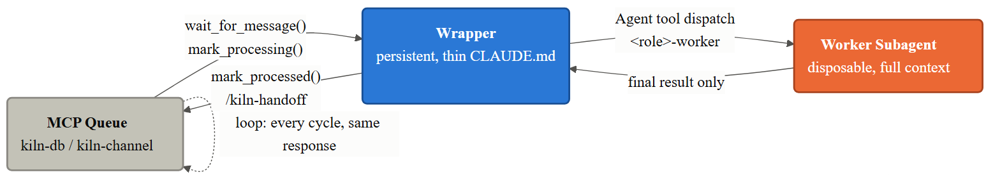

<!-- _class: lead -->

# Kiln

**An orchestration platform that turns swarms of AI agents into reliable, professional software engineers.**

Technical overview — topology, wrapper/worker delegation, and the handoff loop

---

## What Kiln Does

- Launches a **config-driven swarm** — each role's AI backend, worktree, and mode come from a JSON profile, not hardcoded scripts
- Gives each role its **own terminal** (tab/pane) and its **own git worktree** — agents never collide on files or branches
- Wires **inter-agent messaging** through SQLite (`.kiln/messages.db`) via two MCP servers — `kiln-db` (write) and `kiln-channel` (blocking `wait_for_message()`)
- Injects a layered **constitution** (`workflow.md`, `engineering.md`, `project.md`) + a **role file** into every agent at startup
- Cross-platform: Windows (PowerShell + WezTerm/Windows Terminal), Unix/macOS (zsh + tmux)

---

## The Default Profile

A human-facing intake role feeds a fully autonomous four-role cycle:

`human-in-the-loop` (manual, `@current`) gathers and confirms the request, then **specifier → coder → refactorer → architect** run unattended and report back.

---

## The Handoff Loop

Every `auto`-mode role's wrapper drives the same five-step cycle, every turn:

1. **`/kiln-receive`** — blocks on `wait_for_message()`, merges the sender's commit, logs it
2. **Delegate** — dispatches the actual work to a disposable `<role>-worker` subagent
3. **Retry once** on worker failure, then escalate instead of stalling
4. **`/kiln-handoff`** — squashes commits, writes the message, verifies it landed
5. **Loop back to step 1** — in the same turn, no exceptions

Messages move through one lifecycle: `queued` → `delivered` → `processing` → `processed`.

---

## Wrapper + Worker Delegation

The persistent **wrapper** never does the work itself — it only listens, delegates, and hands off. The disposable **worker** gets full context and does the actual task.

Result: wrapper context stays flat and small no matter how many cycles run — the worker's transcript never enters it, only its final report does.

---

## One Role, Concretely: the Coder

The wrapper half (right) is identical for every role. Only the worker's inner loop (left) changes — a refactorer-worker runs coverage → CRAP → mutation gates instead of TDD red/green/refactor.

---

## Watching It Run

The default profile in WezTerm — a Human-in-the-Loop tab alongside an Autonomous Cycle tab, all four roles visible in a 2×2 grid with live status badges.

---

## Agent Backends

Same wrapper/worker shape, different dispatch mechanism per backend:

- **Claude** — worker is a generated `.claude/agents/<role>-worker.md`, dispatched deterministically via the `Agent` tool
- **Copilot** — worker is a generated `.github/agents/<role>-worker.agent.md`; delegation is prose-instructed, not tool-enforced
- **Codex** — worker is a generated `.codex/agents/<role>-worker.toml`, dispatched via Codex's own `spawn_agent`/`assign_agent_task` tools
- **Grok** — blocked: only third-party CLIs available today, no unattended auto-approve path

Every worker is isolated — no `Agent` tool, no MCP messaging tools, only file access in its own worktree.

---

## Configuration & Extensibility

- Swarm shape lives in `kiln/framework/profiles.json` — role, backend, worktree, mode, model, all data-driven
- Per-role **model selection**, including decoupling wrapper and worker models (e.g. Haiku wrapper, Sonnet worker)
- **Flexible layouts** — tabs, grids, split panes, or focus arrangements, mixed per profile
- `kiln.ps1 -Init` / `kiln.sh init` scaffolds a new project — constitution, roles, git, and MCP config in one step
- Built-in health check: `/kiln-ping` sends a trail through the real handoff chain and back

---

## Status & Known Limits

- **Windows**: live-validated — 8+ full cycles, 50+ tests, zero stalls or message loss
- **Claude**: fully validated, including wrapper/worker delegation
- **Copilot**: worker delegation confirmed, not yet run through a full multi-cycle swarm
- **Codex**: config/generation validated, live multi-cycle spawn not yet exercised
- **Unix (`kiln.sh`)**: no loop/runtime template injection yet for Claude/Copilot — Windows-only for now
- Full permissions by default (`bypassPermissions` / `--allow-all` / bypass-sandbox) — keep Kiln projects isolated, no secrets in-repo
