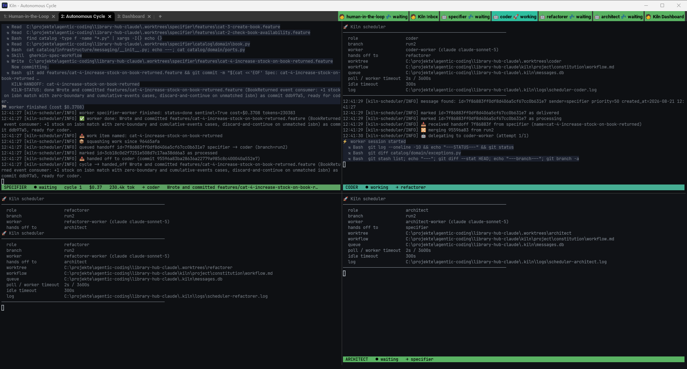

<!-- _class: lead -->

# Kiln

**An orchestration platform that turns swarms of AI agents into reliable, professional software engineers.**

Technical overview — topology, wrapper/worker delegation, and the handoff loop

---

## What Kiln Does

- Launches a **config-driven swarm** — each role's AI backend, worktree, and mode come from a JSON profile, not hardcoded scripts
- Gives each role its **own terminal** (tab/pane) and its **own git worktree** — agents never collide on files or branches
- Wires **inter-agent messaging** through SQLite (`.kiln/messages.db`) via two MCP servers — `kiln-db` (write) and `kiln-channel` (blocking `wait_for_message()`)
- Injects a layered **constitution** (`workflow.md`, `engineering.md`, `project.md`, `skill-orchestration.md`) + a **role file** into every agent at startup
- Cross-platform: one Python implementation, thin PowerShell/POSIX shims; WezTerm on either platform, Windows Terminal or tmux as the fallback

---

## The `full` Profile (the default)

A human-facing intake role feeds a fully autonomous four-role cycle:

`human-in-the-loop` (manual, `@current`) gathers and confirms the request, then **specifier → coder → refactorer → architect** run unattended and report back.

Profiles are named for the **kind of work** — `full`, `fix`, `spike`, `harden`, `dry-run`. The backend is a separate axis (`--agent-override`), not a profile.

---

## The Handoff Loop

Every `auto`-mode role's wrapper drives the same five-step cycle, every turn:

1. **`/kiln-receive`** — blocks on `wait_for_message()`, merges the sender's commit, logs it
2. **Delegate** — dispatches the actual work to a disposable `<role>-worker` subagent
3. **Retry** on worker failure (`maxAttempts`, default 2), then escalate instead of stalling
4. **`/kiln-handoff`** — squashes commits, writes the message, verifies it landed
5. **Loop back to step 1** — in the same turn, no exceptions

Scheduler mode adds the deterministic guards around this: a watchdog on both duration and
silence, an optional `verify` gate folded into the retry loop, `maxCycles`/`maxBudgetUsd` ceilings, a
circuit breaker after three escalations, and `kiln retry` to unpark a role.

Messages move through one lifecycle: `queued` → `delivered` → `processing` → `processed`.

---

## One Role, Concretely: the Coder (Wrapper Mode)

The wrapper half (right) is identical for every role. Only the worker's inner loop (left) changes — a refactorer-worker runs coverage → CRAP → mutation gates instead of TDD red/green/refactor.

---

## The Same Role, on the Scheduler

`run_once()` makes every control-flow decision; the LLM only does the work. The verify gate sits **inside** the retry loop, so a failed gate and a blocked worker share one rule and one escalation counter.

---

## Watching It Run — Intake

Tab 1: the `manual` human-in-the-loop session, with the `inbox` pane pinned beneath it. The strip top-right badges every role at once.

---

## Watching It Run — the Cycle

Tab 2: four scheduler panes. The specifier has just handed off (`$0.37`, 230.4k tok); the coder is delivering, merging and delegating to `coder-worker`. No LLM session drives any of this.

---

## Watching It Run — One Handoff Later

The coder finished at `$5.04` / 11.0M tok and handed off; the refactorer is now merging and delegating. The badge strip tracks it without focusing a pane.

---

## Watching It Run — the Dashboard

Tab 3: every role's state, queue depth, cycles, cost, tokens and cache rate, plus totals, prompt weight per role, recent activity and escalations.

---

## Agent Backends

Same wrapper/worker shape, different dispatch mechanism per backend:

- **Claude** — worker is a generated `.claude/agents/<role>-worker.md`, dispatched deterministically via the `Agent` tool
- **Copilot** — worker is a generated `.github/agents/<role>-worker.agent.md`; delegation is prose-instructed, not tool-enforced
- **Codex** — worker is a generated `.codex/agents/<role>-worker.toml`, dispatched via Codex's own `spawn_agent`/`assign_agent_task` tools
- **Grok** — scheduler adapter only, live-verified: `--always-approve`, `--no-subagents`, and inline `--agents` definitions. No wrapper mode yet, so a grok role must run `auto` + scheduled

Every worker is isolated — no `Agent` tool, no MCP messaging tools, only file access in its own worktree.

---

## Configuration & Extensibility

- Swarm shape lives in `kiln/framework/profiles.json` — role, backend, worktree, mode, model, routing, all data-driven; unknown keys fail the launch rather than being silently dropped
- Per-role **model selection**, including decoupling wrapper and worker models (e.g. Haiku wrapper, Sonnet worker)
- **Flexible layouts** — tabs, grids, split panes, or focus arrangements, mixed per profile
- `kiln.ps1 -Init` / `kiln.sh init` scaffolds a new project — constitution, roles, git, and MCP config in one step
- Built-in health check: `/kiln-ping` sends a trail through the real handoff chain and back

---

## Status & Known Limits

- **Windows**: live-validated — 8+ full cycles, zero stalls or message loss
- **Linux (Ubuntu 24.04 / WSL2)**: the complete loop closed here first — five scheduler cycles, $2.52, zero escalations
- **Claude**: fully validated, including wrapper/worker delegation
- **Codex**: adapter live-verified; **Copilot**: parked out of scheduler rotation, [copilot-cli#4433](https://github.com/github/copilot-cli/issues/4433)
- **Unix (`kiln.sh`)**: full parity — both shims call the same Python; only the terminal backend differs
- Not yet exercised: concurrent SQLite contention, and `mixed-backends` end to end
- Full permissions by default (`bypassPermissions` / `--allow-all` / bypass-sandbox) — keep Kiln projects isolated, no secrets in-repo
