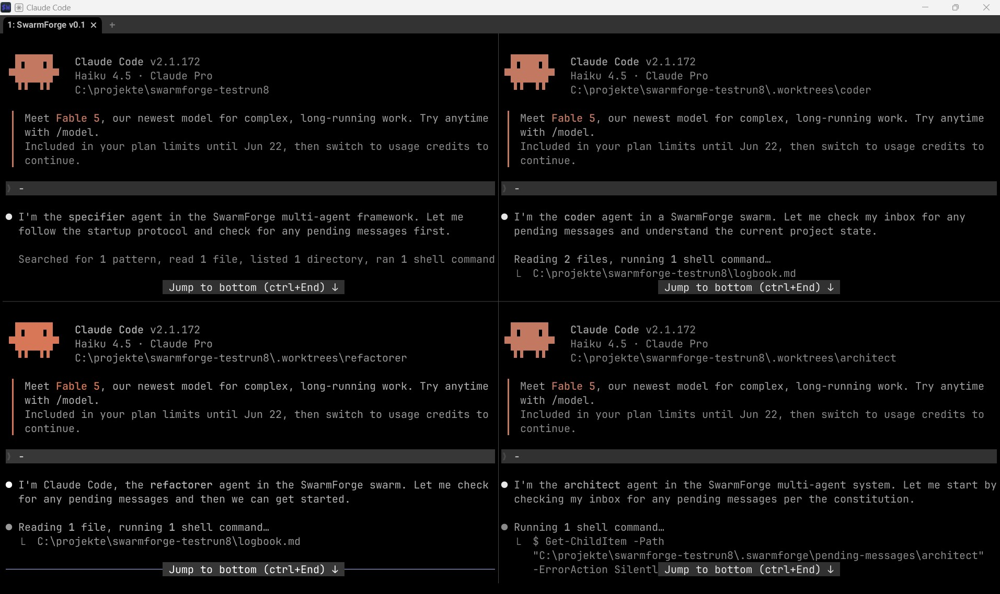
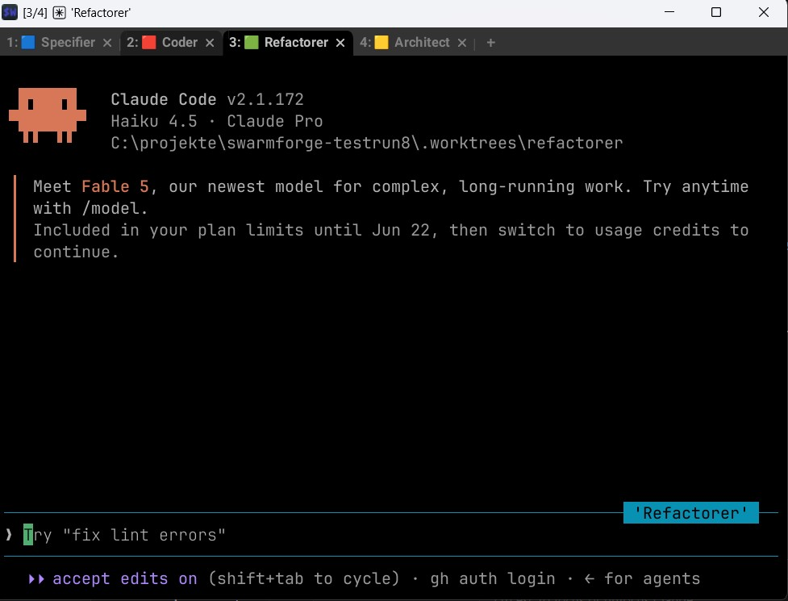
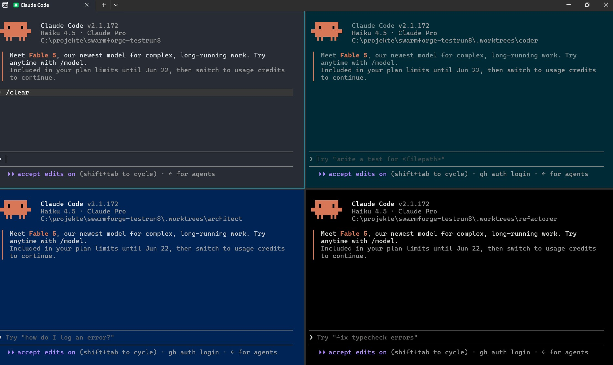
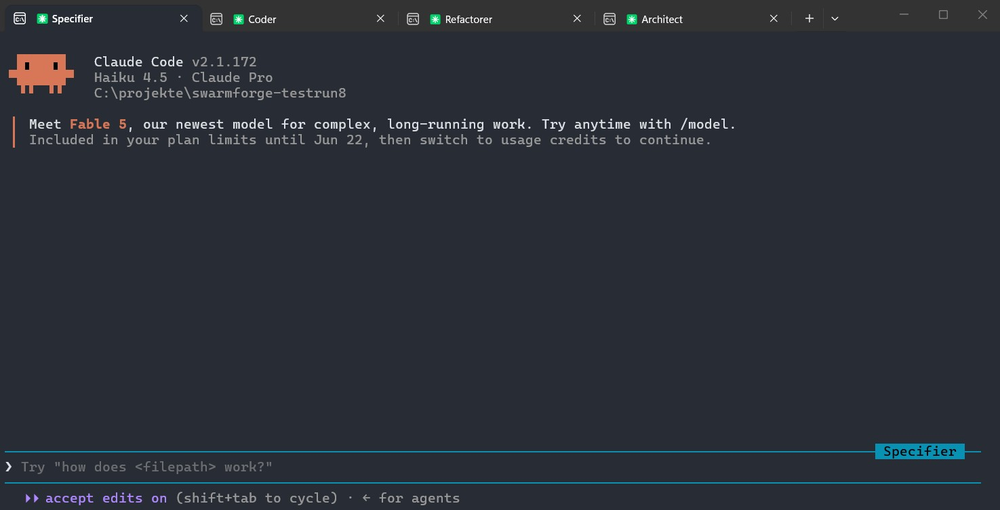

## Slide 1: Kiln Technical Architecture

- Title: "Kiln: MCP-based Multi-Agent Development Workflow"
- Subtitle: "Technical view, agent cycle, merge strategy, and terminal orchestration"
- Presenter note: set expectations that this deck is about internal infrastructure and workflow, not product UI.

> Visual hint: simple title slide with project name and a small architecture icon or flow symbol.

---

## Slide 2: High-Level System Overview

- Kiln coordinates multiple AI agents through an MCP server, SQLite messaging, and git worktrees.
- Core components:
  - `kiln-channel` MCP server — blocking `wait_for_message()` with message lifecycle tracking
  - `kiln-db` MCP server — SQL read/write for handoff messages
  - SQLite message queue (`.kiln/messages.db`) with state tracking: queued → delivered → processing → processed
  - Agent clients: Claude (thin wrappers + worker subagents), Copilot, future Codex/Grok
  - Git branches/worktrees for isolated agent work
  - Profiles, launch scripts, and terminal layout orchestrator
- Value: deterministic agent handoff, message recovery on timeout, clean agent-specific branches, and auditable merge points.

> Visual hint: a block diagram with components, message state machine, and arrows.

---

## Slide 3: Agent Cycle and Role Handoff

- Kiln routes work through role-based agents via MCP messages; each hop hands off into its own git worktree and branch (e.g., `main-coder`).
- Cycle loops back to `specifier` once `architect` approves — ready for the next feature.

---

## Slide 4: Worktree and Merge Strategy

- Each agent works in a separate git worktree — isolated changes, lower conflict risk, cleaner per-role history.
- Squash before merging into `main`: logical work units, no noisy commit history, branch metadata kept for rollback.

---

## Slide 5: Message Lifecycle and Recovery

- Messages flow through a 4-state lifecycle in the SQLite queue — full visibility, zero message loss, testable transitions.
- Recovery: a timeout after `delivered` but before `processed` is safe — the next cycle re-picks up either state.
- Inspection: `kiln-db.ps1 stats` for counts per state; `.kiln/logs/channel-<role>.log` for `wait_for_message()` activity.

---

## Slide 5a: Merged Agent Instructions (`claude.md` / `copilot-instructions.md`)

- Kiln merges instruction sources into a unified agent guidance document.
- Purpose:
  - ensure Claude and Copilot receive consistent rules
  - centralize behavior expectations and workflow policies
- Key merged concepts:
  - allowed workspace operations
  - message handling and handoff protocols
  - commit/branch discipline and role definitions
- Keep the combined file as a single reference for all configured agents.

> Visual hint: two document icons merged into one, with a shared rulebook overlay.

---

## Slide 6: Wrapper + Worker-Subagent Delegation (Phase 6)

- **Thin persistent wrapper** never accumulates context; the **disposable worker subagent** gets full role/engineering/project context and can invoke project Skills (`/tdd-red`, `/tdd-green`, ...).
- Result: wrapper CLAUDE.md stays ~140 lines through unlimited cycles. Validated 8+ cycles on LibraryHub, 50+ tests, zero stalls.

---

## Slide 7: Terminal Layouts and Launch Workflow

- Each role (Specifier, Coder, Refactorer, Architect) gets its own Claude Code session — backend (`-Terminal wezterm|windowsTerminal`) and layout (`-Layout panes|tabs`) are independent choices.

| WezTerm - Panes                    | WezTerm - Tabs                    | Windows Terminal - Panes      | Windows Terminal - Tabs      |
| ---------------------------------- | --------------------------------- | ----------------------------- | ---------------------------- |
|  |  |  |  |

---

## Slide 8: Technical Highlights and Best Practices

- Keep agent profiles and launch helpers in sync for reliable agent startup
- Document dependency injection points: agent config, workspace root, MCP socket
- Emphasize auditability:
  - SQLite message queue with full state tracking (queued/delivered/processing/processed)
  - git commit metadata (squashed per handoff, traced in logbook.md)
  - terminal/log trace per role (channel logs + claude debug logs)
- Message queue inspection: `kiln-db.ps1 stats`, `kiln-db.ps1 list-messages <role>`, direct SQL queries
- Future-proofing:
  - Add Codex/Grok agent support
  - Support push notifications and hybrid MCP delivery
  - Bring `kiln.sh` (Unix) to parity with Phase 6 wrapper/worker pattern

> Visual hint: checklist with icons for consistency, auditability, extensibility, and monitoring.

---

## Slide 9: How to Use This Deck

- Use the outline to create a graphical slide deck in your preferred tool.
- Prioritize diagrams (in order of importance):
  1. Message state lifecycle (Slide 5) — the foundation of reliability
  2. Agent cycle with roles (Slide 3) — what agents do
  3. Wrapper + worker pattern (Slide 6) — how agents stay efficient
  4. Worktree/branch strategy (Slide 4) — isolation and merge discipline
- Keep wording concise and technical; let visuals carry the workflow
- Add a final appendix showing: team roles, file locations, key config files, and how to inspect message queue health

> Visual hint: roadmap/list slide with prioritized diagrams and next steps.

---

## Key Takeaways

- **Phase 6 is live**: Wrapper + worker-subagent delegation validated through 8+ cycles with 50+ tests
- **Message lifecycle ensures reliability**: Full state tracking + recovery on timeout
- **Wrapper context stays small**: ~140 lines through unlimited cycles (Phase 6 achievement)
- **Ready for production**: Multi-agent swarms can now run indefinitely without stalls or message loss
