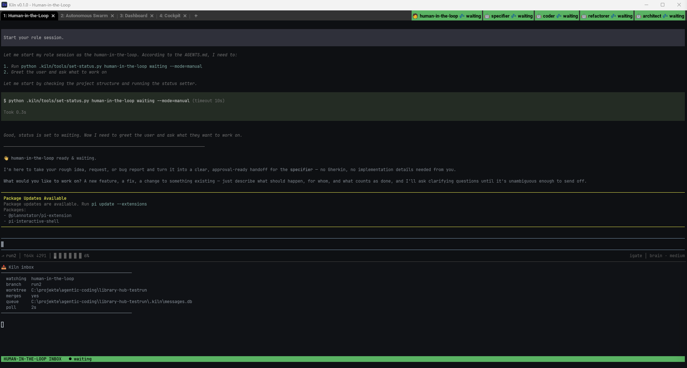
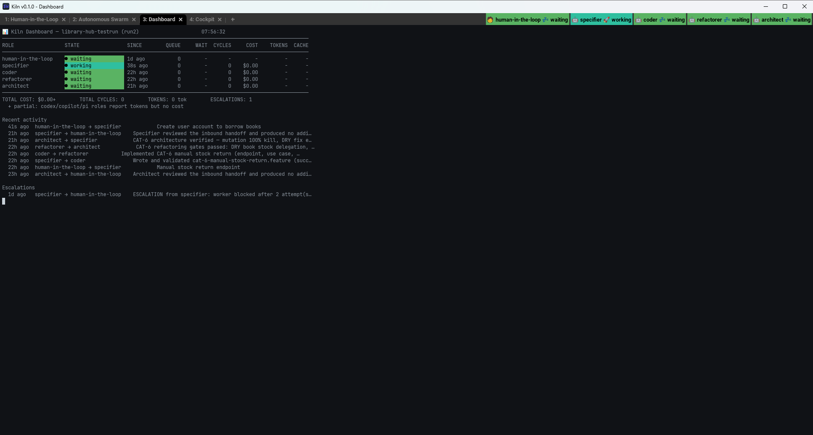

<!-- _class: lead -->


# Kiln

**An orchestration platform that turns swarms of AI agents into reliable, professional software engineers.**

<sub>v0.1.0</sub>

Technical overview — topology, scheduler/worker delegation, and the handoff cycle

---

## What Kiln Does

- Launches a **config-driven swarm** — each role's AI backend, worktree, and mode come from a JSON profile, not hardcoded scripts
- Gives each role its **own terminal** (tab/pane) and its **own git worktree** — agents never collide on files or branches
- Wires **inter-agent messaging** through SQLite (`.kiln/messages.db`) — the Python scheduler reads and writes directly, no MCP overhead
- Injects a layered **constitution** (`workflow.md`, `engineering.md`, `project.md`, `skill-orchestration.md`) + a **role file** into every agent at startup
- Cross-platform: one Python implementation, thin PowerShell/POSIX shims; WezTerm on either platform, Windows Terminal or tmux as the fallback

---

## The `full` Profile (the default)

A human-facing intake role feeds a fully autonomous four-role cycle:


`human-in-the-loop` (manual, `@current`) gathers and confirms the request, then **specifier → coder → refactorer → architect** run unattended and report back.

Profiles are named for the **kind of work** — `full`, `fix`, `spike`, `harden`, `dry-run`. The backend is a separate axis (`--agent-override`), not a profile.

---

## The Handoff Cycle

The deterministic Python scheduler runs the same cycle for every autonomous role:

1. **Poll &amp; claim** — waits for a `queued` message addressed to this role, claims it as `processing`
2. **Merge** — merges the sender's committed work into the role's worktree
3. **Delegate** — dispatches the work to a disposable one-shot worker subprocess
4. **Verify** — runs the optional verify command (tests, lint, coverage); retries on failure
5. **Hand off** — squashes commits, writes a structured message to the next role, loops

The scheduler owns every control-flow decision: retries, timeouts, cost ceilings, escalation. The LLM only does the assigned work. A circuit breaker parks the role after consecutive escalations until a human retries it.

Messages: `queued` → `delivered` → `processing` → `processed`.

---

## Scheduler &amp; Worker Detail


The scheduler's handoff cycle on the left feeds a disposable worker on the right. The worker's context is assembled from four sources: the role description, the project and engineering rules from the constitution, and the structured message it received. The worker can use any of the five supported agent backends and is terminated after every cycle — nothing persists between invocations. The verify gate sits **inside** the retry loop.

---

## Knowledge Base

Beyond the constitution, every role can search the project's **knowledge base** — an indexed documentation library curated by the human-in-the-loop.

- **Catalog** (`kiln/project/knowledge.json`) — approved documentation sources, version-controlled
- **Index** (`.kiln/knowledge.db`) — disposable search index, rebuilt on every sync or launch
- **Supported sources** — local Markdown, UTF-8 text, PDFs, directories, and `http(s)` URLs
- **Search** — any role can retrieve indexed knowledge without loading the entire library into its prompt
- **Scope** — knowledge supports decisions, never overrides the constitution. Only HITL curates the catalog; autonomous roles may search but never add or remove sources.

Setup: `kiln knowledge add`, `kiln knowledge sync`, then `kiln knowledge search "query"`.

---

## Wrapper Mode

The **human-in-the-loop** role uses wrapper mode — a persistent LLM session with Kiln skills and MCP tools:

- Receives work via `wait_for_message()` (MCP channel)
- Manages the backlog, creates tasks, hands off to autonomous roles
- Handles escalations and retries with guidance
- Maintains a continuing conversation — the opposite of the one-shot worker pattern

Autonomous roles never use wrapper mode. They run on the deterministic Python scheduler, which invokes a fresh one-shot worker per cycle and owns every control-flow decision. A role set to `"mode": "auto"` must also set `"scheduler": "python"`; the combination without one is refused at launch.

---

## Watching It Run — Intake



Tab 1: the `manual` human-in-the-loop session, with the `inbox` pane pinned beneath it. The strip top-right badges every role at once.

---

## Watching It Run — the Autonomous Swarm


Tab 2: four scheduler panes, each showing its role, state, cycle count, cost, tokens, and the handoff it most recently produced. No LLM session drives any of this — every pane runs the deterministic scheduler loop.

---

## Watching It Run — the Dashboard



Tab 3: every role's state, queue depth, cycles, cost, tokens and cache rate, plus totals, prompt weight per role, recent activity and escalations.

---

## Watching It Run — the Cockpit


The local web cockpit is the primary interface beyond Tab 1. The Board shows one lane per role, its worktree in the heading, and a card per work item. The Attention panel (not shown) lists failures, escalations, and results awaiting review. New tasks, handoffs, retries, log inspection, and swarm teardown are all available here.

Available from the Cockpit tab in WezTerm, or at the URL written to `.kiln/cockpit-url`.

---

## Agent Backends

Same scheduler interface, different worker dispatch per backend:

- **Pi** — worker invokes `pi --json` in ephemeral mode with a built-in tool list; the default for all shipped profiles
- **Claude** — worker is a generated `.claude/agents/<role>-worker.md`, dispatched deterministically via the `Agent` tool
- **Codex** — worker is a generated `.codex/agents/<role>-worker.toml`, dispatched via Codex's own `spawn_agent`/`assign_agent_task` tools
- **Grok** — scheduler adapter: `--always-approve`, `--no-subagents`, and inline `--agents` definitions
- **Copilot** — worker is a generated `.github/agents/<role>-worker.agent.md`; delegation is prose-instructed, not tool-enforced

Every worker is isolated — no access to the handoff queue, only file access in its own worktree.

---

## Message Routing

The workflow between roles is **entirely configurable** through `profiles.json`. A routing value names the next role — or an object with conditional targets based on who sent the work:

```json
"routing": {
  "human-in-the-loop": "specifier",
  "specifier": { "default": "coder", "architect": "human-in-the-loop" },
  "coder": "refactorer",
  "refactorer": "architect",
  "architect": "specifier"
}
```

Keys inside the object are **sender** names; `default` is the fallback. Routing makes the cycle close — the architect sends a completed lap back to the human, while every other handoff continues the autonomous cycle.

- Profile routing **replaces** the workflow table outright — every handing-off role must appear
- Every role named in routing must also exist in the same profile's terminals
- Custom roles are simply a name, an instruction file, a routing target, and a terminal entry — adding a security auditor or migration specialist takes three files

---

## Proxy &amp; Traffic Capture

An opt-in MITM proxy for worker API traffic, off by default. Currently implemented for Claude and Codex:

```bash
./bin/kiln.sh /path/to/project --proxy
./bin/kiln.sh /path/to/project --proxy --capture full
```

- **Metadata mode** — timing, sizes, model names, token usage, per-request composition. No prompt or response bodies retained.
- **Full capture** — also retains request and response bodies (may contain source code and prompts; treat `.kiln/traffic.db` as sensitive)
- **Port** — listens on 8787 by default, probes upward when busy; `--proxy-port 9000` pins it
- **Redaction** — credentials, cookies, and stable identifiers are stripped before storage
- **Scope** — currently routes only Claude (Anthropic API) and Codex (OpenAI Responses API). Pi, Grok, and Copilot backends are not yet proxied

The proxy runs as a detached background process. `--stop` reclaims it, and the next launch in the same project reclaims it too.

---

## Configuration & Extensibility

- Swarm shape lives in `src/kiln/resources/profiles.json` — role, backend, worktree, mode, model, routing, all data-driven; unknown keys fail at launch rather than being silently dropped
- Per-role **model selection**, including decoupling HITL (conversational) and worker (one-shot) models
- **Flexible layouts** — tabs, grids, split panes, or focus arrangements, mixed per profile
- `kiln.ps1 -Init` / `kiln.sh init` scaffolds a new project — constitution, roles, git, and message DB in one step
- Built-in health check: `/kiln-ping` sends a trail through the real handoff chain and back

---

## Code Architecture & Quality

- Feature packages live under `src/kiln/{launcher,scheduler,cockpit,proxy}`
- Each feature uses **domain → application → infrastructure** boundaries where applicable;
  dependencies point inward and empty ceremonial layers are avoided
- Framework-owned profiles, templates, Claude settings, tools and the project scaffold are
  packaged under `src/kiln/resources/`
- Tests split into four tiers: **unit**, **property** (Hypothesis invariants),
  **integration** (deterministic, no credentials), and **acceptance** (full-cycle workflow
  scenarios against fake workers)
- Coverage, branch coverage, complexity, CRAP, typing, and duplication are reported against a
  reviewed baseline; Cosmic Ray mutation tiers remain an explicit long-running gate

---

## Status & Known Limits

- **Windows**: live-validated — 100+ full cycles across multiple profiles, zero stalls or message loss
- **Linux (Ubuntu 24.04 / WSL2)**: parity proven across scheduler, cockpit, and proxy
- **Pi backend**: primary driver for all shipped profiles
- **Claude**: fully validated, including scheduler/worker delegation
- **Codex**: adapter live-verified
- **Unix (`kiln.sh`)**: full parity — both shims call the same Python; only the terminal backend differs
- **Grok**: scheduler adapter live-verified
- **Copilot**: adapter live-verified
- Full permissions by default (`bypassPermissions` / `--always-approve` / bypass-sandbox) — keep Kiln projects isolated, no secrets in-repo
