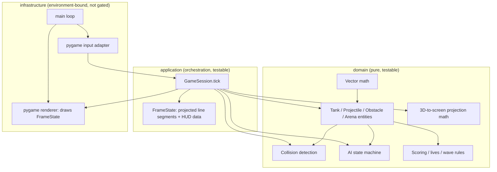

# BattleZone — Vector Tank Combat

## Installation

BattleZone is a reference example for Kiln — deliberately *not* a CRUD/microservices project like
`library-hub`. It's a from-scratch, single-player reimplementation of Atari's 1980 vector-graphics
arcade classic: a first-person wireframe tank simulator. To create a new project:

### Prerequisites

- **Windows**: PowerShell 7+, Git
- **Unix/macOS**: Bash/zsh, Git
- Claude Code CLI (to run agents in the swarm)
- Python 3.10+ (agents install/verify this themselves at startup — see `constitution/engineering.md`)

### Setup

Run the install script **from the Kiln repository root**:

**Windows (PowerShell):**
```powershell
.\bin\kiln.ps1 -Init -WorkingDir C:\path\to\my-battlezone -Example battlezone
cd C:\path\to\my-battlezone
```

**Unix/macOS (Bash):**
```bash
./bin/kiln.sh init /path/to/my-battlezone --example battlezone
cd /path/to/my-battlezone
```

### What the Script Creates

The install script scaffolds a complete, ready-to-run Kiln project with:
- **Constitution files** — `kiln/project/constitution/` with framework rules (workflow.md) and this example's game-specific configuration (project.md, engineering.md)
- **Agent role prompts** — `kiln/project/roles/` with specifier, coder, refactorer, architect instructions
- **Project configuration** — `kiln/profiles.yaml` defining the 4-agent swarm topology
- **Git repository** — Initialized on `main` branch with all files committed
- **Claude Code permissions** — `.claude/settings.json` pre-configured for agents
- **This brief** — `README.md` with game design and mechanics for agents to implement

### Launch the Swarm

Navigate back to the **Kiln repository root** and launch with the project as the working directory:

**Windows:**
```powershell
cd C:\path\to\kiln
.\bin\kiln.ps1 -WorkingDir C:\path\to\my-battlezone
```

**Unix/macOS:**
```bash
cd /path/to/kiln
./bin/kiln.sh /path/to/my-battlezone
```

Kiln will:
1. Create git worktrees for each agent (coder, refactorer, architect; specifier works on main)
2. Initialize tmux sessions or terminal windows/tabs
3. Generate and inject `CLAUDE.md` with full constitution + role + project context into each agent's environment
4. Launch the multi-agent collaboration

---

## Overview

BattleZone puts the player in a tank on a flat desert plain bounded by distant mountains, hunting
and being hunted by enemy tanks rendered entirely as glowing wireframe outlines — no textures, no
fills, just line segments, exactly like the 1980 original. The player moves and turns the tank,
fires a slow-traveling shell (one live shell at a time), and must avoid enemy fire and geometric
obstacles (pyramids, blocks, cubes) scattered across the arena.

Unlike `library-hub`'s two networked microservices, BattleZone is a **single real-time
application**: one process, one fixed-timestep game loop, no database, no message queue. What it
shares with `library-hub` is the thing that actually matters for Kiln's workflow — a strict
layering discipline that keeps a large, deterministic core (movement, collision, AI, projection
math, scoring) fully unit- and mutation-testable, with only a thin, unavoidably environment-bound
shell (the actual window, keyboard, and pixels) excluded from those gates. See **Architecture**
below for exactly where that line is drawn.

**Platform**: pygame (SDL2-backed) runs identically on Windows, Linux, and macOS — no
platform-specific code needed anywhere in this brief.

## Core Systems

BattleZone has no bounded contexts in the service sense — it's one application. These are its
internal subsystems instead:

### World & Physics
Tank/projectile transforms (position, heading), movement integration, collision detection
(circle/AABB checks against obstacles and other entities), and arena-boundary clamping.

### Combat
Shell spawning, ballistics (straight-line travel at fixed speed, limited range), hit detection,
and destruction of tanks/shells on impact.

### AI
Enemy tank behavior: patrol when the player is undetected, pursue once the player is within
detection range and line of sight, fire when in range and line of sight (subject to its own
fire-rate limit).

### Rendering
Pure 3D-world-to-2D-screen-space projection math (camera transform + perspective projection +
near-plane clipping) that turns world geometry into a list of screen-space line segments — this
is the one piece of "rendering" that's actually pure, deterministic, and testable. Only the final
step (drawing those line segments to a pygame surface) is environment-bound.

### Game State
Score, lives, wave progression (a new wave of enemies spawns once the current one is cleared),
and the win/lose condition (there is no "win" — the game ends when the player runs out of lives;
score is the objective).

## User Stories

### Player Tank Control
- **TANK-1**: Move tank forward/backward at a fixed speed
- **TANK-2**: Rotate tank left/right
- **TANK-3**: Fire a shell (rate-limited to one live player shell at a time, matching the original)
- **TANK-4**: Tank movement is blocked by obstacles (collision stops further movement into them)
- **TANK-5**: Player tank is destroyed when hit by an enemy shell or an enemy tank's collision

### Enemy AI
- **AI-1**: Enemy tank patrols the arena (simple waypoint or random-walk movement) while the player is undetected
- **AI-2**: Enemy tank pursues the player once within detection range and line of sight
- **AI-3**: Enemy tank fires at the player when in range and line of sight, respecting its own fire-rate limit
- **AI-4**: Enemy tank is destroyed when hit by a player shell

### World & Collision
- **WORLD-1**: Obstacles block tank and shell movement (collision)
- **WORLD-2**: Shells despawn after reaching max range or on impact
- **WORLD-3**: Player tank is confined to the arena boundary (clamped, not blocked by a hard wall)

### Game State & Scoring
- **GAME-1**: Score increases by a fixed amount when an enemy tank is destroyed
- **GAME-2**: Player starts with a fixed number of lives; losing all lives ends the game
- **GAME-3**: A new wave of enemies (one more than the previous wave) spawns once the current wave is cleared
- **GAME-4**: A game-over screen shows the final score; the player can restart

### Rendering (HUD)
- **HUD-1**: Render a first-person wireframe view of world geometry and entities from the player tank's position and heading
- **HUD-2**: Display score, remaining lives, and a simple compass-style indicator for nearby enemies (direction only, no distance/altitude — matching the original's simplified radar)

## Architecture



The dependency direction matches `library-hub`'s: `infrastructure` → `application` → `domain`,
never the reverse. `domain/` and `application/` have zero `pygame` imports — `FrameState` (a list
of already-projected 2D line segments plus HUD numbers) is the boundary object the application
layer produces every tick; `infrastructure/renderer.py` only draws it, with no game logic of its
own.

## Out of Scope (MVP)

- Saucer enemies (the original's second enemy type) — tanks only
- Sound effects and music
- Terrain elevation / altitude — flat arena plane only, matching the simplified pseudo-3D approach
- Persistent high-score storage
- Networking / multiplayer
- Menus or settings beyond start and game-over screens
- The volcano easter egg from the original
- Difficulty scaling beyond wave-count-driven enemy spawn count (AI behavior itself does not get harder wave over wave in the MVP)

---

## Architecture & Layering Rules

### 3-Layer Structure

Same dependency discipline as `library-hub`, applied to a real-time game loop instead of a
request/response service:

1. **Infrastructure** (outermost, environment-bound — excluded from coverage/mutation gates, see Quality Gates)
   - pygame window/surface setup, keyboard event polling → input intents, wireframe line drawing, the `main.py` entrypoint that runs the fixed-timestep loop
   - Location: `infrastructure/` package

2. **Application** (middle, orchestrates domain via a single per-tick entry point)
   - `GameSession.tick(dt, input_intents) -> FrameState` — advances the simulation one step and returns what should be rendered
   - Knows `domain/`, does NOT import `infrastructure/` or `pygame`
   - Location: `application/` package

3. **Domain** (innermost, pure simulation logic)
   - Entities, value objects (vectors, transforms), collision detection, AI state machine, projection math, scoring rules
   - Zero dependencies on `application/` or `infrastructure/` — no `pygame` import anywhere in this package
   - Location: `domain/` package

### Dependency Rules (Enforced)

| From | To | Allowed? |
| ---- | -- | -------- |
| `infrastructure/` | `application/` | Yes |
| `infrastructure/` | `domain/` | Yes |
| `application/` | `domain/` | Yes |
| `application/` | `infrastructure/` | No |
| `domain/` | `application/` | No |
| `domain/` | `infrastructure/` | No |

Violations detected by code review must be fixed before merge (no ArchUnit-equivalent tool
mandated for Python here — `ruff`'s import-linting rules or a simple `grep -r "import pygame"
domain/ application/` check in CI is sufficient given the package count).

### Boundary Object Pattern

- **Input**: pygame keyboard events → mapped by `infrastructure/input_adapter.py` → **input intents** (plain enum/dataclass, e.g. `MOVE_FORWARD`, `TURN_LEFT`, `FIRE`) → `GameSession`
- **Simulation → Rendering**: `GameSession.tick()` → **`FrameState`** (projected line segments + HUD numbers, a plain dataclass) → `infrastructure/renderer.py` draws it

Domain and application classes are **pure Python dataclasses** — no `pygame.Surface`,
`pygame.Rect`, or any other `pygame` type ever crosses into `domain/` or `application/`.

### Package Structure

Flat layout — no `src/` wrapper, matching `library-hub`'s convention:

```
battlezone/                        (Python package)
  __init__.py
  domain/
    vector.py         (Vector2 math — pure)
    tank.py            (Tank entity, movement rules)
    projectile.py       (Projectile entity, ballistics)
    obstacle.py          (static world geometry)
    arena.py              (world bounds, obstacle layout)
    collision.py           (pure collision-detection functions)
    ai.py                    (enemy AI state machine)
    projection.py             (3D world -> 2D screen-space projection math)
    scoring.py                 (score/lives/wave rules)
  application/
    game_session.py    (GameSession.tick — the one orchestration entry point)
    frame_state.py       (FrameState DTO — the domain/infrastructure boundary object)
    input_intent.py        (input intent enum/dataclass)
  infrastructure/
    renderer.py         (pygame: draws FrameState's line segments + HUD)
    input_adapter.py     (pygame events -> input intents)
    main.py                (entrypoint: owns the fixed-timestep loop)
tests/
  ...                  (see Testing Strategy)
```

The project root holds no game logic — it is orchestration and configuration only:
`pyproject.toml`, `.venv`, `tests/`, `README.md`. No `assets/` directory is needed — the game is
wireframe-only, no textures or sprites.

## Running the Game Locally

```bash
python -m battlezone.infrastructure.main
```

Controls: arrow keys or WASD to move/turn, space to fire, Esc to quit.

---

## Tech Stack (Locked Decisions)

- **Language**: Python 3.10+
- **Rendering/Windowing/Input**: `pygame` (SDL2-backed) — cross-platform (Windows/Linux/macOS), simple enough to hand-roll a wireframe line renderer without pulling in a 3D engine
- **Package manager**: `uv` (preferred) or `pip`
- **Testing**: `pytest`
- **BDD / Acceptance Tests**: `pytest-bdd` — feature files in `features/`, step implementations in `tests/acceptance/steps/`, run headlessly against `GameSession` directly (no pygame window involved)
- **Property Tests**: `hypothesis` — for simulation invariants (see Testing Strategy)
- **Quality Tools**: `mutmut` (mutation testing, `domain/`+`application/` only), `radon` (CRAP/complexity), `ruff` (linting and formatting — no separate `black` dependency), `mypy` (type checking)

All quality tools apply to `domain/` and `application/` only — see Quality Gates for why
`infrastructure/` is intentionally excluded.

---

## Quality Gates

Coverage, type checking, and lint are checked before every handoff, including the coder's.
Mutation testing is the architect's responsibility (full run, once per cycle) — the coder never
runs it, and the refactorer only scans mutation site counts (see `constitution/roles/coder.md`
and `refactorer.md` → Non-Ownership). Do not send a handoff if a gate you own fails. **Scoped to
`domain/` and `application/` only** — `infrastructure/` (pygame rendering, input polling, the
main loop) is the environmentally-unsuitable boundary that `constitution/engineering.md`'s
general rule already excludes from automated test/coverage/mutation tooling, since it opens a
real window and polls real input devices.

- **Mutation Testing**: `domain/` and `application/` must achieve mutation score ≥ 80% — `mutmut run --paths-to-mutate battlezone/domain,battlezone/application`
- **Test Coverage**: `domain/` and `application/` must achieve > 90% — `coverage run -m pytest tests/unit tests/property && coverage report`
- **Type Checking**: `domain/` and `application/` must pass `mypy` in strict mode — `mypy battlezone/domain battlezone/application --strict`
- **Code Style**: Must pass `ruff` (whole package, including `infrastructure/`) — `ruff check . && ruff format --check .`
- **Manual Playtest**: `infrastructure/` has no automated gate — before a handoff that touches rendering or input, run the game locally and confirm it still starts, renders, and responds to controls (see Running the Game Locally)

---

## Testing Strategy

**Unit Tests** (`tests/unit/`): pure simulation logic in isolation — vector math, tank/projectile
movement integration, collision detection, AI state transitions, projection math, scoring rules.
No I/O, no pygame import anywhere in this tree. Coverage > 90%, mutation score ≥ 80% on
`domain/`+`application/`.

**Acceptance Tests** (`tests/acceptance/`): `pytest-bdd` step implementations that execute the
`.feature` files in `features/`, driving `GameSession` directly and asserting on the resulting
`FrameState`/game state — fully headless, no window ever opens. Each step file must call
`scenarios("features/<file>.feature")` so pytest actually treats the Gherkin scenarios as live
test cases — without this the `.feature` files are dead documentation.

**Property Tests** (`tests/property/`): Hypothesis-based randomized tests for simulation
invariants — e.g. "a world point directly ahead of the camera always projects to the horizontal
center of the screen," "clamping a tank's position to the arena bounds is idempotent," "collision
detection is symmetric (A hits B iff B hits A)," "a tank's heading after any number of full
360° rotations equals its starting heading, modulo 2π." Property tests exercise a broad input
space and verify these rules hold under any valid state, not just hand-picked examples.

**What's explicitly not covered by these gates**: `infrastructure/renderer.py`,
`infrastructure/input_adapter.py`, `infrastructure/main.py` — these open a real window, poll
real input devices, and are only verified by the manual playtest step in Quality Gates.

**Test Organization**:

```
tests/
  conftest.py
  unit/
    domain/            (unit tests for vector math, entities, collision, AI, projection, scoring)
    application/        (unit tests for GameSession.tick orchestration)
  acceptance/
    conftest.py          (fixtures for a fresh GameSession per scenario)
    steps/
      tank_steps.py        (step defs for features/tank-*.feature)
      ai_steps.py            (step defs for features/ai-*.feature)
      game_steps.py             (step defs for features/game-*.feature)
  property/
    domain/             (Hypothesis property tests for domain invariants)
features/                (Gherkin specs — owned by specifier, do not modify)
```

| Command | Purpose |
| ------- | ------- |
| `pytest` | All tests — run before handoff |
| `pytest tests/unit/` | Unit tests only — quick feedback |
| `pytest tests/acceptance/` | Acceptance tests (headless, no window) |
| `pytest tests/property/` | Property-based invariant tests |
| `coverage run -m pytest tests/unit tests/property && coverage report` | Coverage report (domain/application) |
| `mutmut run --paths-to-mutate battlezone/domain,battlezone/application` | Mutation testing |

---

## Non-Functional Requirements

- **Code language**: English only — comments, docstrings, variable names, error messages.
- **Target frame rate**: 60 FPS, fixed-timestep simulation tied to render rate for the MVP (decoupling simulation tick rate from render rate is a possible future refinement, not required here).
- **Platform**: Windows and Linux (pygame/SDL2 is cross-platform; no platform-specific code required anywhere in this brief).
- **Persistence**: None required — no save files, no high-score file.
- **Error handling**: The game should never crash on invalid input; out-of-range values (e.g. a tank position computed outside the arena) are clamped, not thrown.
