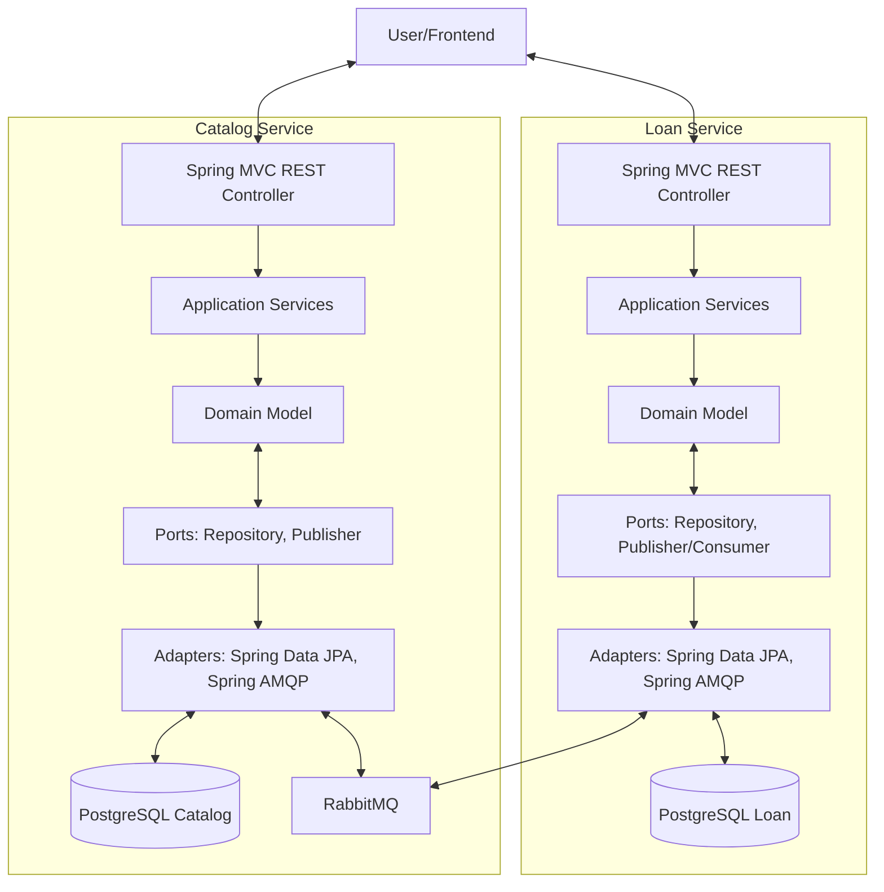

# LibraryHub (Java) — Library Loan System

## Installation

LibraryHub (Java) is a reference example for Kiln — the same product as `library-hub`, ported to
a Java/Spring Boot stack. To create a new project:

### Prerequisites

- **Windows**: PowerShell 7+, Git
- **Unix/macOS**: Bash/zsh, Git
- Claude Code CLI (to run agents in the swarm)
- JDK 21+ (agents install/verify this themselves at startup — see `constitution/engineering.md`)

### Setup

Run the install script **from the Kiln repository root**:

**Windows (PowerShell):**
```powershell
.\bin\kiln.ps1 -Init -WorkingDir C:\path\to\my-library-hub-java -Example library-hub-java
cd C:\path\to\my-library-hub-java
```

**Unix/macOS (Bash):**
```bash
./bin/kiln.sh init /path/to/my-library-hub-java --example library-hub-java
cd /path/to/my-library-hub-java
```

### What the Script Creates

The install script scaffolds a complete, ready-to-run Kiln project with:
- **Constitution files** — `kiln/project/constitution/` with framework rules (engineering.md, workflow.md) and this example's Java/Spring-specific configuration (project.md, engineering.md)
- **Agent role prompts** — `kiln/project/roles/` with specifier, coder, refactorer, architect instructions
- **Project configuration** — `kiln/profiles.json` defining the swarm topology (optional; overrides the framework profile it would otherwise inherit)
- **Git repository** — Initialized on `main` branch with all files committed
- **Claude Code permissions** — `.claude/settings.json` pre-configured for agents
- **This brief** — `README.md` with architecture and user stories for agents to implement

### Launch the Swarm

Navigate back to the **Kiln repository root** and launch with the project as the working directory:

**Windows:**
```powershell
cd C:\path\to\kiln
.\bin\kiln.ps1 -WorkingDir C:\path\to\my-library-hub-java
```

**Unix/macOS:**
```bash
cd /path/to/kiln
./bin/kiln.sh /path/to/my-library-hub-java
```

Kiln will:
1. Create git worktrees for each agent (coder, refactorer, architect; specifier works on main)
2. Initialize tmux sessions or terminal windows/tabs
3. Generate and inject `CLAUDE.md` with full constitution + role + project context into each agent's environment
4. Launch the multi-agent collaboration

---

## Overview

LibraryHub is a simple but realistic digital library system where users can search for books, borrow them, and return them over a deadline. The system uses two independent microservices communicating via asynchronous messaging to maintain eventual consistency and decouple concerns.

This is the **same product, user stories, and bounded contexts as `examples/library-hub`** (the Python/FastAPI original) — reimplemented on a Java/Spring Boot stack. The domain and behavior are intentionally kept 1:1 with the Python version so the two examples stay directly comparable; the package layout and dependency-injection style below diverge from the Python version where that's the idiomatic Java/Spring way of doing things (multi-module Maven build, constructor injection, JPA entities kept separate from domain records) rather than a literal transliteration.

## Bounded Contexts

### Catalog Service
Owns the book catalog and stock management. Manages all book metadata (title, author, genre, description) and the current available count per ISBN. Publishes events when books are reserved or out of stock. Consumes book-return events to replenish stock and keep availability current. Database: PostgreSQL (books, book_stock tables).

### Loan Service
Owns user accounts and loan records with deadlines and overdue tracking. When a user requests to borrow, immediately returns PENDING and publishes a request event; consumes reservation results (ACTIVE/REJECTED) asynchronously. Manages loan lifecycle: PENDING → ACTIVE/REJECTED → RETURNED. Tracks due dates (default 28 days, configurable) and overdue items. Database: PostgreSQL (users, loans tables).

## User Stories

### Catalog Service
- **CAT-1**: Search books by title, author, or genre with pagination
- **CAT-2**: Check book availability by ISBN
- **CAT-3**: Create new book with metadata and initial stock
- **CAT-4**: Automatically increase stock when BookReturned event arrives
- **CAT-5**: Retrieve single book by ISBN
- **CAT-6**: Manual stock return endpoint

### Loan Service
- **LOAN-0**: Create user account to borrow books
- **LOAN-1**: Borrow book (immediate 202 Accepted response)
- **LOAN-2**: View single loan status
- **LOAN-3**: View all loans for a user
- **LOAN-4**: Return book
- **LOAN-5**: View overdue loans (admin)

## Architecture



The two services communicate via asynchronous messaging (event-driven), enabling eventual consistency and full decoupling.

## Out of Scope (MVP)

- User authentication and JWT
- Email/SMS notifications
- Payment system
- Complex user management or role-based access
- Frontend / UI
- Book cover images or advanced metadata

---

## Architecture & Layering Rules

### 3-Layer Structure

The codebase is organized into three layers with unidirectional dependencies (always flowing from outside to inside):

1. **Infrastructure** (outermost, knows everything)
   - Spring MVC REST controllers, Spring Data JPA repositories, Spring AMQP adapters, request/response DTOs
   - Responsibility: HTTP bindings, database adapters, message queue handlers, Spring `@Configuration`/dependency wiring
   - Location: `infrastructure/` package

2. **Application** (middle, orchestrates domain via ports)
   - Use cases, application services
   - Knows `domain/`, uses `domain/ports/`, does NOT import from `infrastructure/`
   - Location: `application/` package

3. **Domain** (innermost, pure business logic)
   - Entities, Value Objects, Domain Events, Port Interfaces
   - Zero dependencies on `application/` or `infrastructure/` — no Spring, no JPA, no Jackson annotations
   - Location: `domain/` package

### Dependency Rules (Enforced)

| From | To | Allowed? |
| ---- | -- | -------- |
| `infrastructure/` | `application/` | Yes |
| `infrastructure/` | `domain/` | Yes |
| `application/` | `domain/` | Yes |
| `application/` | `infrastructure/` | No (only via ports) |
| `domain/` | `application/` | No |
| `domain/` | `infrastructure/` | No |

Violations detected by static analysis (ArchUnit test, run as part of the unit suite) or code review must be fixed before merge.

### Mapping Pattern

- **HTTP Request** (request DTO) → mapped by `infrastructure/api/` → **Domain Object** → **Use Case**
- **Domain Object** → mapped by `infrastructure/persistence/` → **JPA Entity** → **Database**
- **Database** → **JPA Entity** → mapped by `infrastructure/persistence/` → **Domain Object** → returned via API

Domain classes are **plain Java records/final classes** with no JPA (`@Entity`, `@Table`) or Jackson (`@JsonProperty`) annotations. JPA entities are separate infrastructure-layer classes, mapped to/from domain objects at the repository adapter boundary.

### Package Structure (Multi-Module Maven)

Each service is its own Maven module under a parent POM, with a standard source layout — this is the one deliberate divergence from the Python original's flat, no-`src/`-wrapper layout, since a `src/main/java/...` tree is the idiomatic Java convention agents (and any Java developer) will expect:

```text
library-hub-java/                          (Maven parent project, packaging: pom)
├── pom.xml                                (<modules>catalog-service, loans-service</modules>; shared dependencyManagement)
├── catalog-service/                       (Maven module, e.g. catalog-service/)
│   ├── pom.xml                            (parent: ../pom.xml)
│   └── src/main/java/com/libraryhub/catalog/
│       ├── domain/
│       │   ├── <Entity>.java              (record/final class, business logic)
│       │   ├── events/                    (domain events as records)
│       │   └── ports/                     (interfaces, no implementation)
│       ├── application/
│       │   └── <UseCase>.java             (orchestrates domain, calls ports)
│       └── infrastructure/
│           ├── api/
│           │   ├── <X>Controller.java     (Spring MVC controller)
│           │   └── dto/                   (request/response DTOs)
│           ├── persistence/
│           │   ├── <X>JpaEntity.java      (JPA entity)
│           │   └── <X>RepositoryAdapter.java  (port implementation)
│           ├── messaging/
│           │   ├── <X>Publisher.java      (Spring AMQP publisher adapter)
│           │   └── <X>Consumer.java       (Spring AMQP consumer adapter)
│           └── config/
│               └── <X>Config.java         (Spring `@Configuration`, bean wiring)
└── loans-service/                         (same structure; plural naming matches the README section heading and this module's name everywhere)
```

Each module holds no cross-service business logic — bounded contexts stay fully independent, sharing nothing but the RabbitMQ broker and the parent POM's shared `dependencyManagement` (versions only, not code).

Gherkin feature files live at each module's root in `src/test/resources/features/` (owned by specifier, do not modify).

## Running Services Locally

To start each service for manual testing or development:

```bash
# Catalog service (default port 8000)
./mvnw -pl catalog-service spring-boot:run

# Loans service (alternate port to avoid conflict)
./mvnw -pl loans-service spring-boot:run -Dspring-boot.run.arguments=--server.port=8001
```

Both services expect environment setup (database connections, RabbitMQ, etc.) — see
Infrastructure section for bootstrap requirements.

---

## Tech Stack (Locked Decisions)

- **Language**: Java 21+ (records, pattern matching, virtual threads available if useful)
- **Framework**: Spring Boot 3.x (Spring MVC — synchronous, not WebFlux; matches the "simple but realistic" scope, avoids reactive-stack complexity that isn't the point of this example)
- **Persistence**: Spring Data JPA (Hibernate) + PostgreSQL (two isolated databases: catalog_db, loan_db)
- **Message Queue**: Spring AMQP / RabbitMQ (async, event-driven, topic exchange pattern)
- **Build Tool**: Maven, multi-module (parent POM + `catalog-service`/`loans-service` modules)
- **Testing**: JUnit 5, AssertJ, Mockito
- **BDD / Acceptance Tests**: Cucumber-JVM — feature files in `src/test/resources/features/`, step definitions in `src/test/java/.../acceptance/steps/`
- **Acceptance Fixtures**: Testcontainers (`postgresql`, `rabbitmq` modules) — use real PostgreSQL and RabbitMQ; do NOT use an embedded/in-memory database for acceptance tests
- **Quality Tools**: PIT/`pitest` (mutation testing), JaCoCo (coverage), PIT's CRAP metric (complexity/CRAP, threshold 30 — see `skill-orchestration.md`'s Java/Kotlin tool mapping and "Threshold Note"), Checkstyle or Spotless (formatting/lint), ArchUnit (layering rule enforcement), jqwik (property-based testing)
- **Package Manager**: Maven's own dependency management (no separate package manager)

All services use the same tech stack. No divergence.

---

## Quality Gates

Coverage, style, and layering are checked before every handoff, including the coder's. Mutation
testing (PIT) and CRAP are the architect's/refactorer's responsibility, not the coder's (see
`constitution/roles/coder.md` and `refactorer.md` → Non-Ownership). Do not send a handoff if a
gate you own fails.

- **Mutation Testing**: `domain/` and `application/` must achieve mutation score ≥ 80% — `./mvnw org.pitest:pitest-maven:mutationCoverage`
- **Test Coverage**: All code must achieve > 90% — `./mvnw jacoco:report jacoco:check`
- **CRAP**: functions must stay at or below PIT's CRAP threshold of 30 (differs from the Python example's radon threshold of ≤6 — see `skill-orchestration.md`)
- **Code Style**: Must pass Checkstyle/Spotless — `./mvnw checkstyle:check spotless:check`
- **Layering**: ArchUnit layer-dependency test must pass — `./mvnw test -Dtest=*ArchitectureTest`

---

## Testing Strategy

**Unit Tests** (`src/test/java/.../unit/`): pure business logic in isolation, mock all dependencies (Mockito), no I/O, run fast. Coverage > 90%, mutation score ≥ 80%.

**Acceptance Tests** (`src/test/java/.../acceptance/`): Cucumber-JVM step definitions that execute the `.feature` files in `src/test/resources/features/`. Each step class must be wired into a `@CucumberContextConfiguration`/runner (e.g. a JUnit 5 `@Suite` with `@IncludeEngines("cucumber")`) so pytest-bdd's Java equivalent actually treats the Gherkin scenarios as live test cases — without this the `.feature` files are dead documentation. Use Testcontainers for real PostgreSQL and RabbitMQ — do not use an embedded database here.

**Property Tests** (`src/test/java/.../property/`): jqwik-based randomized tests for domain invariants and edge cases. Organized per service and layer (mirroring `unit/`), covering domain entities, value objects, validation rules, and application-layer transformations. Property tests exercise a broad input space and verify that business rules hold under any valid state.

**Test Organization** (per module, e.g. `catalog-service/src/test/java/com/libraryhub/catalog/`):

```text
unit/
  domain/         (unit tests for catalog domain)
  application/    (unit tests for catalog application services)
acceptance/
  steps/          (Cucumber-JVM step definitions for features/cat-*.feature)
  CucumberTest.java  (JUnit 5 suite runner, @IncludeEngines("cucumber"))
property/
  domain/         (jqwik property tests for domain invariants)

src/test/resources/features/   (Gherkin specs — owned by specifier, do not modify)
```

| Command | Purpose |
| ------- | ------- |
| `./mvnw test` | All unit tests — run before handoff |
| `./mvnw test -Dtest="**/unit/**"` | Unit tests only — quick feedback |
| `./mvnw test -Dtest=CucumberTest` | Acceptance tests (requires running containers) |
| `./mvnw jacoco:report` | Coverage report |
| `./mvnw org.pitest:pitest-maven:mutationCoverage` | Mutation testing |

---

## Non-Functional Requirements

- **Code language**: English only — comments, Javadoc, variable names, error messages. Test data may contain Unicode.
- **Error handling**: Return appropriate HTTP status codes (404 not found, 409 conflict, 422/400 validation, 500 server error), via a `@ControllerAdvice` global exception handler.
- **Logging**: Structured JSON logging in the infrastructure layer using SLF4J + Logback (`logback-spring.xml` JSON encoder).
- **Authentication**: Not required for MVP.
