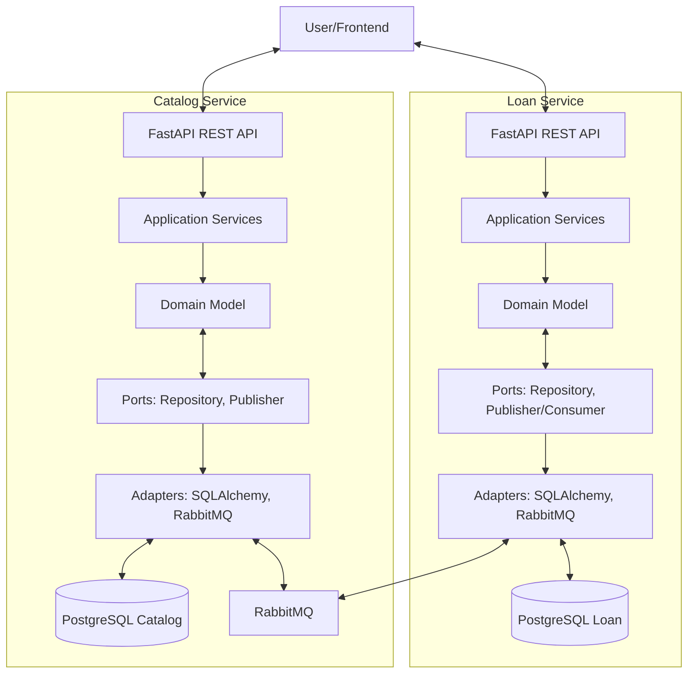

# LibraryHub — Library Loan System

## Installation

LibraryHub is a reference example for Kiln. To create a new LibraryHub project:

### Prerequisites

- **Windows**: PowerShell 7+, Git
- **Unix/macOS**: Bash/zsh, Git
- Claude Code CLI (to run agents in the swarm)

### Setup

Run the install script **from the Kiln repository root**:

**Windows (PowerShell):**
```powershell
.\bin\kiln-init.ps1 -Target C:\path\to\my-library-hub -Example library-hub
cd C:\path\to\my-library-hub
```

**Unix/macOS (Bash):**
```bash
./bin/kiln-init.sh /path/to/my-library-hub --example library-hub
cd /path/to/my-library-hub
```

### What the Script Creates

The install script scaffolds a complete, ready-to-run Kiln project with:
- **Constitution files** — `kiln/constitution/` with framework rules (engineering.md, workflow.md) and project-specific configuration
- **Agent role prompts** — `kiln/roles/` with specifier, coder, refactorer, architect instructions
- **Project configuration** — `kiln/profiles.yaml` defining the 4-agent swarm topology
- **Git repository** — Initialized on `main` branch with all files committed
- **Claude Code permissions** — `.claude/settings.json` pre-configured for agents
- **This brief** — `README.md` with architecture and user stories for agents to implement

### Launch the Swarm

Navigate back to the **Kiln repository root** and launch with the project as the working directory:

**Windows:**
```powershell
cd C:\path\to\kiln
.\bin\kiln.ps1 -WorkingDir C:\path\to\my-library-hub
```

**Unix/macOS:**
```bash
cd /path/to/kiln
./bin/kiln.sh /path/to/my-library-hub
```

Kiln will:
1. Create git worktrees for each agent (coder, refactorer, architect; specifier works on main)
2. Initialize tmux sessions or terminal windows/tabs
3. Generate and inject `CLAUDE.md` with full constitution + role + project context into each agent's environment
4. Launch the multi-agent collaboration

---

## Overview

LibraryHub is a simple but realistic digital library system where users can search for books, borrow them, and return them over a deadline. The system uses two independent microservices communicating via asynchronous messaging to maintain eventual consistency and decouple concerns.

This project serves as the **reference example for SwarmForge** — demonstrating a realistic use case with full TDD discipline, clean architecture, and multi-agent collaboration across specifier, coder, refactorer, and architect roles.

## Bounded Contexts

### Catalog Service
Owns the book catalog and stock management. Manages all book metadata (title, author, genre, description) and the current available count per ISBN. Publishes events when books are reserved or out of stock. Consumes book-return events to replenish stock and keep availability current. Database: PostgreSQL (books, book_stock tables).

### Loan Service
Owns user accounts and loan records with deadlines and overdue tracking. When a user requests to borrow, immediately returns PENDING and publishes a request event; consumes reservation results (ACTIVE/REJECTED) asynchronously. Manages loan lifecycle: PENDING → ACTIVE/REJECTED → RETURNED. Tracks due dates (default 28 days, configurable) and overdue items. Database: PostgreSQL (users, loans tables).

## User Stories

### Catalog Service
- **CAT-1**: Search books by title, author, or genre with pagination
- **CAT-2**: Check book availability by ISBN
- **CAT-3**: Create new book with metadata and initial stock
- **CAT-4**: Automatically increase stock when BookReturned event arrives
- **CAT-5**: Retrieve single book by ISBN
- **CAT-6**: Manual stock return endpoint

### Loan Service
- **LOAN-0**: Create user account to borrow books
- **LOAN-1**: Borrow book (immediate 202 Accepted response)
- **LOAN-2**: View single loan status
- **LOAN-3**: View all loans for a user
- **LOAN-4**: Return book
- **LOAN-5**: View overdue loans (admin)

## Architecture



The two services communicate via asynchronous messaging (event-driven), enabling eventual consistency and full decoupling.

## Out of Scope (MVP)

- User authentication and JWT
- Email/SMS notifications
- Payment system
- Complex user management or role-based access
- Frontend / UI
- Book cover images or advanced metadata
